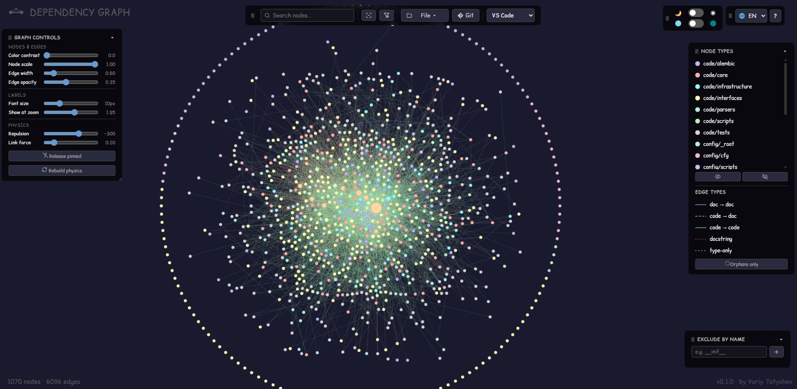

# build-graph

> **Architectural memory for your refactors.** See the blast radius of your
> changes across code, docs, and git — on one interactive map that both you
> and your AI agent can read.

`build-graph` renders a **single-file interactive HTML graph** connecting
three layers no other tool combines:

- **code → code** — Python imports (AST-based, `TYPE_CHECKING`-aware)
- **code ↔ docs** — which markdown files mention which source files
- **git drift** — added / modified / renamed / deleted overlay with ghost
  nodes for files that no longer exist

…and exports the same map as a **compact, token-efficient JSON** designed to
drop into an LLM agent's context.



<!-- TODO: GIF — hover/pin/path interactions -->

## Install

```bash
pip install build-graph        # or: uv tool install build-graph
```

Zero dependencies — stdlib only, Python 3.11+. The HTML output needs only a
browser (D3.js from CDN with SRI pinning, or fully embedded via `--no-cdn`).

## Quick start

```bash
cd your-project
build-graph                    # autodiscovery, no config needed → docs/graph.html
build-graph --compact          # + docs/graph-compact.json for AI agents
build-graph --init             # optional: pin discovered structure to graph.toml
```

Two companion CLIs ship in the same package:

| CLI | What it does |
|---|---|
| `find-related-docs <file>` | Reverse lookup: which docs mention this code file. `--git-added` / `--git-modified` modes for pre-commit hooks; `--exclude <dirname>` skips docs subfolders. |
| `verify-doc-links` | Check that every file reference in your `.md` files points to a real file. Exits non-zero on broken refs — drop it straight into CI. |

## Why not X?

- **pydeps / Import Linter** — imports only; no docs layer, no git drift.
- **lychee & co.** — dead-URL checkers; no map, no code layer.
- **Obsidian graph view** — notes only; doesn't see your code.
- **Repomix / Gitingest** — pack the repo *text* for LLMs; build-graph gives
  the *structure* in ~35 KB instead of megabytes.

## Designed for AI agents

`--compact` writes a self-documenting JSON snapshot (embedded legend, indexed
nodes, 3-letter type codes) that agents use for:

1. **Blast radius** — incoming imports of the file you're about to change,
   without grep.
2. **Docs routing** — which ADR / reference doc to read *before* editing a
   file.
3. **Three-way doc-sync** — the graph reveals (1) what's documented, (2) what
   should be documented but isn't, and (3) what's documented but no longer
   exists (ghost nodes = staleness detector).

Add `build-graph --compact` to a pre-commit hook or CI step to keep the map
fresh for every agent session.

## The interactive graph

- **Canvas renderer** — smooth at 1000+ nodes / 6000+ edges (pre-warmed
  layout, viewport culling, label LOD).
- **6 edge types** — doc→doc, code→doc, code→code, type-only
  (`TYPE_CHECKING`), docstring mentions, git renames.
- **Git overlay** — status colours + ghost nodes + rename edges; `--mock-git`
  for a synthetic demo.
- **Analysis aids** — dead-code candidates, orphan ring, shortest path
  between two nodes (Shift+click), isolate-a-type, exclude-by-name.
- **Sharing** — URL-encoded views (Copy link), Mermaid export of the focused
  subgraph, full/compact JSON export.
- **Comfort** — 10 UI languages, dark/light themes, hue-aligned
  pastel/saturated palettes, draggable glass panels, IDE deep links
  (VS Code / Cursor / PyCharm), FAQ built in (`?`).

Everything lands in **one self-contained HTML file** — attach it to a PR,
send it in chat, open it offline.

## Configuration (optional)

Autodiscovery classifies every tracked file by kind (code / doc / config /
locale) × location, detects your package and docs layout, and generates
deterministic colours. A `graph.toml` is only an override:

```bash
build-graph --init           # generate graph.toml pinning current structure
build-graph --init --diff    # report drift (new folders, stale pins), change nothing
build-graph --init --merge   # append coverage for new folders, keep your edits
```

See [`graph.example.toml`](graph.example.toml) for the annotated format
(`[docs]` categories, `[[code]]` dirs, `[[rules]]`, `[scan]` excludes,
`[dead_code]` exemptions, colour pins).

Two optional plain-text companions, both looked up in the project root:

- `known-brokens.txt` — whitelist for `verify-doc-links` false positives
  (one exact path per line).
- `exclude-dirs.txt` — directory-name skip list used only when git is
  unavailable (with git, `.gitignore` is the source of truth).

## CLI reference (build-graph)

| Flag | Effect |
|---|---|
| `--root PATH` | project root to scan (default: cwd) |
| `--config PATH` | graph.toml location (default: `<root>/graph.toml`) |
| `--output PATH` | HTML output (default: `docs/graph.html` or `[output].path`) |
| `--scope full\|package` | whole repo (default) or package+tests+docs only |
| `--json` / `--compact` | verbose / agent-oriented JSON snapshots next to the HTML |
| `--docs-only` / `--no-tests` | trim the node set |
| `--no-cdn` | fully offline output: embed D3.js inline (SHA-256 verified) and drop the external font link |
| `--mock-git` | synthetic git overlay for demos/testing |
| `--init [--diff\|--merge\|--force]` | config lifecycle (see above) |

## Known limitations

Static analysis has natural borders — the graph is a referential map, not a
semantic one:

- Dynamic imports resolve only literal / top-level-constant module names
  (f-strings, dict lookups, conditional rebinding are skipped).
- `eval` / `exec`, plugin entry points, and DI-by-string are invisible.
- Markdown templating (`{{ ref }}`, Jekyll/Hugo shortcodes) isn't parsed.
- Links resolve to whole files — section anchors (`file.md#part`) map to the
  file node.
- code→code edges are Python-only for now (the markdown/doc layers are
  language-agnostic).
- One repo per graph; symlinks are treated as physical paths.

## License

[MIT](LICENSE) © Yuriy Totyshev
