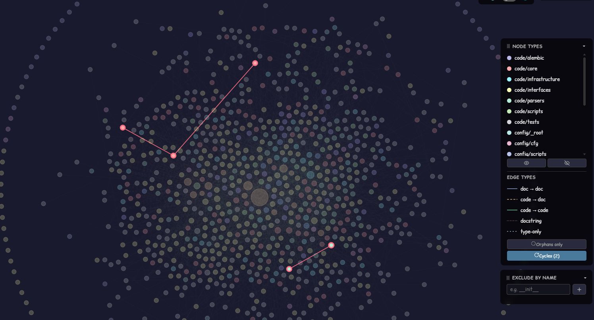
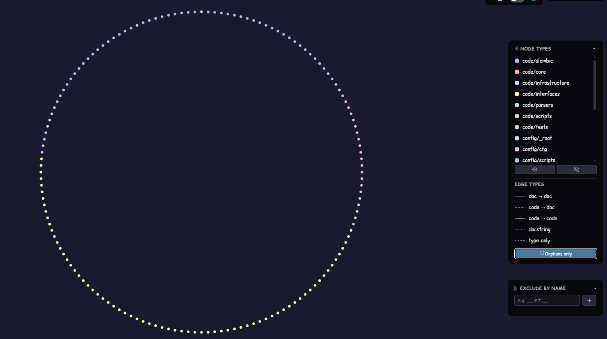
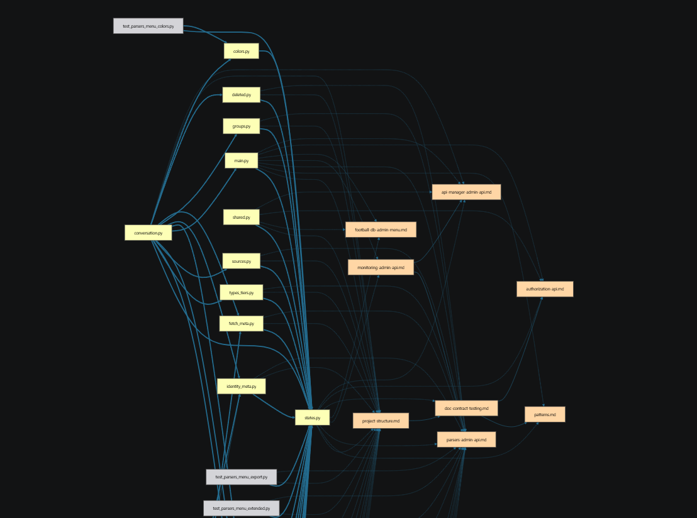
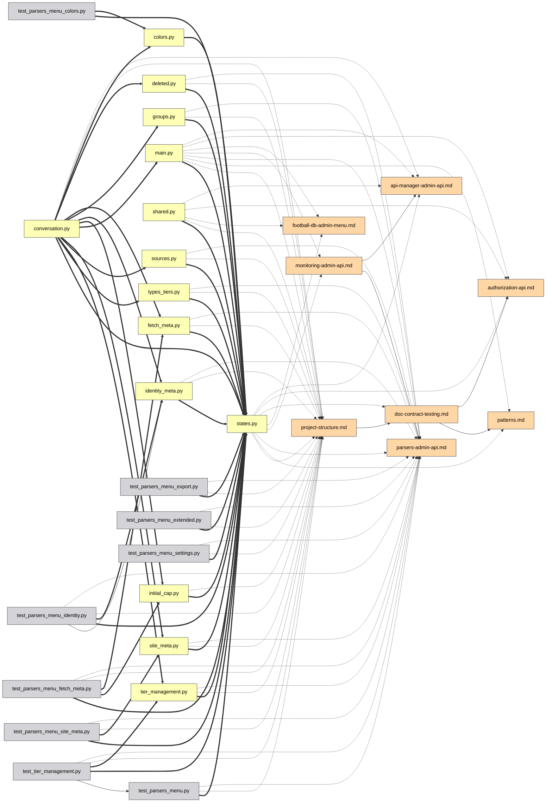

# UI guide

Every feature of the interactive graph, one by one. Try them live on the
[demo](https://mr-freewan.github.io/build-graph/) — it's the graph of the
build-graph repository itself, with a synthetic git overlay enabled.

---

## Getting around

The graph is a single canvas: **scroll to zoom, drag the background to
pan, drag a node to move it**. Node labels fade in as you zoom past the
*Show at zoom* threshold (viewport culling and label LOD keep 1000+ nodes
smooth). The crosshair button in the top bar resets the view; the counter
in the bottom-left corner shows how many nodes and edges are on the map.

Hovering a node highlights it with its direct neighbours and dims
everything else; hovering an edge shows a tooltip with the edge type,
source → target and the exact line numbers behind the relation.

## Panels

All seven panels are **draggable** — grab the dotted handle in the header.
The three main panels (Graph controls, legend, Exclude by name) **collapse**
into their title bar on a header click (chevron shows the state). The
info-panel resizes on both axes, Graph controls — horizontally. Positions,
sizes and collapsed states persist in `localStorage` and survive a reload;
when the window shrinks, panels clamp into the viewport and return to their
saved spot when it grows back.

The top-right corner hosts the appearance switches: **10 UI languages**
(DE / EN / ES / FR / IT / JA / KO / PT / RU / ZH), **dark / light theme**,
and **pastel / saturated palette** — the two palettes are hue-aligned, so
switching never re-shuffles which colour means what. Edge colours and
legend swatches follow the palette too. The built-in FAQ (the `?` button,
50+ answers in all 10 languages) makes an appearance here as well.

## Graph controls

The left panel tunes the picture and the physics:

- **Nodes & edges** — colour contrast, node scale, edge width, edge opacity.
- **Labels** — font size and the zoom level at which labels appear.
- **Physics** — repulsion and link force; changes restart the simulation
  live.
- **Release pinned** frees every sticky-pinned node; **Rebuild physics**
  reheats the layout (pinned nodes keep their place — sticky wins over
  rebuild).

## Search and exclusion

The search field (`Ctrl/Cmd+K`) matches node names **and paths** — typing
`handlers/` lights up the whole subtree. The `×` button or `Esc` clears it.

**Exclude by name** removes noise: add a pattern and matching nodes are
taken off the board; excluded nodes are frozen so the layout doesn't jump.
Rebuild physics re-flows the survivors into the freed space.

## Legend filtering

The legend is interactive:

- **Click a node type** to hide/show it; the eye buttons show/hide all at
  once.
- **🎯 isolate** on any row keeps only that type (click again to undo).
- **Click an edge type** to hide those edges — nodes left with no visible
  connections disappear too, so "only `docstring` edges" gives you a clean
  docstring subgraph, not a cloud of disconnected dots.
- **Orphans only** shows just the files nothing links to.

## Inspecting a node

Click a node — the **info-panel** opens and the selection stays highlighted
(pinned) after the cursor leaves:

- The path is rendered as **clickable breadcrumbs** — click a directory
  segment and it becomes the search query.
- Connections are grouped: `filename:line [type] ▸ +N` — expand to see
  every line where the relation occurs.
- The **IDE selector** (VS Code / Cursor / PyCharm / Copy path) turns every
  file into a deep link — open the exact file:line straight from the
  browser.

With a node pinned, hovering any of its neighbours peeks one level deeper:
the highlight becomes the union of both neighbourhoods — a quick two-step
walk of the dependency chain without losing your place.

## Pinning nodes in place

Two ways to nail a node to the canvas:

- **Double-click** it, or
- press **B** while hovering — works even mid-drag: drag a node aside,
  hit B, release — it stays.

Pinned nodes show a 📌 marker, survive Rebuild physics, and are released
either by another double-click or globally with **Release pinned**.

## Path between two nodes

**Shift+click** two nodes to get the shortest dependency path between them
(undirected BFS): endpoints and the path edges turn purple, the rest dims.
If no path exists, a toast says so. `Esc` or a background click clears it.

## Focusing an edge

Click an edge to isolate it: only the source and target stay lit (with
their labels forced on), so you can read exactly which two files the
relation binds. `Esc` or a background click releases.

## Git mode

The **Git** button switches node colours from types to **working-tree
status**: added / modified / renamed / deleted / clean. Extras appear that
plain colouring can't show:

- **Ghost nodes** (dashed outline) — deleted files that docs still
  reference, and the old halves of renames.
- **Rename edges** (dashed, no arrow) — old ghost → new live node.
- The legend switches to git statuses with the same click-to-filter,
  eye buttons and 🎯 isolation.

The button is disabled (with a tooltip) when git isn't available. For demos
and screenshots, `--mock-git` bakes a synthetic overlay covering all five
categories.

## Analysis aids

**💀 Dead code** (legend, appears when there are candidates) highlights
files with no incoming imports and no documentation mentions. Entry points
are exempt automatically: `[project.scripts]` from `pyproject.toml`,
`main.py`, `__init__.py`, `conftest.py`, `test_*.py`, plus anything matched
by `[dead_code].exempt` globs in `graph.toml`. The 💀 toggle is shown at
the end of the Git-mode clip above.

**Cycles** (legend, appears when import loops exist) highlights strongly
connected components in the runtime `code->code` import graph: loop edges
turn coral, loop members get a coral ring, everything else fades. Type-only
(`TYPE_CHECKING`) imports don't count — they are the legal way to break a
cycle. The counter is the number of independent loops, and while a mode
like this is active, faded nodes and edges ignore the pointer — hovering
past them won't light them up.

**Orphan ring** — zero-degree files aren't scattered; they sit on a circle
around the live cluster, so "connected core vs loose files" is readable at
a glance. Files that autodiscovery couldn't classify get an amber ring and
their own counter button in the top bar.

## Sharing and export

The **File menu** collects the outputs:

- **Copy link** — the current view (language, theme, palette, filters,
  git mode, search, pinned selection) encoded in the URL hash. Open the
  link — see the same picture. Personal prefs (panel positions, sliders,
  IDE choice) deliberately stay out of the URL.
- **Copy as Mermaid** — the focused subgraph (path > edge focus >
  pinned node + neighbours > search results) as a `flowchart LR` snippet,
  arrow style encoding the edge type. Paste it into a PR description.
- **Copy JSON** — the full graph data for an LLM agent (same data as the
  `--json` / `--compact` CLI flags).
- **Export / Import prefs** — move your entire setup (positions, sliders,
  filters, theme) to another machine as a JSON file.

A real *Copy as Mermaid* example — one admin subsystem isolated via search,
exported, pasted into markdown as-is:

The exported Mermaid source behind that picture

## FAQ and shortcuts

The `?` button opens a built-in FAQ — 50+ answers in all 10 languages,
covering everything on this page (you can see it opened in the Panels clip
above).

| Key | Action |
|-----|--------|
| `Esc` | close things, in order: File menu → FAQ → info-panel → edge focus → clear search |
| `Space` | pause / resume the physics |
| `Ctrl/Cmd+K` | focus the search field |
| `B` | pin/unpin the node under the cursor (works mid-drag) |
| `Shift+click` × 2 | shortest path between two nodes |
| double-click | pin/unpin a node in place |
