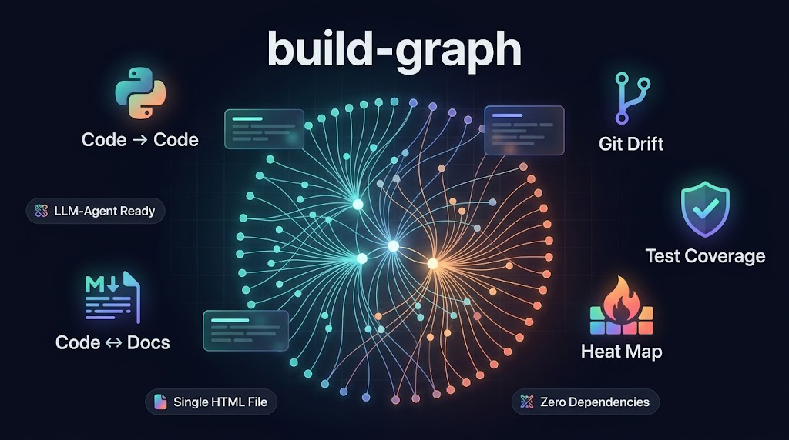

<p align="center">
  
</p>

<p align="center">
  <a href="README.de.md">Deutsch</a> |
  <a href="../README.md">English</a> |
  <a href="README.es.md">Español</a> |
  <a href="README.fr.md">Français</a> |
  <b>Italiano</b> |
  <a href="README.ja.md">日本語</a> |
  <a href="README.ko.md">한국어</a> |
  <a href="README.pt.md">Português</a> |
  <a href="README.ru.md">Русский</a> |
  <a href="README.zh.md">中文</a>
</p>

<p align="center">
  <a href="https://github.com/Mr-Freewan/build-graph/actions/workflows/ci.yml"></a>
  <a href="https://pypi.org/project/graph-build/"></a>
  
  
  <a href="../LICENSE"></a>
  <a href="https://github.com/astral-sh/ruff"></a>
  <a href="#progettato-per-agenti-ia"></a>
  <a href="../CONTRIBUTING.md"></a>
</p>

<p align="center">
  <a href="https://mr-freewan.github.io/build-graph/"></a>
  <a href="https://codespaces.new/Mr-Freewan/build-graph"></a>
</p>

> **Memoria architetturale per i tuoi refactoring.** Una panoramica del raggio
> d'impatto delle tue modifiche su codice, documentazione e git — su un'unica mappa
> interattiva leggibile sia da te sia dal tuo agente IA. Un insieme di utilità
> leggere e un'interfaccia semplice ma molto funzionale sotto forma di documento
> HTML autonomo condivisibile «così com'è». Leggerezza e riservatezza.

`build-graph` disegna un **grafo interattivo in un unico file HTML** che collega
cinque livelli che nessun altro strumento combina:

- **codice → codice** — import di Python (basati su AST, consapevoli di
  `TYPE_CHECKING`)
- **codice ↔ documentazione** — quali file markdown menzionano quali sorgenti
- **deriva git** — livello di added / modified / renamed / deleted più nodi
  fantasma per i file che non esistono più
- **mappa di calore delle modifiche** — consente di individuare e attenuare i
  punti caldi delle modifiche, insieme alle probabili fonti di bug
- **mappa di copertura dei test** — legge il `coverage.xml` del progetto e mostra
  la copertura a colpo d'occhio, evidenziando i file meno coperti

…ed esporta la stessa mappa come **JSON compatto ed efficiente nei token**,
pensato per il contesto di un agente LLM.

E tutto questo con **zero dipendenze**: pura libreria standard di Python,
`pip install` non trascina nient'altro. L'unico codice di terze parti è D3.js nel
browser, caricato da CDN con pinning SRI o completamente incorporato con `--no-cdn`
per una totale autonomia.


**[▶ Demo dal vivo](https://mr-freewan.github.io/build-graph/)** — il grafo di
questo stesso repository (dogfood), con un livello sintetico `--mock-git` così che
anche le modalità Git e copertura siano cliccabili.
**[📖 Guida all'interfaccia](guide.it.md)** — una panoramica concisa, passo dopo
passo, delle funzioni principali.

## Installazione

```bash
pip install graph-build        # oppure: uv tool install graph-build
```

Installa direttamente da GitHub:

```bash
pip install git+https://github.com/Mr-Freewan/build-graph.git

# oppure da un clone:
git clone https://github.com/Mr-Freewan/build-graph.git
pip install ./build-graph
```

> La distribuzione su PyPI si chiama `graph-build` (il nome diretto è occupato); i
> nomi dei comandi installati restano invariati: `build-graph`, `find-related-docs`,
> `verify-doc-links`.

## Avvio rapido

```bash
cd your-project
build-graph                    # rilevamento automatico, nessuna configurazione → docs/graph.html
build-graph --ultra-compact    # + docs/graph-ultra.json per gli agenti IA
build-graph --init             # opzionale: fissare la struttura rilevata in graph.toml
```

Due strumenti complementari — `find-related-docs` (ricerca inversa: codice → docs)
e `verify-doc-links` (controllo dei link morti per la CI) — arrivano nello stesso
pacchetto; vedi [Strumenti CLI](#strumenti-cli).

## Perché non altri strumenti?

- **pydeps / Import Linter** — solo import; nessun livello di documentazione,
  nessuna deriva git.
- **lychee e simili** — controllano gli URL morti; nessuna mappa, nessun livello di
  codice.
- **Vista a grafo di Obsidian** — solo note; non vede il tuo codice.
- **Repomix / Gitingest** — impacchettano il *testo* del repository per gli LLM;
  build-graph fornisce la *struttura*: ~2 % dei token che costerebbe il testo
  grezzo (vedi [i numeri](#quanto-costa-in-contesto)).
- **Graphify / Understand-Anything** — strumenti di knowledge graph che trascinano
  stack di dipendenze più pesanti e si affidano a un LLM non deterministico per
  l'analisi; build-graph è deterministico e senza dipendenze, e aggiunge i livelli
  git e doc-sync che nessuno dei due ha.

## Progettato per agenti IA

`--ultra-compact` (o il precedente `--compact`) scrive uno snapshot JSON
auto-documentante — legenda incorporata, nessuno schema esterno necessario — che
gli agenti usano per:

1. **Raggio d'impatto** — gli import in ingresso del file che stai per cambiare,
   senza grep.
2. **Instradamento della documentazione** — quale ADR / documento di riferimento
   leggere *prima* di modificare un file.
3. **Doc-sync a tre livelli** — il grafo mostra (1) cosa è documentato, (2) cosa
   dovrebbe esserlo ma non lo è, e (3) cosa è documentato ma non esiste più (nodi
   fantasma = rilevatore di obsolescenza).

Aggiungi `build-graph --ultra-compact` a un hook di pre-commit o a uno step di CI così
che la mappa resti aggiornata per ogni sessione dell'agente.

### Il formato ultracompatto

`--ultra-compact` scrive `graph-ultra.json` (schema v3): il formato da preferire
quando lo snapshot finisce in una finestra di contesto. Porta esattamente ciò che
porta `--compact`, in circa il 40 % dei byte, perché ogni informazione è scritta
una sola volta:

```jsonc
{
  "v": "3.0",
  "legend": { "...": "cosa significano ogni sezione e ogni codice qui sotto" },
  "stats": { "nodes": 1070, "ghosts": 0, "edges": 6279 },
  "cols": ["id", "file", "cat", "heat", "cov"],
  "n": {
    "app/core/security": [[412, "access.py", "cor", 23, 87]],
    "docs/adr":          [[7, "0009-parser-framework.md", "adr", 4, -1]]
  },
  "git": [[412, "mod"]],
  "e": {
    "imported_by":  [[412, [[518, 31], [604, [12, 88]]]]],
    "doc_mentions": [[7, [[412, 142]]]]
  }
}
```

I file sono raggruppati sotto la loro directory, così un percorso si scrive una
volta sola e la riga di un nodo è semplicemente `id, nome del file, categoria`,
più una colonna `heat` (quanti commit hanno toccato il file) e una colonna `cov`
(copertura delle righe in percentuale, `-1` quando non è misurata) ogni volta che
quei livelli sono stati raccolti. `cols` dichiara questa disposizione, così una
riga non è mai ambigua.

Gli archi sono raggruppati in sezioni che prendono il nome dalla loro chiave di
gruppo: una riga si legge partendo dalla chiave e la direzione non va mai dedotta
dall'ordine degli argomenti. `imported_by` è indicizzato dal modulo importato,
`doc_mentions` dal documento che menziona. Un elemento è un id nudo,
`[id, riga]` oppure `[id, [righe]]`. I livelli opzionali — stati `git`, `ghosts`
(file cancellati a cui i docs puntano ancora), `ge` (gli archi che li toccano) —
compaiono solo quando c'è qualcosa da segnalare. `degree` non viene memorizzato:
è il numero di archi incidenti.

### Il formato compatto

`--compact` scrive `graph-compact.json` (schema v2), il predecessore più piatto
del formato qui sopra — invariato, e ancora la scelta giusta se lo analizzi già:
i nodi come array indicizzato, gli archi come righe
`[indice_sorgente, indice_destinazione, tipo, [numeri_di_riga]]`, codici a tre
lettere per ogni categoria e tipo di arco. La chiave `legend` incorpora l'intera
tabella di decodifica, quindi anche questo file si spiega da solo:

```jsonc
{
  "v": "2.0",
  "legend": { "...": "cosa significa ogni campo e codice qui sotto" },
  "stats": { "nodes": 1070, "ghosts": 0, "edges": 6279 },
  "n": [
    { "p": "smm_bot_async/core/security/access.py", "t": "cor", "d": 56 },
    { "p": "docs/explanation/adr/0009-parser-framework.md", "t": "adr",
      "d": 11, "s": "mod" }
  ],
  "e": [
    [ 1, 75, "d2d", [186] ]
  ]
}
```

`p` — percorso, `t` — categoria, `d` — grado, `s` — stato git (omesso quando
pulito). Tipi di arco: `c2c` import, `c2d` menzioni nei docs, `d2d` link tra docs,
`dcs` riferimenti da docstring, `typ` solo `TYPE_CHECKING`, `ren` rinomini git. I
file eliminati ma ancora menzionati viaggiano come nodi fantasma (`"G": 1`).

### Quanto costa in contesto

Numeri reali da un repository in produzione — un migliaio abbondante di file
mappati e qualche migliaio di archi (token ≈ byte / 4, la solita stima
approssimativa):

| Cosa metti nel contesto              | Dimensione | ≈ Token   |
|--------------------------------------|-----------:|----------:|
| I file mappati stessi                |      14 MB | ~3.650.000 |
| `--json` (snapshot dettagliato)      |     1,2 MB |   ~320.000 |
| `--compact`                          |    0,27 MB |    ~69.000 |
| **`--ultra-compact`**                | **0,10 MB** | **~27.000** |

Tutta l'architettura — ogni import, ogni menzione nei docs, ogni riferimento
obsoleto — entra in ben meno dell'1 % di ciò che costerebbe il testo grezzo, e
lascia quasi interamente libera una sessione da 200 k di contesto per lavorare. Senza la mappa un agente
riscopre questa struttura a ogni sessione: decine di grep speculativi e letture di
file che bruciano una quantità di token comparabile *per domanda*, non una volta
sola. Su progetti piccoli la mappa è quasi gratis — lo snapshot ultracompatto di
questo stesso repository pesa meno di 8 KB ≈ ~2.000 token.

<details>
<summary>Non fidarti di questi numeri sulla parola — misura il tuo repository</summary>

```bash
$ build-graph --root . --bench

Context cost on this repo (tokens ~= bytes / 4):

  What you put in context            Size      ~Tokens  vs corpus
  raw corpus (1060 files)         13.9 MB    3,651,892     100.0%
  --json export (schema v1)        1.2 MB      320,439       8.8%
  --compact export (schema v2)   270.9 KB       69,339       1.9%
  --ultra-compact export (v3)    103.6 KB       26,517       0.7%
```

`--bench` si limita a misurare — non scrive alcun file.

</details>

### Un prompt da cui partire

```text
graph-ultra.json is a dependency map of this repository: nodes are
files, edges are imports and documentation mentions. Read the embedded
"legend" key first — it explains every section and code.

Using the map (before any grep):
1. Lay of the land: the 10 highest-degree hubs, grouped by category,
   with one line each on why they're central.
2. I'm about to modify <path/to/file.py>. List the blast radius:
   direct and 2-hop incoming importers, plus every doc that mentions
   the file — and tell me which of those docs to read first.
3. Anything suspicious: ghost nodes (docs pointing at deleted files),
   zero-degree modules, docs nothing links to.

Verify any surprising claim against the actual source before acting.
```

**Altre ricette:** [Prompt per agenti IA](agent-prompts.it.md) — prompt pronti
all'uso per raggio d'impatto, doc-sync a tre livelli, rilevamento fantasmi e caccia
al codice morto.

## Il grafo interattivo

- **Renderer Canvas** — fluido a 1000+ nodi / 6000+ archi (layout preriscaldato,
  culling per viewport, LOD delle etichette).
- **6 tipi di arco** — doc→doc, code→doc, code→code, solo-tipo (`TYPE_CHECKING`),
  menzioni da docstring, rinomini git.
- **Livello Git** — colori di stato + nodi fantasma + archi di rinomina;
  `--mock-git` per una demo sintetica.
- **Diff del grafo** — `--diff-base REF` confronta l'albero di lavoro con un ref
  git: gli stati dei file alimentano il livello Git, i nuovi archi di dipendenza
  appaiono in verde e quelli rimossi in rosso (tratteggiato), con contatori nella
  legenda. Aggiungi `--diff-head REF` per confrontare invece due ref specifici.
- **Livello Heat** — colore dei nodi per frequenza di commit git (gradiente
  blu→rosso), tutta la storia per impostazione predefinita o gli ultimi N giorni
  con `--heat-days N`. Uno slider min-edits nella legenda nasconde tutto ciò che è
  più freddo della soglia scelta — gli archi seguono. Mutuamente esclusivo con il
  livello Git (entrambi ricolorano i nodi, quindi è attivo solo uno alla volta); a
  differenza della modalità Git, è additivo: il livello Node types resta visibile e
  utilizzabile sotto.
- **Livello Coverage** — colore dei nodi per copertura delle righe di test
  (gradiente verde→rosso — questo serve a trovare i file mal coperti, quindi si
  legge al contrario di Heat) da un `coverage.xml` Cobertura (`--coverage PATH`, per
  es. `pytest --cov=your_pkg --cov-report=xml`). Uno slider max-coverage nasconde
  tutto ciò che è coperto *oltre* il tetto scelto, isolando i file peggio coperti
  man mano che lo abbassi; attivarlo nasconde anche automaticamente nella legenda
  tutti i Node types tranne il codice (di nuovo con un clic). Esclusivo anche con
  Git e Heat. Spento — e il suo pulsante nascosto — quando non è fornito alcun
  report.
- **Tooltip del nodo** — passa sopra un nodo qualsiasi per vederne nome e percorso;
  in modalità Heat o Coverage, anche il numero di modifiche o la percentuale di
  copertura dietro al colore. I tooltip degli archi si disattivano finché una di
  queste modalità è attiva.
- **Aiuti all'analisi** — candidati a codice morto, rilevatore di cicli di import
  (Tarjan SCC sugli import a runtime; gli archi `TYPE_CHECKING` non contano), anello
  degli orfani, percorso più breve tra due nodi (Shift+clic), isolare un tipo,
  escludere per nome. La semplice menzione in un doc di un file omonimo (`config.py`
  con decine di corrispondenze, senza percorso) è attribuita a un unico nodo di
  categoria `ambiguous`, invece di disperdersi su tutti i candidati.
- **Condivisione** — viste codificate nell'URL (Copy link), export Mermaid del
  sottografo a fuoco, export JSON completo/compatto.
- **Comodità** — 10 lingue dell'interfaccia, temi scuro/chiaro, palette
  pastello/satura accordate per tinta, pannelli di vetro trascinabili, deep link
  all'IDE (VS Code / Cursor / PyCharm), FAQ integrata (`?`).

Tutto sta in **un unico file HTML autonomo** — allegalo a una PR, mandalo in chat,
aprilo offline.

## Configurazione (facoltativa)

Il rilevamento automatico classifica ogni file versionato per natura (codice /
documentazione / configurazione / locale) × posizione, rileva il tuo pacchetto e la
disposizione dei docs, e genera colori deterministici. Un `graph.toml` è solo un
override:

```bash
build-graph --init           # generare graph.toml fissando la struttura attuale
build-graph --init --diff    # segnalare la deriva (nuove cartelle, pin obsoleti), senza cambiare nulla
build-graph --init --merge   # aggiungere la copertura delle nuove cartelle, mantenendo le tue modifiche
```

Vedi il formato annotato in [`graph.example.toml`](../graph.example.toml)
(categorie `[docs]`, directory `[[code]]`, `[[rules]]`, esclusioni `[scan]`,
esenzioni `[dead_code]`, pin di colore).

Due compagni testuali facoltativi, entrambi cercati nella radice del progetto:

- `known-brokens.txt` — whitelist per i falsi positivi di `verify-doc-links` (un
  percorso esatto per riga).
- `exclude-dirs.txt` — elenco di nomi di directory da saltare, usato solo quando
  git non è disponibile (con git, `.gitignore` è la fonte di verità).

## Riferimento CLI (build-graph)

| Opzione | Effetto |
|---|---|
| `--root PATH` | radice del progetto da scansionare (predefinito: cwd) |
| `--config PATH` | posizione di graph.toml (predefinito: `<root>/graph.toml`) |
| `--output PATH` | output HTML (predefinito: `docs/graph.html` o `[output].path`) |
| `--scope full\|package` | intero repo (predefinito) o solo pacchetto+test+docs |
| `--json` / `--compact` / `--ultra-compact` | snapshot JSON accanto all'HTML: dettagliato (v1), compatto (v2), ultracompatto (v3) |
| `--docs-only` / `--no-tests` | ridurre l'insieme dei nodi |
| `--no-cdn` | output completamente offline: incorporare D3.js inline (verificato SHA-256) e rimuovere il link al font esterno |
| `--mock-git` | livello git sintetico per demo/test |
| `--diff-base REF` | build ref-diff: stati + cambiamenti degli archi rispetto a un ref git (head = albero di lavoro salvo `--diff-head`) |
| `--diff-head REF` | con `--diff-base`: confrontare con questo ref invece che con l'albero di lavoro |
| `--heat-days N` | limitare il livello Heat agli ultimi N giorni (predefinito: tutta la storia) |
| `--coverage PATH` | attivare il livello Coverage da un `coverage.xml` Cobertura |
| `--init [--diff\|--merge\|--force]` | ciclo di vita della configurazione (vedi sopra) |

## Strumenti CLI

`find-related-docs` e `verify-doc-links` usano lo stesso scanner di riferimenti da
cui è costruito il grafo — ciò che la mappa disegna come arco codice↔docs è
esattamente ciò che essi cercano e verificano. `graph-query` risponde a domande su
uno snapshot già costruito.

### find-related-docs

Ricerca inversa: quali docs menzionano un dato file di codice. Eseguilo prima di
modificare un file per sapere quali pagine andranno aggiornate dopo, oppure collega
`--git-added` a un hook di pre-commit così che le modifiche non documentate vengano
segnalate prima di entrare.

<details>
<summary>Opzioni ed esempi</summary>

```bash
find-related-docs src/mypkg/core/access.py   # un file (funziona anche il solo nome)
find-related-docs --git-added -v             # pre-commit: file in stage, con numeri di riga dei docs
find-related-docs --git-modified             # albero di lavoro: modifiche in stage + non in stage
```

| Opzione | Effetto |
|---|---|
| `path` | file o directory da cercare (un solo nome viene cercato in tutto il progetto) |
| `--docs-dir PATH` | directory della documentazione (predefinito: `docs`) |
| `--exclude DIRNAME` | saltare un nome di cartella ovunque sotto la directory dei docs (ripetibile) |
| `--git-added` | controllare tutti i file in stage; avverte anche dei file eliminati ancora menzionati nei docs |
| `--git-modified` | controllare tutti i file modificati (in stage + non in stage) |
| `-v` / `--verbose` | stampare `docs/<file>.md:<line>` per ogni menzione |

</details>

### verify-doc-links

Verifica che ogni riferimento a file nei tuoi `.md` punti a un file reale. I codici
di uscita ne fanno un gate di CI pronto all'uso:

<details>
<summary>Opzioni ed esempi</summary>

| Uscita | Significato |
|---|---|
| `0` | tutti i riferimenti validi |
| `1` | trovati riferimenti rotti |
| `2` | percorso di destinazione non valido (non trovato o non un `.md`) |

```bash
verify-doc-links                     # tutto docs/ contro la radice del progetto
verify-doc-links docs/reference -v   # un sottoalbero, con le righe incriminate
```

```yaml
# Step di CI (GitHub Actions)
- run: pip install graph-build
- run: verify-doc-links --root .
```

| Opzione | Effetto |
|---|---|
| `path` | file `.md` o directory da controllare (predefinito: `docs`) |
| `--root PATH` | radice del progetto rispetto a cui i riferimenti sono risolti (predefinito: cwd) |
| `--known-brokens PATH` | file whitelist (predefinito: `<root>/known-brokens.txt`) |
| `-v` / `--verbose` | mostrare le righe incriminate |

Oltre a `known-brokens.txt`, i falsi positivi si possono silenziare in linea con
commenti HTML (invisibili nel Markdown renderizzato): `<!-- broken-link-ok -->`
sulla stessa riga, `<!-- broken-links-ok-start -->` / `<!-- broken-links-ok-end -->`
attorno a un blocco, oppure `<!-- ignore-ref: path/to/file.py -->` ovunque nel file.

</details>

### graph-query

Poni domande al grafo senza aprire un browser. Funziona sul JSON scritto da
`--json`, `--compact` o `--ultra-compact` (rilevato automaticamente; predefinito
`docs/graph-ultra.json`, poi gli snapshot più vecchi):

<details>
<summary>Opzioni ed esempi</summary>

```bash
graph-query blast-radius app/core.py   # importatori transitivi + ogni doc che li menziona
graph-query hubs --top 15              # file più connessi, ripartizione in/out
graph-query stale-docs --check         # docs più vecchi del codice che descrivono (gate CI: exit 1)
graph-query orphans --type code        # file senza alcun arco
```

| Comando | Risponde a |
|---|---|
| `blast-radius <path>` | «cosa si rompe se tocco questo file» — import in ingresso transitivi (`--depth`, `--edges` per regolare), più i docs interessati |
| `hubs` | «dov'è il centro di gravità» — nodi top per archi ingresso+uscita (`--top N`) |
| `stale-docs` | «quali docs sono in ritardo sul codice» — confronta le ultime date di commit (una passata di `git log`; fallback su mtime), `--check` per la CI |
| `orphans` | «cosa non è connesso a nulla» — nodi di grado 0, filtrabili per categoria |

Ogni comando accetta `--json` per un output leggibile dalla macchina — inoltralo a
`jq` o dallo a un agente.

</details>

## Limitazioni note

L'analisi statica ha confini naturali — il grafo è una mappa referenziale, non
semantica:

- Gli import dinamici sono risolti solo per nomi di modulo letterali / fissati da
  costanti di primo livello (f-string, lookup su dict, rebinding condizionale
  vengono saltati).
- `eval` / `exec` e la DI per stringa sono invisibili. I punti di ingresso
  `[project.scripts]` / `[project.gui-scripts]` di `pyproject.toml` vengono letti,
  ma solo per esentare quei moduli dalla marcatura come codice morto — non creano
  archi.
- Il templating Markdown (`{{ ref }}`, shortcode Jekyll/Hugo) non viene analizzato.
- I link si risolvono a file interi — le ancore di sezione (`file.md#part`) mappano
  al nodo del file.
- Gli archi codice→codice sono per ora solo Python (i livelli markdown/docs sono
  indipendenti dal linguaggio).
- Un repo per grafo; i symlink sono trattati come percorsi fisici.

## Licenza

[MIT](../LICENSE) © Yuriy Totyshev
