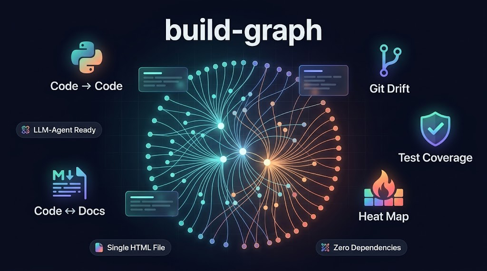

<p align="center">
  
</p>

<p align="center">
  <a href="README.de.md">Deutsch</a> |
  <a href="../README.md">English</a> |
  <a href="README.es.md">Español</a> |
  <a href="README.fr.md">Français</a> |
  <a href="README.it.md">Italiano</a> |
  <a href="README.ja.md">日本語</a> |
  <b>한국어</b> |
  <a href="README.pt.md">Português</a> |
  <a href="README.ru.md">Русский</a> |
  <a href="README.zh.md">中文</a>
</p>

<p align="center">
  <a href="https://github.com/Mr-Freewan/build-graph/actions/workflows/ci.yml"></a>
  <a href="https://pypi.org/project/graph-build/"></a>
  
  
  <a href="../LICENSE"></a>
  <a href="https://github.com/astral-sh/ruff"></a>
  <a href="#ai-에이전트를-위한-설계"></a>
  <a href="../CONTRIBUTING.md"></a>
</p>

<p align="center">
  <a href="https://mr-freewan.github.io/build-graph/"></a>
  <a href="https://codespaces.new/Mr-Freewan/build-graph"></a>
</p>

> **리팩터링을 위한 아키텍처 기억.** 코드·문서·git 전반에 걸친 변경의 영향
> 범위를, 당신과 AI 에이전트 모두가 읽을 수 있는 하나의 인터랙티브 지도로
> 조망합니다. 가벼운 유틸리티 모음과, 단순하지만 매우 기능적인 UI를, 그대로
> 공유할 수 있는 자족적 HTML 문서로 제공합니다. 가볍고, 프라이빗합니다.

`build-graph`는 다른 어떤 도구도 결합하지 못하는 다섯 개의 계층을 잇는 **단일
HTML 파일 인터랙티브 그래프** 를 렌더링합니다:

- **코드 → 코드** — Python 임포트(AST 기반, `TYPE_CHECKING` 인식)
- **코드 ↔ 문서** — 어떤 markdown 파일이 어떤 소스를 언급하는지
- **git 드리프트** — added / modified / renamed / deleted 오버레이와, 더 이상
  존재하지 않는 파일을 위한 고스트 노드
- **파일 변경 히트맵** — 변경이 가장 잦은 핫스팟과 잠재적 버그 원인을 짚어내고
  다스릴 수 있게 해줍니다
- **테스트 커버리지 지도** — 프로젝트의 `coverage.xml`을 읽어 커버리지를 한눈에
  보여주고, 가장 덜 커버된 파일을 강조합니다

…그리고 같은 지도를, LLM 에이전트의 컨텍스트에 투입하기 위한 **컴팩트하고 토큰
효율적인 JSON** 으로 내보냅니다.

게다가 이 모든 것이 **의존성 제로** 입니다. 순수 Python 표준 라이브러리만 쓰며,
`pip install` 은 그 외 아무것도 끌어오지 않습니다. 유일한 서드파티 코드는
브라우저의 D3.js 로, SRI 고정과 함께 CDN 에서 불러오거나 `--no-cdn` 으로 완전히
임베드하여 완전한 오프라인화가 가능합니다.


**[▶ 라이브 데모](https://mr-freewan.github.io/build-graph/)** — 바로 이
저장소의 그래프(도그푸딩)이며, 합성 `--mock-git` 오버레이가 있어 Git 모드와
커버리지 모드도 클릭할 수 있습니다.
**[📖 UI 가이드](guide.ko.md)** — 핵심 기능을 하나씩 짚는 간결한 워크스루.

## 설치

```bash
pip install graph-build        # 또는: uv tool install graph-build
```

GitHub 에서 바로 설치:

```bash
pip install git+https://github.com/Mr-Freewan/build-graph.git

# 또는 클론에서:
git clone https://github.com/Mr-Freewan/build-graph.git
pip install ./build-graph
```

> PyPI 배포명은 `graph-build` 입니다(직접적인 이름은 이미 사용 중). 설치되는
> 명령 이름은 그대로 유지됩니다: `build-graph`, `find-related-docs`,
> `verify-doc-links`.

## 빠른 시작

```bash
cd your-project
build-graph                    # 자동 검색, 설정 불필요 → docs/graph.html
build-graph --compact          # + AI 에이전트용 docs/graph-compact.json
build-graph --init             # 선택: 검색된 구조를 graph.toml 에 고정
```

두 개의 동반 CLI — `find-related-docs`(역방향 조회: 코드 → 문서)와
`verify-doc-links`(CI 용 깨진 링크 검사) — 는 같은 패키지에 들어 있습니다.
[CLI 도구](#cli-도구) 를 참고하세요.

## 왜 다른 도구가 아닌가

- **pydeps / Import Linter** — 임포트만. 문서 계층도, git 드리프트도 없음.
- **lychee 등** — 죽은 URL 을 검사할 뿐. 지도도, 코드 계층도 없음.
- **Obsidian 그래프 뷰** — 노트만. 당신의 코드는 보지 못함.
- **Repomix / Gitingest** — 저장소의 *텍스트* 를 LLM 용으로 묶음. build-graph 는
  *구조* 를 제공: 원시 텍스트가 들 토큰의 약 2 %([수치](#컨텍스트-비용) 참고).
- **Graphify / Understand-Anything** — 더 무거운 의존성 스택을 끌어오고 분석을
  비결정적 LLM 에 의존하는 지식 그래프 도구. build-graph 는 결정적이고 의존성이
  없으며, 둘 다 갖지 못한 git 계층과 doc-sync 계층을 더합니다.

## AI 에이전트를 위한 설계

`--compact` 는 자기 문서화된 JSON 스냅숏(내장 범례, 인덱싱된 노드, 세 글자 타입
코드)을 씁니다. 에이전트는 이를 다음에 사용합니다:

1. **영향 범위** — 곧 변경할 파일로 들어오는 임포트를 grep 없이.
2. **문서 라우팅** — 파일을 편집하기 *전에* 읽어야 할 ADR / 참조 문서.
3. **3 계층 doc-sync** — 그래프는 (1) 무엇이 문서화되었는지, (2) 문서화되어야
   하지만 안 된 것, (3) 문서화되어 있으나 더 이상 존재하지 않는 것(고스트 노드 =
   진부화 감지기)을 보여줍니다.

`build-graph --compact` 를 pre-commit 훅이나 CI 단계에 추가하면, 에이전트
세션마다 지도가 최신으로 유지됩니다.

### 컴팩트 형식

`--compact` 는 `graph-compact.json`(스키마 v2)을 씁니다: 노드는 인덱싱된 배열,
엣지는 `[소스_인덱스, 타깃_인덱스, 타입, [줄_번호]]` 행, 각 카테고리와 엣지
타입에 세 글자 코드. `legend` 키는 전체 디코딩 표를 내장하므로, 에이전트는 외부
스키마가 필요 없고 파일이 스스로를 설명합니다:

```jsonc
{
  "v": "2.0",
  "legend": { "...": "아래 각 필드와 코드의 의미" },
  "stats": { "nodes": 1070, "ghosts": 0, "edges": 6279 },
  "n": [
    { "p": "smm_bot_async/core/security/access.py", "t": "cor", "d": 56 },
    { "p": "docs/explanation/adr/0009-parser-framework.md", "t": "adr",
      "d": 11, "s": "mod" }
  ],
  "e": [
    [ 1, 75, "d2d", [186] ]
  ]
}
```

`p` — 경로, `t` — 카테고리, `d` — 차수, `s` — git 상태(깨끗하면 생략). 엣지
타입: `c2c` 임포트, `c2d` 문서 언급, `d2d` 문서 링크, `dcs` docstring 참조,
`typ` `TYPE_CHECKING` 전용, `ren` git 이름 변경. 삭제되었지만 여전히 언급되는
파일은 고스트 노드로 함께 실립니다(`"G": 1`).

### 컨텍스트 비용

프로덕션 저장소의 실제 수치 — 매핑된 파일 1,070 개, 엣지 6,279 개
(토큰 ≈ 바이트 / 4, 흔한 대략 추정):

| 컨텍스트에 넣는 것                   |    크기 | ≈ 토큰     |
|--------------------------------------|--------:|-----------:|
| 매핑된 파일 자체                     |   15 MB | ~3,700,000 |
| `--json`(상세 스냅숏)                |  1.6 MB |   ~410,000 |
| **`--compact`**                      | **0.33 MB** | **~80,000** |

아키텍처 전체 — 모든 임포트, 모든 문서 언급, 모든 진부해진 참조 — 가 원시
텍스트가 들 비용의 약 2 % 에 들어가며, 작업 여유를 남긴 채 200k 컨텍스트 한
세션에 담깁니다. 지도가 없으면 에이전트는 매 세션 이 구조를 재발견합니다: 수십
번의 추측성 grep 과 파일 읽기가, 한 번이 아니라 *질문마다* 비슷한 양의 토큰을
태웁니다. 작은 프로젝트에서 지도는 거의 공짜입니다 — 바로 이 저장소의 컴팩트
스냅숏은 4 KB ≈ 약 1,000 토큰입니다.

<details>
<summary>이 수치를 그대로 믿지 말고 — 직접 저장소에서 측정하세요</summary>

```bash
$ build-graph --root . --bench

Context cost on this repo (tokens ~= bytes / 4):

  What you put in context            Size      ~Tokens  vs corpus
  raw corpus (1070 files)         14.3 MB    3,757,913     100.0%
  --json export (schema v1)        1.5 MB      397,419      10.6%
  --compact export (schema v2)   311.4 KB       79,729      2.1%
```

`--bench` 는 측정만 합니다 — 어떤 파일도 쓰지 않습니다.

</details>

### 시작용 프롬프트

```text
graph-compact.json is a dependency map of this repository: nodes are
files, edges are imports and documentation mentions. Read the embedded
"legend" key first — it explains every field and code.

Using the map (before any grep):
1. Lay of the land: the 10 highest-degree hubs, grouped by category,
   with one line each on why they're central.
2. I'm about to modify <path/to/file.py>. List the blast radius:
   direct and 2-hop incoming importers, plus every doc that mentions
   the file — and tell me which of those docs to read first.
3. Anything suspicious: ghost nodes (docs pointing at deleted files),
   zero-degree modules, docs nothing links to.

Verify any surprising claim against the actual source before acting.
```

**더 많은 레시피:** [AI 에이전트용 프롬프트](agent-prompts.ko.md) — 영향 범위,
3 계층 doc-sync, 고스트 감지, 데드 코드 사냥을 위한 바로 쓰는 프롬프트 모음.

## 인터랙티브 그래프

- **Canvas 렌더러** — 1000+ 노드 / 6000+ 엣지에서도 매끄러움(예열된 레이아웃,
  뷰포트 컬링, 라벨 LOD).
- **6 가지 엣지 타입** — doc→doc, code→doc, code→code, 타입 전용
  (`TYPE_CHECKING`), docstring 언급, git 이름 변경.
- **Git 오버레이** — 상태 색상 + 고스트 노드 + 이름 변경 엣지. 합성 데모용
  `--mock-git`.
- **그래프 diff** — `--diff-base REF` 는 작업 트리를 git 레퍼런스와 비교합니다:
  파일 상태가 Git 오버레이에 반영되고, 새 의존성 엣지는 초록, 제거된 엣지는
  빨강(점선)으로, 범례에 카운터가 나옵니다. `--diff-head REF` 를 더하면 대신 두
  개의 특정 레퍼런스를 비교합니다.
- **Heat 오버레이** — git 커밋 빈도에 따른 노드 색상(파랑→빨강 그라데이션).
  기본은 전체 이력, `--heat-days N` 으로 최근 N 일로 제한. 범례의 min-edits
  슬라이더는 선택한 임계값보다 차가운 것을 모두 숨기고, 엣지도 따라갑니다. Git
  오버레이와 상호 배타적(둘 다 노드를 다시 칠하므로 한 번에 하나만 활성).
  Git 모드와 달리 가산적이라, 아래의 Node types 계층은 보이고 사용 가능한 채로
  남습니다.
- **Coverage 오버레이** — 테스트 라인 커버리지에 따른 노드 색상(초록→빨강
  그라데이션 — 이쪽은 잘 커버되지 않은 파일을 찾는 것이라, Heat 과 반대로
  읽힙니다). Cobertura 의 `coverage.xml` 에서(`--coverage PATH`, 예:
  `pytest --cov=your_pkg --cov-report=xml`). max-coverage 슬라이더는 선택한 상한
  *보다 많이* 커버된 것을 숨겨, 내릴수록 가장 덜 커버된 파일을 분리합니다.
  켜면 범례에서 코드 외의 Node types 도 자동으로 숨겨집니다(클릭 한 번으로 복귀).
  이것도 Git, Heat 과 상호 배타적. 보고서가 주어지지 않으면 꺼지고, 버튼도
  숨겨집니다.
- **노드 툴팁** — 아무 노드에나 호버하면 이름과 경로가 보입니다. Heat 또는
  Coverage 모드에서는 색상 뒤의 편집 횟수나 커버리지 비율도. 이 모드들이 활성인
  동안 엣지 툴팁은 꺼집니다.
- **분석 보조** — 데드 코드 후보, 임포트 순환 감지기(런타임 임포트에 대한 Tarjan
  SCC. `TYPE_CHECKING` 엣지는 세지 않음), 고아 링, 두 노드 사이의 최단 경로
  (Shift+클릭), 타입 격리, 이름으로 제외. 문서에서 동명 파일에 대한 맨 언급
  (경로 없이 `config.py` 가 수십 건 일치)은 모든 후보로 흩어지지 않고,
  `ambiguous` 카테고리의 단일 노드에 귀속됩니다.
- **공유** — URL 로 인코딩된 뷰(Copy link), 포커스된 서브그래프의 Mermaid
  내보내기, 전체 / 컴팩트 JSON 내보내기.
- **편의** — 10 개 UI 언어, 다크 / 라이트 테마, 색조를 맞춘 파스텔 / 채도 높은
  팔레트, 드래그 가능한 유리 패널, IDE 딥 링크(VS Code / Cursor / PyCharm),
  내장 FAQ(`?`).

모든 것이 **하나의 자족적 HTML 파일** 에 담깁니다 — PR 에 첨부하고, 채팅으로
보내고, 오프라인으로 여세요.

## 구성(선택 사항)

자동 검색은 버전 관리되는 각 파일을 종류(코드 / 문서 / 구성 / 로케일) × 위치로
분류하고, 패키지와 문서 레이아웃을 감지하며, 결정적 색상을 생성합니다.
`graph.toml` 은 오버라이드일 뿐입니다:

```bash
build-graph --init           # 현재 구조를 고정한 graph.toml 생성
build-graph --init --diff    # 드리프트(새 폴더, 진부해진 핀)를 보고하되, 아무것도 바꾸지 않음
build-graph --init --merge   # 새 폴더의 커버리지를 추가하되, 당신의 편집은 유지
```

주석이 달린 형식은 [`graph.example.toml`](../graph.example.toml) 을 참고하세요
(`[docs]` 카테고리, `[[code]]` 디렉터리, `[[rules]]`, `[scan]` 제외,
`[dead_code]` 면제, 색상 핀).

두 개의 선택적 평문 동반 파일, 둘 다 프로젝트 루트에서 찾습니다:

- `known-brokens.txt` — `verify-doc-links` 오탐을 위한 화이트리스트(한 줄에 정확한
  경로 하나).
- `exclude-dirs.txt` — 건너뛸 디렉터리 이름 목록. git 을 쓸 수 없을 때만
  사용됩니다(git 이 있으면 `.gitignore` 가 진실의 원천).

## CLI 레퍼런스(build-graph)

| 플래그 | 효과 |
|---|---|
| `--root PATH` | 스캔할 프로젝트 루트(기본: cwd) |
| `--config PATH` | graph.toml 위치(기본: `<root>/graph.toml`) |
| `--output PATH` | HTML 출력(기본: `docs/graph.html` 또는 `[output].path`) |
| `--scope full\|package` | 전체 저장소(기본) 또는 패키지+테스트+문서만 |
| `--json` / `--compact` | 상세 / 에이전트 지향 JSON 스냅숏 |
| `--docs-only` / `--no-tests` | 노드 집합을 축소 |
| `--no-cdn` | 완전 오프라인 출력: D3.js 를 인라인 임베드(SHA-256 검증)하고 외부 폰트 링크를 제거 |
| `--mock-git` | 데모 / 테스트용 합성 git 오버레이 |
| `--diff-base REF` | ref-diff 빌드: git 레퍼런스 대비 상태 + 엣지 변화(`--diff-head` 가 없으면 head = 작업 트리) |
| `--diff-head REF` | `--diff-base` 와 함께: 작업 트리 대신 이 레퍼런스와 비교 |
| `--heat-days N` | Heat 오버레이를 최근 N 일로 제한(기본: 전체 이력) |
| `--coverage PATH` | Cobertura 의 `coverage.xml` 에서 Coverage 오버레이를 활성화 |
| `--init [--diff\|--merge\|--force]` | 구성 라이프사이클(위 참고) |

## CLI 도구

`find-related-docs` 와 `verify-doc-links` 는 그래프를 만드는 것과 같은 참조
스캐너를 사용합니다 — 지도가 코드↔문서 엣지로 그리는 것이 바로 이 둘이 조회하고
검증하는 것입니다. `graph-query` 는 이미 만들어진 스냅숏에 대한 질문에
답합니다.

### find-related-docs

역방향 조회: 주어진 코드 파일을 어떤 문서가 언급하는지. 파일을 편집하기 전에
실행하면 이후 어떤 페이지를 갱신해야 하는지 알 수 있고, `--git-added` 를
pre-commit 훅에 연결하면 문서화되지 않은 변경이 들어가기 전에 표시됩니다.

<details>
<summary>플래그 및 예시</summary>

```bash
find-related-docs src/mypkg/core/access.py   # 파일 하나(맨 파일명도 가능)
find-related-docs --git-added -v             # pre-commit: 스테이지된 파일, 문서 줄 번호 포함
find-related-docs --git-modified             # 작업 트리: 스테이지된 + 스테이지 안 된 변경
```

| 플래그 | 효과 |
|---|---|
| `path` | 조회할 파일 또는 디렉터리(맨 파일명은 프로젝트 전체에서 검색) |
| `--docs-dir PATH` | 문서 디렉터리(기본: `docs`) |
| `--exclude DIRNAME` | 문서 디렉터리 아래 어디든 있는 폴더 이름을 건너뜀(반복 가능) |
| `--git-added` | 스테이지된 모든 파일을 검사; 문서에 남은 삭제 파일도 경고 |
| `--git-modified` | 변경된 모든 파일을 검사(스테이지된 + 안 된) |
| `-v` / `--verbose` | 각 언급마다 `docs/<file>.md:<line>` 출력 |

</details>

### verify-doc-links

`.md` 파일 내 모든 파일 참조가 실재하는 파일을 가리키는지 검증합니다. 종료
코드가 있어 바로 쓰는 CI 게이트가 됩니다:

<details>
<summary>플래그 및 예시</summary>

| 종료 | 의미 |
|---|---|
| `0` | 모든 참조 유효 |
| `1` | 깨진 참조 발견 |
| `2` | 대상 경로 무효(없거나 `.md` 아님) |

```bash
verify-doc-links                     # docs/ 전체를 프로젝트 루트 기준으로
verify-doc-links docs/reference -v   # 하위 트리 하나, 문제 줄 포함
```

```yaml
# CI 단계(GitHub Actions)
- run: pip install graph-build
- run: verify-doc-links --root .
```

| 플래그 | 효과 |
|---|---|
| `path` | 검사할 `.md` 파일 또는 디렉터리(기본: `docs`) |
| `--root PATH` | 참조를 해석할 프로젝트 루트(기본: cwd) |
| `--known-brokens PATH` | 화이트리스트 파일(기본: `<root>/known-brokens.txt`) |
| `-v` / `--verbose` | 문제 줄 표시 |

`known-brokens.txt` 외에도, 오탐은 HTML 주석(렌더된 Markdown 에서는 보이지 않음)
으로 인라인 억제할 수 있습니다: 같은 줄에 `<!-- broken-link-ok -->`, 블록을 감싸는
`<!-- broken-links-ok-start -->` / `<!-- broken-links-ok-end -->`, 또는 파일 어디든
`<!-- ignore-ref: path/to/file.py -->`.

</details>

### graph-query

브라우저를 열지 않고 그래프에 질문합니다. `--json` 또는 `--compact` 가 쓴 JSON
위에서 동작합니다(자동 감지; 기본: `docs/graph-compact.json`):

<details>
<summary>플래그 및 예시</summary>

```bash
graph-query blast-radius app/core.py   # 추이적 임포터 + 그들을 언급하는 각 문서
graph-query hubs --top 15              # 가장 많이 연결된 파일, in/out 분해
graph-query stale-docs --check         # 설명 대상 코드보다 오래된 문서(CI 게이트: exit 1)
graph-query orphans --type code        # 엣지가 하나도 없는 파일
```

| 명령 | 답하는 것 |
|---|---|
| `blast-radius <path>` | "이 파일을 건드리면 무엇이 깨지나" — 추이적 수신 임포트(`--depth`, `--edges` 로 조정), 그리고 영향받는 문서 |
| `hubs` | "무게 중심이 어디인가" — in+out 엣지 기준 상위 노드(`--top N`) |
| `stale-docs` | "어떤 문서가 코드에 뒤처졌나" — 마지막 커밋 시각 비교(`git log` 한 번; mtime 폴백), CI 용 `--check` |
| `orphans` | "무엇과도 연결되지 않은 것" — 차수 0 노드, 카테고리로 필터 가능 |

각 명령은 기계가 읽을 수 있는 출력을 위해 `--json` 을 받습니다 — `jq` 로
파이프하거나 에이전트에 넘기세요.

</details>

## 알려진 제한

정적 분석에는 자연스러운 경계가 있습니다 — 그래프는 참조적 지도이지 의미론적
지도가 아닙니다:

- 동적 임포트는 리터럴 / 최상위 상수로 설정된 모듈 이름에 대해서만 해석됩니다
  (f-string, dict 조회, 조건부 재바인딩은 건너뜀).
- `eval` / `exec` 과 문자열 기반 DI 는 보이지 않습니다. `pyproject.toml` 의
  `[project.scripts]` / `[project.gui-scripts]` 엔트리 포인트는 읽히지만, 그
  모듈을 데드 코드 표시에서 면제하기 위해서일 뿐 엣지를 만들지는 않습니다.
- Markdown 템플릿(`{{ ref }}`, Jekyll/Hugo 숏코드)은 파싱되지 않습니다.
- 링크는 파일 전체로 해석됩니다 — 섹션 앵커(`file.md#part`)는 파일 노드로
  매핑됩니다.
- code→code 엣지는 현재 Python 전용입니다(markdown / 문서 계층은 언어
  독립적).
- 그래프 하나당 저장소 하나; 심링크는 물리 경로로 취급됩니다.

## 라이선스

[MIT](../LICENSE) © Yuriy Totyshev
