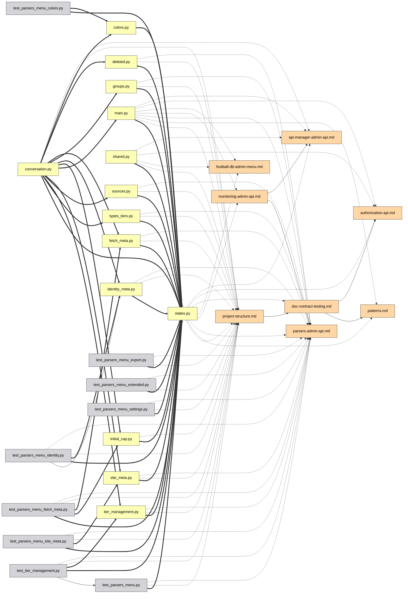

# UI-Leitfaden

**Deutsch** | [English](../docs/guide.md) | [Español](guide.es.md) | [Français](guide.fr.md) | [Italiano](guide.it.md) | [日本語](guide.ja.md) | [한국어](guide.ko.md) | [Português](guide.pt.md) | [Русский](guide.ru.md) | [中文](guide.zh.md)

Jede Funktion des interaktiven Graphen, eine nach der anderen. Probieren Sie
sie live in der [Demo](https://mr-freewan.github.io/build-graph/) aus — es ist
der Graph des build-graph-Repositorys selbst, mit einem synthetischen
Git-Overlay.

---

## Navigation

Der Graph ist eine einzige Leinwand: **Scrollen zoomt, das Ziehen des
Hintergrunds verschiebt die Ansicht, das Ziehen eines Knotens bewegt ihn**.
Knotenbeschriftungen blenden sich ein, sobald der Zoom die Schwelle *Show at
zoom* überschreitet (Viewport-Culling und Label-LOD halten 1000+ Knoten
flüssig). Die Fadenkreuz-Schaltfläche in der oberen Leiste setzt die Ansicht
zurück; der Zähler in der linken unteren Ecke zeigt, wie viele Knoten und
Kanten auf der Karte sind.

Das Überfahren eines Knotens hebt ihn samt seinen direkten Nachbarn hervor und
dimmt alles andere ab; das Überfahren einer Kante zeigt einen Tooltip mit dem
Kantentyp, Quelle → Ziel und den genauen Zeilennummern hinter der Beziehung.

## Bedienfelder

Alle sieben Bedienfelder sind **verschiebbar** — fassen Sie den gepunkteten
Griff in der Kopfzeile an. Die drei Hauptpanels (Graph controls, Legende,
Exclude by name) **klappen** per Klick auf die Titelzeile in diese ein (der
Chevron zeigt den Zustand). Das Info-Panel lässt sich auf beiden Achsen
skalieren, Graph controls — horizontal. Positionen, Größen und Einklappzustände
werden in `localStorage` gespeichert und überstehen ein Neuladen; schrumpft das
Fenster, klemmen sich die Panels in den Viewport und kehren an ihren
gespeicherten Platz zurück, wenn es wieder wächst.

In der oberen rechten Ecke sitzen die Erscheinungsbild-Schalter: **10
UI-Sprachen** (DE / EN / ES / FR / IT / JA / KO / PT / RU / ZH), **dunkles /
helles Theme** und **pastellfarbene / gesättigte Palette** — die beiden
Paletten sind farbtonangeglichen, sodass ein Wechsel nie neu durchmischt, welche
Farbe was bedeutet. Kantenfarben und Legenden-Farbfelder folgen der Palette
ebenfalls. Das eingebaute FAQ (die `?`-Schaltfläche, 50+ Antworten in allen 10
Sprachen) taucht hier ebenfalls auf.

## Graph controls

Das linke Panel justiert das Bild und die Physik:

- **Nodes & edges** — Farbkontrast, Knotengröße, Kantenbreite, Kantendeckkraft.
- **Labels** — Schriftgröße und die Zoomstufe, ab der Beschriftungen erscheinen.
- **Physics** — Abstoßung und Verbindungskraft; Änderungen starten die
  Simulation live neu.
- **Release pinned** löst alle fest angehefteten Knoten; **Rebuild physics**
  heizt das Layout neu auf (angeheftete Knoten behalten ihren Platz — Anheften
  schlägt Neuaufbau).

## Suche und Ausschluss

Das Suchfeld (`Ctrl/Cmd+K`) matcht Knotennamen **und Pfade** — die Eingabe von
`handlers/` lässt den ganzen Teilbaum aufleuchten. Die `×`-Schaltfläche oder
`Esc` leert es.

**Exclude by name** entfernt Rauschen: Fügen Sie ein Muster hinzu, und passende
Knoten werden vom Feld genommen; ausgeschlossene Knoten werden eingefroren,
damit das Layout nicht springt. Rebuild physics lässt die Verbliebenen in den
frei gewordenen Raum nachfließen.

## Filtern über die Legende

Die Legende ist interaktiv:

- **Klick auf einen Knotentyp** blendet ihn aus/ein; die Augen-Schaltflächen
  zeigen/verbergen alle auf einmal.
- **🎯 isolate** in einer beliebigen Zeile behält nur diesen Typ (erneuter Klick
  macht es rückgängig).
- **Klick auf einen Kantentyp** blendet diese Kanten aus — Knoten, die ohne
  sichtbare Verbindungen zurückbleiben, verschwinden ebenfalls, sodass „nur
  `docstring`-Kanten" einen sauberen docstring-Teilgraphen ergeben, keine Wolke
  unverbundener Punkte.
- **Orphans only** zeigt nur die Dateien, auf die nichts verweist.

## Einen Knoten inspizieren

Verweilt der Cursor kurz auf einem Knoten, erscheint ein kleiner **Tooltip** mit
Name und Pfad — ein schnellerer Blick als das Öffnen des vollen Panels darunter.
Im Heat- oder Coverage-Modus fügt er die Zahl hinter der Farbe hinzu (Anzahl der
Änderungen / Coverage-%), die sonst nur per Klick sichtbar ist. Die Verzögerung
ist bewusst länger als ein typischer Hover-Effekt, damit das Streichen des
Cursors über viele Knoten nicht pro Knoten einen Tooltip aufblitzen lässt.
Kanten-Tooltips (unten) sind aus, solange der Heat- oder Coverage-Modus aktiv ist
— Kanten behalten dort ihre normale Typfarbe, sodass ein Überfahren nichts
Nützliches zu sagen hat.

Klicken Sie einen Knoten an — das **Info-Panel** öffnet sich und die Auswahl
bleibt hervorgehoben (angeheftet), nachdem der Cursor sie verlassen hat:

- Der Pfad wird als **anklickbare Breadcrumbs** dargestellt — klicken Sie ein
  Verzeichnissegment an, und es wird zur Suchanfrage.
- Verbindungen sind gruppiert: `filename:line [type] ▸ +N` — aufklappen, um
  jede Zeile zu sehen, in der die Beziehung auftritt.
- Der **IDE-Selektor** (VS Code / Cursor / PyCharm / Copy path) macht aus jeder
  Datei einen Deep Link — öffnen Sie die exakte file:line direkt aus dem
  Browser.

Ist ein Knoten angeheftet, blickt das Überfahren eines seiner Nachbarn eine
Ebene tiefer: Die Hervorhebung wird zur Vereinigung beider Nachbarschaften — ein
schneller Zwei-Schritt-Gang durch die Abhängigkeitskette, ohne den Platz zu
verlieren.

## Knoten fixieren

Zwei Wege, einen Knoten an die Leinwand zu heften:

- **Doppelklick** darauf, oder
- **B** drücken, während der Cursor darüber ist — funktioniert sogar mitten im
  Ziehen: einen Knoten beiseiteziehen, B drücken, loslassen — er bleibt.

Angeheftete Knoten zeigen eine 📌-Markierung, überstehen Rebuild physics und
werden entweder durch einen weiteren Doppelklick oder global über **Release
pinned** gelöst.

## Pfad zwischen zwei Knoten

**Shift+Klick** auf zwei Knoten liefert den kürzesten Abhängigkeitspfad zwischen
ihnen (ungerichtetes BFS): Endpunkte und Pfadkanten werden violett, der Rest
dimmt ab. Existiert kein Pfad, sagt das ein Toast. `Esc` oder ein Klick auf den
Hintergrund leert ihn.

## Eine Kante fokussieren

Klicken Sie eine Kante an, um sie zu isolieren: Nur Quelle und Ziel bleiben
beleuchtet (mit erzwungenen Beschriftungen), sodass Sie genau ablesen können,
welche zwei Dateien die Beziehung verbindet. `Esc` oder ein Klick auf den
Hintergrund gibt sie frei.

## Git-Modus

Die **Git**-Schaltfläche schaltet die Knotenfarben von Typen auf den **Status
des Arbeitsverzeichnisses** um: added / modified / renamed / deleted / clean. Es
erscheinen Extras, die eine schlichte Einfärbung nicht zeigen kann:

- **Ghost-Knoten** (gestrichelter Umriss) — gelöschte Dateien, auf die Docs noch
  verweisen, und die alten Hälften von Umbenennungen.
- **Umbenennungskanten** (gestrichelt, ohne Pfeil) — alter Ghost → neuer
  lebender Knoten.
- Die Legende schaltet auf Git-Status um, mit demselben Klick-Filter, denselben
  Augen-Schaltflächen und 🎯-Isolation.

Die Schaltfläche ist deaktiviert (mit Tooltip), wenn Git nicht verfügbar ist.
Für Demos und Screenshots backt `--mock-git` ein synthetisches Overlay, das alle
fünf Kategorien abdeckt.

## Graph-Diff

Bauen Sie mit `--diff-base REF`, um das Arbeitsverzeichnis mit einer
Git-Referenz (Branch, Tag, Commit) zu vergleichen — eine Code-Review-Ansicht des
Abhängigkeitsgraphen. Die Seite öffnet sich mit bereits aktivem Git-Overlay:
Dateistatus kommt wie üblich aus Git, während Abhängigkeitskanten, die **seit
der Referenz neu sind, grün gerendert** werden und **entfernte rot**
(gestrichelt), verankert an Ghost-Knoten, wenn die Datei weg ist. Die
Git-Legende bekommt +N/−N-Kantenzähler und ihr Titel zeigt den verglichenen
Bereich. Umbenennungen werden verfolgt — eine Kante, die lediglich mit einer
umbenannten Datei mitgezogen ist, bleibt neutral.

Fügen Sie `--diff-head REF` hinzu, um statt des Arbeitsverzeichnisses zwei
bestimmte Referenzen zu vergleichen — beide Seiten werden aus `git
archive`-Snapshots gebaut, sodass Arbeitsverzeichnis-Änderungen nach der
Head-Referenz nicht Teil des Diffs sind. Ohne es vergleicht `--diff-base` allein
weiterhin wie zuvor gegen das Arbeitsverzeichnis.

## Heat-Modus

Die **Heatmap**-Schaltfläche schaltet die Knotenfarben von Typen auf die
**Häufigkeit der Git-Aktivität** um: ein Blau→Rot-Verlauf danach, wie oft sich
jede Datei geändert hat, logarithmisch skaliert, damit eine Handvoll ständig
bearbeiteter Dateien nicht alles andere in denselben Ton wäscht. Standardmäßig
deckt er die gesamte Historie ab; bauen Sie mit `--heat-days N`, um ihn
stattdessen auf die letzten N Tage zu beschränken. Das Panel **Activity heat**
zeigt den Erfassungszeitraum und den rohen Commit-Anzahl-Bereich (`0` bis zur
Anzahl der heißesten Datei) sowie einen **min-edits-Slider** — ziehen Sie ihn
hoch, um alles zu verbergen, was kälter als die gewählte Schwelle ist
(verbundene Kanten verbergen sich mit). „Clear filters" setzt ihn zusammen mit
allem anderen auf 0 zurück.

Anders als der Git-Modus ist der Heat-Modus additiv: Node types (und Edge types
und der Rest der Legende) bleiben unter dem Activity-heat-Panel genau wie sie
sind, weiterhin wie gewohnt nach Typ filterbar — Heat ändert nur, in welcher
Farbe ein Knoten gezeichnet wird, es definiert nicht neu, was „Typ" bedeutet.
Heat und Git-Modus schließen einander weiterhin gegenseitig aus: Beide färben
Knoten um, also schaltet das Einschalten des einen das andere aus. Die
Schaltfläche ist deaktiviert (mit Tooltip), wenn Git nicht verfügbar ist.

## Coverage-Modus

Die **Cov.**-Schaltfläche schaltet die Knotenfarben von Typen auf die
**Testzeilen-Abdeckung** um: ein Grün→Rot-Verlauf aus einer
Cobertura-`coverage.xml` (bauen Sie mit `--coverage PATH`, z. B. dem Bericht aus
`pytest --cov=your_pkg --cov-report=xml` — `--cov` braucht den Paketnamen;
`--cov-report=xml` allein sammelt nichts).
Die Richtung ist bewusst gegenüber dem Heat-Modus umgekehrt: Der ganze Sinn
dieses Overlays ist, schlecht abgedeckte Dateien zu finden, also sitzt Grün
(100%, gut) links und Rot (0%, schlecht) rechts. Der Slider darunter ist eine
**Obergrenze, kein Boden**: Ziehen Sie ihn von 100% herunter, und er verbirgt
alles, was *mehr* als dieser Prozentsatz abgedeckt ist, sodass nur die am
schlechtesten abgedeckten Dateien auf dem Bildschirm bleiben — das Gegenteil des
min-edits-Sliders von Heat, der stattdessen die geschäftigsten Dateien behält.
Dasselbe additive Verhalten wie im Heat-Modus (Node types bleibt darunter
nutzbar) und derselbe Drei-Wege-Ausschluss mit Git und Heat — nur einer der drei
kann Knoten gleichzeitig umfärben.

Anders als Git und Heat, deren Schaltflächen in der Leiste bleiben (deaktiviert,
mit Tooltip), wenn ihre Datenquelle nicht verfügbar ist, wird die
Coverage-Schaltfläche **vollständig ausgeblendet**, wenn zur Build-Zeit keine
`coverage.xml` angegeben wurde — Coverage auszuführen ist opt-in und weit
weniger universell als eine Git-Historie zu haben, sodass eine dauerhaft
ausgegraute Schaltfläche nur Unordnung wäre.

Das Einschalten des Coverage-Modus blendet in der Legende außerdem automatisch
jeden Node type außer `code/*` aus — ein Coverage-Bericht kann nie etwas über
Docs- oder Konfigurationsdateien aussagen, also gibt es keinen Grund, die
Ansicht mit Knoten zu überladen, die immer neutralgrau gerendert werden. Es ist
derselbe Ausblendmechanismus wie ein Klick auf einen Typ in der Legende, nur
vorab angewandt: Jede Kategorie kann von dort wieder eingeblendet werden.

## Analysehilfen

**💀 Dead code** (Legende, erscheint bei Kandidaten) hebt Dateien ohne
eingehende Importe und ohne Dokumentationserwähnungen hervor. Einstiegspunkte
sind automatisch ausgenommen: `[project.scripts]` aus `pyproject.toml`,
`main.py`, `__init__.py`, `conftest.py`, `test_*.py`, plus alles, was von den
`[dead_code].exempt`-Globs in `graph.toml` erfasst wird. Der 💀-Umschalter ist am
Ende des Git-Modus-Clips oben zu sehen.

**Cycles** (Legende, erscheint, wenn Import-Schleifen existieren) hebt stark
zusammenhängende Komponenten im Laufzeit-`code->code`-Importgraphen hervor:
Schleifenkanten werden korallenrot, Schleifenmitglieder bekommen einen
korallenroten Ring, alles andere verblasst. Reine Typ-Importe (`TYPE_CHECKING`)
zählen nicht — sie sind der legale Weg, einen Zyklus zu brechen. Der Zähler ist
die Anzahl unabhängiger Schleifen, und während ein solcher Modus aktiv ist,
ignorieren verblasste Knoten und Kanten den Zeiger — ein Überfahren lässt sie
nicht aufleuchten.

**Orphan ring** — Dateien mit Grad null sind nicht verstreut; sie sitzen auf
einem Kreis um den lebenden Cluster, sodass „verbundener Kern vs. lose Dateien"
auf einen Blick lesbar ist. Dateien, die die Autoerkennung nicht klassifizieren
konnte, bekommen einen bernsteinfarbenen Ring und ihre eigene Zähler-Schaltfläche
in der oberen Leiste.

**Ambiguous group nodes** — ein Dokument, das einen nackten Dateinamen wie
`__init__.py` oder `config.py` ohne Pfad erwähnt (und außerhalb einer
Dateibaum-Auflistung), kann nicht zu einer bestimmten Datei aufgelöst werden,
wenn Dutzende Dateien diesen Namen teilen. Statt zu raten und die Kante auf jede
gleichnamige Datei aufzufächern, wird diese Erwähnung einem einzigen
synthetischen Knoten in seiner eigenen `ambiguous`-Legendenkategorie
zugeschrieben, beschriftet mit der Trefferzahl (`__init__.py (×N)`). Dahinter
steht keine echte Datei — ein Klick zeigt nur das Label, kein IDE-Öffnen oder
Copy-Path. Seine **Connections**-Liste ist allerdings ganz normal: Jedes
Dokument, das den nackten Namen erwähnt, ist mit den genauen Zeilennummern und
IDE-Öffnen-Link aufgeführt — klicken Sie sich durch, und wenn die Erwähnung auf
eine bestimmte Datei zeigen soll, schreiben Sie sie als expliziten Pfad um
(`dir/config.py` statt nacktem `config.py`), damit sie beim nächsten Build
direkt zu dieser Datei aufgelöst wird.

## Teilen und Export

Das **File-Menü** sammelt die Ausgaben:

- **Copy link** — die aktuelle Ansicht (Sprache, Theme, Palette, Filter,
  Git-Modus, Suche, angeheftete Auswahl), im URL-Hash kodiert. Öffnen Sie den
  Link — sehen Sie dasselbe Bild. Persönliche Einstellungen (Panel-Positionen,
  Slider, IDE-Wahl) bleiben bewusst aus der URL heraus.
- **Copy as Mermaid** — der fokussierte Teilgraph (Pfad > Kantenfokus >
  angehefteter Knoten + Nachbarn > Suchergebnisse) als `flowchart LR`-Snippet,
  wobei der Pfeilstil den Kantentyp kodiert. Fügen Sie es in eine
  PR-Beschreibung ein.
- **Copy JSON** — die vollständigen Graphdaten für einen LLM-Agenten (dieselben
  Daten wie die CLI-Flags `--json` / `--compact`).
- **Export / Import prefs** — verschieben Sie Ihr gesamtes Setup (Positionen,
  Slider, Filter, Theme) als JSON-Datei auf eine andere Maschine.

Ein echtes *Copy as Mermaid*-Beispiel — ein Admin-Subsystem per Suche isoliert,
exportiert, unverändert in Markdown eingefügt:

Der exportierte Mermaid-Quelltext hinter diesem Bild

## FAQ und Tastenkürzel

Die `?`-Schaltfläche öffnet ein eingebautes FAQ — 50+ Antworten in allen 10
Sprachen, die alles auf dieser Seite abdecken (Sie sehen es im
Bedienfelder-Clip oben geöffnet).

| Taste | Aktion |
|-------|--------|
| `Esc` | schließt der Reihe nach: File-Menü → FAQ → Info-Panel → Kantenfokus → Suche leeren |
| `Space` | Physik pausieren / fortsetzen |
| `Ctrl/Cmd+K` | Suchfeld fokussieren |
| `B` | Knoten unter dem Cursor an-/abheften (funktioniert mitten im Ziehen) |
| `Shift+Klick` × 2 | kürzester Pfad zwischen zwei Knoten |
| Doppelklick | einen Knoten an Ort und Stelle an-/abheften |
