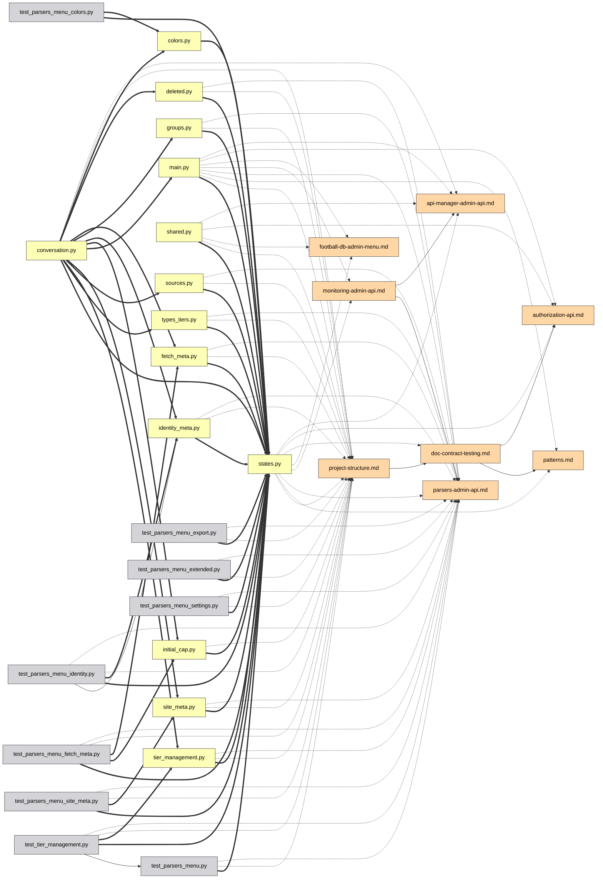

# Guía de la interfaz

[Deutsch](guide.de.md) | [English](../docs/guide.md) | **Español** | [Français](guide.fr.md) | [Italiano](guide.it.md) | [日本語](guide.ja.md) | [한국어](guide.ko.md) | [Português](guide.pt.md) | [Русский](guide.ru.md) | [中文](guide.zh.md)

Cada función del grafo interactivo, una por una. Pruébalas en vivo en la
[demo](https://mr-freewan.github.io/build-graph/) — es el grafo del propio
repositorio build-graph, con una superposición de git sintética activada.

---

## Cómo moverse

El grafo es un único lienzo: **desplázate para hacer zoom, arrastra el fondo
para desplazar la vista, arrastra un nodo para moverlo**. Las etiquetas de los
nodos aparecen a medida que el zoom supera el umbral *Show at zoom* (el descarte
por viewport y el LOD de etiquetas mantienen fluidos más de 1000 nodos). El
botón de mira en la barra superior restablece la vista; el contador en la
esquina inferior izquierda muestra cuántos nodos y aristas hay en el mapa.

Al pasar el cursor sobre un nodo se resalta junto con sus vecinos directos y se
atenúa todo lo demás; al pasar sobre una arista se muestra un tooltip con el
tipo de arista, origen → destino y los números de línea exactos detrás de la
relación.

## Paneles

Los siete paneles son **arrastrables** — agarra el asa punteada de la cabecera.
Los tres paneles principales (Graph controls, leyenda, Exclude by name) se
**colapsan** en su barra de título al hacer clic en ella (el chevrón muestra el
estado). El panel de información se redimensiona en ambos ejes, Graph controls —
horizontalmente. Las posiciones, tamaños y estados colapsados persisten en
`localStorage` y sobreviven a una recarga; cuando la ventana se encoge, los
paneles se ajustan al viewport y vuelven a su sitio guardado cuando vuelve a
crecer.

En la esquina superior derecha están los interruptores de apariencia: **10
idiomas de interfaz** (DE / EN / ES / FR / IT / JA / KO / PT / RU / ZH), **tema
oscuro / claro** y **paleta pastel / saturada** — las dos paletas están
alineadas en tono, así que cambiar nunca reordena qué color significa qué. Los
colores de las aristas y las muestras de la leyenda también siguen la paleta. El
FAQ integrado (el botón `?`, más de 50 respuestas en los 10 idiomas) también
aparece aquí.

## Controles del grafo

El panel izquierdo ajusta la imagen y la física:

- **Nodes & edges** — contraste de color, escala de nodos, ancho de aristas,
  opacidad de aristas.
- **Labels** — tamaño de fuente y el nivel de zoom en el que aparecen las
  etiquetas.
- **Physics** — repulsión y fuerza de enlace; los cambios reinician la
  simulación en vivo.
- **Release pinned** libera todos los nodos fijados; **Rebuild physics**
  recalienta el layout (los nodos fijados conservan su lugar — la fijación gana
  sobre la reconstrucción).

## Búsqueda y exclusión

El campo de búsqueda (`Ctrl/Cmd+K`) coincide con nombres de nodos **y rutas** —
escribir `handlers/` ilumina todo el subárbol. El botón `×` o `Esc` lo borra.

**Exclude by name** elimina ruido: añade un patrón y los nodos coincidentes se
retiran del tablero; los nodos excluidos se congelan para que el layout no
salte. Rebuild physics hace que los supervivientes fluyan hacia el espacio
liberado.

## Filtrado por leyenda

La leyenda es interactiva:

- **Clic en un tipo de nodo** para ocultarlo/mostrarlo; los botones de ojo
  muestran/ocultan todos a la vez.
- **🎯 isolate** en cualquier fila conserva solo ese tipo (clic de nuevo para
  deshacer).
- **Clic en un tipo de arista** para ocultar esas aristas — los nodos que quedan
  sin conexiones visibles también desaparecen, así que «solo aristas
  `docstring`» te da un subgrafo docstring limpio, no una nube de puntos
  inconexos.
- **Orphans only** muestra solo los archivos a los que no enlaza nada.

## Inspeccionar un nodo

Mantener el cursor un momento sobre un nodo muestra un pequeño **tooltip** con su
nombre y ruta — un vistazo más rápido que abrir el panel completo de abajo. En
modo Heat o Coverage añade el número detrás del color (número de ediciones / %
de cobertura), que de otro modo solo se ve al hacer clic. El retardo es
deliberadamente más largo que un efecto de hover típico para que barrer el
cursor por muchos nodos no haga parpadear un tooltip por cada uno. Los tooltips
de aristas (abajo) se apagan mientras el modo Heat o Coverage está activo — allí
las aristas conservan su color de tipo normal, así que pasar el cursor por una
no tiene nada útil que decir.

Haz clic en un nodo — se abre el **panel de información** y la selección
permanece resaltada (fijada) después de que el cursor la abandone:

- La ruta se representa como **migas de pan clicables** — haz clic en un segmento
  de directorio y se convierte en la consulta de búsqueda.
- Las conexiones están agrupadas: `filename:line [type] ▸ +N` — despliega para
  ver cada línea donde ocurre la relación.
- El **selector de IDE** (VS Code / Cursor / PyCharm / Copy path) convierte cada
  archivo en un deep link — abre el file:line exacto directamente desde el
  navegador.

Con un nodo fijado, pasar el cursor por cualquiera de sus vecinos asoma un nivel
más profundo: el resaltado se convierte en la unión de ambas vecindades — un
rápido recorrido de dos pasos por la cadena de dependencias sin perder tu sitio.

## Fijar nodos en su sitio

Dos formas de clavar un nodo al lienzo:

- **Doble clic** en él, o
- pulsa **B** mientras pasas el cursor — funciona incluso a mitad de arrastre:
  arrastra un nodo a un lado, pulsa B, suelta — se queda.

Los nodos fijados muestran un marcador 📌, sobreviven a Rebuild physics y se
liberan con otro doble clic o globalmente con **Release pinned**.

## Ruta entre dos nodos

**Shift+clic** en dos nodos para obtener la ruta de dependencias más corta entre
ellos (BFS no dirigido): los extremos y las aristas de la ruta se vuelven
púrpura, el resto se atenúa. Si no existe ruta, un toast lo indica. `Esc` o un
clic en el fondo lo borra.

## Enfocar una arista

Haz clic en una arista para aislarla: solo el origen y el destino permanecen
iluminados (con sus etiquetas forzadas), así puedes leer exactamente qué dos
archivos vincula la relación. `Esc` o un clic en el fondo la libera.

## Modo Git

El botón **Git** cambia los colores de los nodos de tipos a **estado del árbol
de trabajo**: added / modified / renamed / deleted / clean. Aparecen extras que
una coloración simple no puede mostrar:

- **Nodos fantasma** (contorno discontinuo) — archivos borrados que los docs aún
  referencian, y las mitades antiguas de los renombrados.
- **Aristas de renombrado** (discontinuas, sin flecha) — fantasma antiguo →
  nodo vivo nuevo.
- La leyenda cambia a estados git con el mismo clic-para-filtrar, botones de ojo
  y aislamiento 🎯.

El botón está deshabilitado (con un tooltip) cuando git no está disponible. Para
demos y capturas, `--mock-git` hornea una superposición sintética que cubre las
cinco categorías.

## Diff del grafo

Compila con `--diff-base REF` para comparar el árbol de trabajo con una
referencia git (rama, etiqueta, commit) — una vista de revisión de código del
grafo de dependencias. La página se abre con la superposición Git ya activada:
los estados de archivo vienen de git como de costumbre, mientras que las aristas
de dependencia **nuevas desde la referencia se renderizan en verde** y las
**eliminadas en rojo** (discontinuas), ancladas a nodos fantasma cuando el
archivo ya no está. La leyenda git gana contadores de aristas +N/−N y su título
muestra el rango comparado. Los renombrados se siguen — una arista que
simplemente se movió con un archivo renombrado permanece neutral.

Añade `--diff-head REF` para comparar dos referencias específicas en lugar del
árbol de trabajo — ambos lados se construyen a partir de instantáneas de `git
archive`, así que los cambios en el árbol de trabajo hechos después de la
referencia head no forman parte del diff. Sin él, `--diff-base` por sí solo
sigue comparando con el árbol de trabajo como antes.

## Modo Heat

El botón **Heatmap** cambia los colores de los nodos de tipos a **frecuencia de
actividad git**: un degradado azul→rojo según con qué frecuencia ha cambiado
cada archivo, en escala logarítmica para que un puñado de archivos editados
constantemente no diluya todo lo demás en el mismo tono. Por defecto cubre todo
el historial; compila con `--heat-days N` para restringirlo a los últimos N
días. El panel **Activity heat** muestra el periodo de recolección y el rango
bruto de número de commits (`0` hasta el conteo del archivo más caliente), más
un **deslizador min-edits** — arrástralo hacia arriba para ocultar todo lo más
frío que el umbral elegido (las aristas conectadas se ocultan con él). «Clear
filters» lo restablece a 0 junto con todo lo demás.

A diferencia del modo Git, el modo Heat es aditivo: Node types (y Edge types, y
el resto de la leyenda) permanecen exactamente como están debajo del panel
Activity heat, aún filtrables por tipo como siempre — heat solo cambia de qué
color se dibuja un nodo, no redefine qué significa «tipo». Heat y modo Git siguen
siendo mutuamente excluyentes entre sí: ambos recolorean nodos, así que activar
uno desactiva el otro. El botón está deshabilitado (con un tooltip) cuando git
no está disponible.

## Modo Coverage

El botón **Cov.** cambia los colores de los nodos de tipos a **cobertura de
líneas por tests**: un degradado verde→rojo de un `coverage.xml` de Cobertura
(compila con `--coverage PATH`, p. ej. el informe de `pytest --cov=your_pkg
--cov-report=xml` — `--cov` necesita el nombre del paquete; `--cov-report=xml`
por sí solo no recolecta nada).
La dirección está deliberadamente invertida respecto al modo Heat: el objetivo
de esta superposición es encontrar archivos mal cubiertos, así que el verde
(100%, bueno) está a la izquierda y el rojo (0%, malo) a la derecha. El
deslizador debajo es un **techo, no un suelo**: arrástralo hacia abajo desde
100% y oculta todo lo cubierto *más* que ese porcentaje, dejando en pantalla
solo los archivos peor cubiertos — lo contrario del deslizador min-edits de
Heat, que en cambio conserva los archivos más activos. El mismo comportamiento
aditivo que el modo Heat (Node types sigue usable debajo) y la misma exclusión
mutua a tres bandas con Git y Heat — solo uno de los tres puede recolorear nodos
a la vez.

A diferencia de Git y Heat, cuyos botones permanecen en la barra
(deshabilitados, con un tooltip) cuando su fuente de datos no está disponible, el
botón Coverage está **completamente oculto** cuando no se proporcionó ningún
`coverage.xml` en tiempo de compilación — ejecutar cobertura es opcional y mucho
menos universal que tener un historial git, así que un botón permanentemente en
gris solo sería estorbo.

Activar el modo Coverage también oculta automáticamente en la leyenda todos los
Node types excepto `code/*` — un informe de cobertura nunca puede decir nada
sobre archivos de documentación o configuración, así que no tiene sentido
saturar la vista con nodos que siempre se renderizarán en gris neutro. Es el
mismo mecanismo de ocultar que hacer clic en un tipo en la leyenda, solo que
preaplicado: cualquier categoría se puede volver a mostrar desde ahí.

## Ayudas de análisis

**💀 Dead code** (leyenda, aparece cuando hay candidatos) resalta archivos sin
importaciones entrantes y sin menciones en la documentación. Los puntos de
entrada están exentos automáticamente: `[project.scripts]` de `pyproject.toml`,
`main.py`, `__init__.py`, `conftest.py`, `test_*.py`, más todo lo que coincida
con los globs `[dead_code].exempt` en `graph.toml`. El interruptor 💀 se ve al
final del clip del modo Git de arriba.

**Cycles** (leyenda, aparece cuando existen bucles de importación) resalta los
componentes fuertemente conexos en el grafo de importaciones `code->code` en
tiempo de ejecución: las aristas del bucle se vuelven coral, los miembros del
bucle obtienen un anillo coral, todo lo demás se desvanece. Las importaciones
solo de tipo (`TYPE_CHECKING`) no cuentan — son la forma legal de romper un
ciclo. El contador es el número de bucles independientes, y mientras un modo
como este está activo, los nodos y aristas desvanecidos ignoran el puntero —
pasar el cursor por encima no los ilumina.

**Orphan ring** — los archivos de grado cero no están dispersos; se sitúan en un
círculo alrededor del clúster vivo, así «núcleo conectado vs. archivos sueltos»
es legible de un vistazo. Los archivos que la autodetección no pudo clasificar
obtienen un anillo ámbar y su propio botón contador en la barra superior.

**Ambiguous group nodes** — un documento que menciona un nombre de archivo
desnudo como `__init__.py` o `config.py` sin ruta (y fuera de un listado de
árbol de archivos) no puede resolverse a un archivo específico cuando docenas de
archivos comparten ese nombre. En lugar de adivinar y abanicar la arista a cada
archivo homónimo, esa mención se atribuye a un único nodo sintético en su propia
categoría de leyenda `ambiguous`, etiquetado con el número de coincidencias
(`__init__.py (×N)`). No tiene un archivo real detrás — hacer clic muestra solo
la etiqueta, sin abrir en IDE ni copiar ruta. Sin embargo, su lista de
**Connections** es totalmente normal: cada documento que menciona el nombre
desnudo aparece con los números de línea exactos, enlace de abrir en IDE
incluido — recórrelos, y si la mención debe apuntar a un archivo específico,
reescríbela como ruta explícita (`dir/config.py` en lugar de `config.py`
desnudo) para que se resuelva directamente a ese archivo en la siguiente
compilación.

## Compartir y exportar

El **menú File** reúne las salidas:

- **Copy link** — la vista actual (idioma, tema, paleta, filtros, modo git,
  búsqueda, selección fijada) codificada en el hash de la URL. Abre el enlace —
  verás la misma imagen. Las preferencias personales (posiciones de paneles,
  deslizadores, elección de IDE) se quedan deliberadamente fuera de la URL.
- **Copy as Mermaid** — el subgrafo enfocado (ruta > enfoque de arista > nodo
  fijado + vecinos > resultados de búsqueda) como un fragmento `flowchart LR`,
  con el estilo de flecha codificando el tipo de arista. Pégalo en una
  descripción de PR.
- **Copy JSON** — los datos completos del grafo para un agente LLM (los mismos
  datos que los flags de CLI `--json` / `--compact`).
- **Export / Import prefs** — mueve toda tu configuración (posiciones,
  deslizadores, filtros, tema) a otra máquina como archivo JSON.

Un ejemplo real de *Copy as Mermaid* — un subsistema admin aislado mediante
búsqueda, exportado, pegado en markdown tal cual:

El código fuente Mermaid exportado detrás de esa imagen

## FAQ y atajos

El botón `?` abre un FAQ integrado — más de 50 respuestas en los 10 idiomas, que
cubren todo lo de esta página (puedes verlo abierto en el clip de Paneles de
arriba).

| Tecla | Acción |
|-------|--------|
| `Esc` | cierra cosas, en orden: menú File → FAQ → panel de información → enfoque de arista → borrar búsqueda |
| `Space` | pausar / reanudar la física |
| `Ctrl/Cmd+K` | enfocar el campo de búsqueda |
| `B` | fijar/desfijar el nodo bajo el cursor (funciona a mitad de arrastre) |
| `Shift+clic` × 2 | ruta más corta entre dos nodos |
| doble clic | fijar/desfijar un nodo en su sitio |
