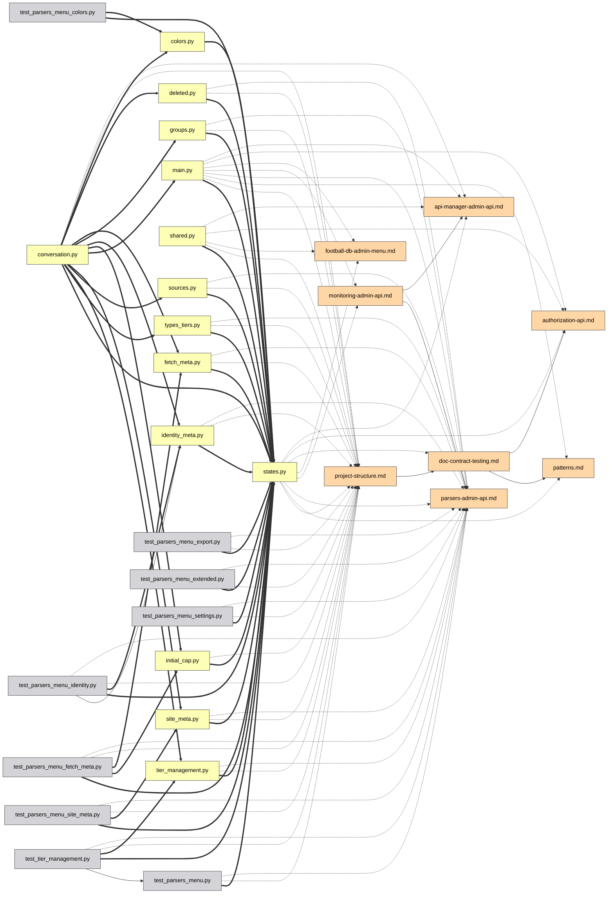

# Guide de l'interface

[Deutsch](guide.de.md) | [English](../docs/guide.md) | [Español](guide.es.md) | **Français** | [Italiano](guide.it.md) | [日本語](guide.ja.md) | [한국어](guide.ko.md) | [Português](guide.pt.md) | [Русский](guide.ru.md) | [中文](guide.zh.md)

Chaque fonctionnalité du graphe interactif, une par une. Essayez-les en direct
sur la [démo](https://mr-freewan.github.io/build-graph/) — c'est le graphe du
dépôt build-graph lui-même, avec une surcouche git synthétique activée.

---

## Se déplacer

Le graphe est une seule toile : **faites défiler pour zoomer, faites glisser
l'arrière-plan pour vous déplacer, faites glisser un nœud pour le déplacer**.
Les étiquettes des nœuds apparaissent en fondu à mesure que le zoom dépasse le
seuil *Show at zoom* (le culling du viewport et le LOD des étiquettes gardent
1000+ nœuds fluides). Le bouton en croix de la barre supérieure réinitialise la
vue ; le compteur dans le coin inférieur gauche indique combien de nœuds et
d'arêtes sont sur la carte.

Survoler un nœud le met en évidence avec ses voisins directs et estompe tout le
reste ; survoler une arête affiche une infobulle avec le type d'arête, source →
cible et les numéros de ligne exacts derrière la relation.

## Panneaux

Les sept panneaux sont **déplaçables** — attrapez la poignée pointillée de
l'en-tête. Les trois panneaux principaux (Graph controls, légende, Exclude by
name) se **replient** dans leur barre de titre au clic sur celle-ci (le chevron
indique l'état). Le panneau d'info se redimensionne sur les deux axes, Graph
controls — horizontalement. Les positions, tailles et états repliés persistent
dans `localStorage` et survivent à un rechargement ; quand la fenêtre rétrécit,
les panneaux se calent dans le viewport et reviennent à leur place enregistrée
quand elle s'agrandit à nouveau.

Le coin supérieur droit héberge les commutateurs d'apparence : **10 langues
d'interface** (DE / EN / ES / FR / IT / JA / KO / PT / RU / ZH), **thème sombre
/ clair** et **palette pastel / saturée** — les deux palettes sont alignées en
teinte, donc changer ne rebat jamais quelle couleur signifie quoi. Les couleurs
des arêtes et les pastilles de la légende suivent aussi la palette. La FAQ
intégrée (le bouton `?`, 50+ réponses dans les 10 langues) fait aussi son
apparition ici.

## Contrôles du graphe

Le panneau de gauche règle l'image et la physique :

- **Nodes & edges** — contraste des couleurs, échelle des nœuds, largeur des
  arêtes, opacité des arêtes.
- **Labels** — taille de police et niveau de zoom auquel les étiquettes
  apparaissent.
- **Physics** — répulsion et force des liens ; les changements relancent la
  simulation en direct.
- **Release pinned** libère tous les nœuds épinglés ; **Rebuild physics**
  réchauffe la disposition (les nœuds épinglés gardent leur place — l'épinglage
  l'emporte sur la reconstruction).

## Recherche et exclusion

Le champ de recherche (`Ctrl/Cmd+K`) correspond aux noms de nœuds **et aux
chemins** — taper `handlers/` illumine tout le sous-arbre. Le bouton `×` ou
`Esc` l'efface.

**Exclude by name** supprime le bruit : ajoutez un motif et les nœuds
correspondants sont retirés du plateau ; les nœuds exclus sont figés pour que la
disposition ne saute pas. Rebuild physics fait refluer les survivants dans
l'espace libéré.

## Filtrage par la légende

La légende est interactive :

- **Cliquez sur un type de nœud** pour le masquer/afficher ; les boutons œil
  affichent/masquent tout d'un coup.
- **🎯 isolate** sur n'importe quelle ligne ne garde que ce type (recliquez pour
  annuler).
- **Cliquez sur un type d'arête** pour masquer ces arêtes — les nœuds laissés
  sans connexions visibles disparaissent aussi, donc « seulement les arêtes
  `docstring` » vous donne un sous-graphe docstring propre, pas un nuage de
  points déconnectés.
- **Orphans only** n'affiche que les fichiers vers lesquels rien ne pointe.

## Inspecter un nœud

Survoler un nœud un instant affiche une petite **infobulle** avec son nom et son
chemin — un coup d'œil plus rapide que d'ouvrir le panneau complet en dessous.
En mode Heat ou Coverage, elle ajoute le nombre derrière la couleur (nombre de
modifications / % de couverture), qui n'est autrement visible qu'en cliquant. Le
délai est délibérément plus long qu'un effet de survol typique afin que balayer
le curseur sur de nombreux nœuds ne fasse pas clignoter une infobulle par nœud.
Les infobulles d'arêtes (ci-dessous) s'éteignent tant que le mode Heat ou
Coverage est actif — les arêtes y gardent leur couleur de type normale, donc en
survoler une n'a rien d'utile à dire.

Cliquez sur un nœud — le **panneau d'info** s'ouvre et la sélection reste mise en
évidence (épinglée) après que le curseur l'a quittée :

- Le chemin est rendu sous forme de **fil d'Ariane cliquable** — cliquez sur un
  segment de répertoire et il devient la requête de recherche.
- Les connexions sont groupées : `filename:line [type] ▸ +N` — dépliez pour voir
  chaque ligne où la relation se produit.
- Le **sélecteur d'IDE** (VS Code / Cursor / PyCharm / Copy path) transforme
  chaque fichier en lien profond — ouvrez le file:line exact directement depuis
  le navigateur.

Un nœud étant épinglé, survoler l'un de ses voisins jette un œil un niveau plus
profond : la mise en évidence devient l'union des deux voisinages — une marche
rapide en deux pas le long de la chaîne de dépendances sans perdre votre place.

## Épingler des nœuds

Deux façons de clouer un nœud à la toile :

- **Double-cliquez** dessus, ou
- appuyez sur **B** en le survolant — fonctionne même en plein glissement :
  déplacez un nœud sur le côté, appuyez sur B, relâchez — il reste.

Les nœuds épinglés affichent un marqueur 📌, survivent à Rebuild physics et se
libèrent soit par un autre double-clic, soit globalement avec **Release
pinned**.

## Chemin entre deux nœuds

**Shift+clic** sur deux nœuds pour obtenir le plus court chemin de dépendances
entre eux (BFS non orienté) : les extrémités et les arêtes du chemin deviennent
violettes, le reste s'estompe. S'il n'existe aucun chemin, un toast le signale.
`Esc` ou un clic sur l'arrière-plan l'efface.

## Focaliser une arête

Cliquez sur une arête pour l'isoler : seuls la source et la cible restent
éclairées (avec leurs étiquettes forcées), afin que vous puissiez lire
exactement quels deux fichiers la relation lie. `Esc` ou un clic sur
l'arrière-plan la libère.

## Mode Git

Le bouton **Git** bascule les couleurs des nœuds des types au **statut de
l'arbre de travail** : added / modified / renamed / deleted / clean. Des extras
apparaissent qu'une coloration simple ne peut montrer :

- **Nœuds fantômes** (contour pointillé) — fichiers supprimés que les docs
  référencent encore, et les anciennes moitiés des renommages.
- **Arêtes de renommage** (pointillées, sans flèche) — ancien fantôme → nouveau
  nœud vivant.
- La légende bascule vers les statuts git avec le même clic-pour-filtrer, les
  mêmes boutons œil et l'isolation 🎯.

Le bouton est désactivé (avec une infobulle) quand git n'est pas disponible.
Pour les démos et captures, `--mock-git` cuit une surcouche synthétique couvrant
les cinq catégories.

## Diff du graphe

Construisez avec `--diff-base REF` pour comparer l'arbre de travail à une
référence git (branche, tag, commit) — une vue revue de code du graphe de
dépendances. La page s'ouvre avec la surcouche Git déjà activée : les statuts de
fichiers viennent de git comme d'habitude, tandis que les arêtes de dépendance
**nouvelles depuis la référence sont rendues en vert** et les **supprimées en
rouge** (pointillées), ancrées aux nœuds fantômes quand le fichier a disparu. La
légende git gagne des compteurs d'arêtes +N/−N et son titre montre la plage
comparée. Les renommages sont suivis — une arête qui a simplement bougé avec un
fichier renommé reste neutre.

Ajoutez `--diff-head REF` pour comparer deux références précises au lieu de
l'arbre de travail — les deux côtés sont construits à partir de snapshots `git
archive`, donc les changements de l'arbre de travail effectués après la
référence head ne font pas partie du diff. Sans lui, `--diff-base` seul compare
toujours à l'arbre de travail comme avant.

## Mode Heat

Le bouton **Heatmap** bascule les couleurs des nœuds des types à la **fréquence
d'activité git** : un dégradé bleu→rouge selon la fréquence de modification de
chaque fichier, à échelle logarithmique pour qu'une poignée de fichiers
constamment édités ne délave pas tout le reste dans la même teinte. Par défaut
il couvre tout l'historique ; construisez avec `--heat-days N` pour le
restreindre aux N derniers jours. Le panneau **Activity heat** montre la période
de collecte et la plage brute du nombre de commits (`0` jusqu'au compte du
fichier le plus chaud), plus un **curseur min-edits** — tirez-le vers le haut
pour masquer tout ce qui est plus froid que le seuil choisi (les arêtes
connectées se masquent avec). « Clear filters » le remet à 0 avec tout le reste.

Contrairement au mode Git, le mode Heat est additif : Node types (et Edge types,
et le reste de la légende) restent exactement tels quels sous le panneau
Activity heat, toujours filtrables par type comme d'habitude — heat change
seulement de quelle couleur un nœud est dessiné, il ne redéfinit pas ce que
« type » signifie. Heat et le mode Git restent mutuellement exclusifs l'un de
l'autre : les deux recolorent les nœuds, donc activer l'un désactive l'autre. Le
bouton est désactivé (avec une infobulle) quand git n'est pas disponible.

## Mode Coverage

Le bouton **Cov.** bascule les couleurs des nœuds des types à la **couverture de
lignes par les tests** : un dégradé vert→rouge à partir d'un `coverage.xml`
Cobertura (construisez avec `--coverage PATH`, p. ex. le rapport de `pytest
--cov=your_pkg --cov-report=xml` — `--cov` a besoin du nom du paquet ;
`--cov-report=xml` seul ne collecte rien).
La direction est délibérément inversée par rapport au mode Heat : tout l'intérêt
de cette surcouche est de trouver les fichiers mal couverts, donc le vert (100%,
bon) est à gauche et le rouge (0%, mauvais) à droite. Le curseur en dessous est
un **plafond, pas un plancher** : tirez-le vers le bas depuis 100% et il masque
tout ce qui est couvert à *plus* que ce pourcentage, ne laissant à l'écran que
les fichiers les moins bien couverts — l'inverse du curseur min-edits de Heat,
qui garde au contraire les fichiers les plus actifs. Même comportement additif
que le mode Heat (Node types reste utilisable en dessous) et même exclusion
mutuelle à trois voies avec Git et Heat — un seul des trois peut recolorer les
nœuds à la fois.

Contrairement à Git et Heat, dont les boutons restent dans la barre
(désactivés, avec une infobulle) quand leur source de données est indisponible,
le bouton Coverage est **entièrement masqué** quand aucun `coverage.xml` n'a été
fourni au moment du build — lancer la couverture est optionnel et bien moins
universel qu'avoir un historique git, donc un bouton grisé en permanence ne
serait que de l'encombrement.

Activer le mode Coverage masque aussi automatiquement dans la légende tous les
Node types sauf `code/*` — un rapport de couverture ne peut jamais rien dire sur
les fichiers de docs ou de config, donc inutile d'encombrer la vue de nœuds qui
seront toujours rendus en gris neutre. C'est le même mécanisme de masquage que
cliquer sur un type dans la légende, juste pré-appliqué : n'importe quelle
catégorie peut être réaffichée depuis là.

## Aides à l'analyse

**💀 Dead code** (légende, apparaît quand il y a des candidats) met en évidence
les fichiers sans imports entrants et sans mentions dans la documentation. Les
points d'entrée sont exemptés automatiquement : `[project.scripts]` de
`pyproject.toml`, `main.py`, `__init__.py`, `conftest.py`, `test_*.py`, plus
tout ce qui correspond aux globs `[dead_code].exempt` dans `graph.toml`. Le
bouton 💀 est montré à la fin du clip du mode Git ci-dessus.

**Cycles** (légende, apparaît quand des boucles d'import existent) met en
évidence les composantes fortement connexes dans le graphe d'imports
`code->code` à l'exécution : les arêtes de boucle deviennent corail, les membres
de la boucle reçoivent un anneau corail, tout le reste s'efface. Les imports de
type seul (`TYPE_CHECKING`) ne comptent pas — c'est la façon légale de casser un
cycle. Le compteur est le nombre de boucles indépendantes, et tant qu'un mode
comme celui-ci est actif, les nœuds et arêtes effacés ignorent le pointeur — les
survoler ne les allume pas.

**Orphan ring** — les fichiers de degré zéro ne sont pas éparpillés ; ils se
placent sur un cercle autour du cluster vivant, si bien que « cœur connecté vs.
fichiers isolés » se lit d'un coup d'œil. Les fichiers que l'autodétection n'a
pas pu classer reçoivent un anneau ambre et leur propre bouton compteur dans la
barre supérieure.

**Ambiguous group nodes** — un document qui mentionne un nom de fichier nu comme
`__init__.py` ou `config.py` sans chemin (et hors d'un listing d'arborescence de
fichiers) ne peut pas être résolu vers un fichier précis quand des dizaines de
fichiers partagent ce nom. Au lieu de deviner et d'éventer l'arête vers chaque
fichier homonyme, cette mention est attribuée à un unique nœud synthétique dans
sa propre catégorie de légende `ambiguous`, étiqueté avec le nombre de
correspondances (`__init__.py (×N)`). Il n'y a aucun fichier réel derrière —
cliquer n'affiche que l'étiquette, sans ouverture IDE ni copie de chemin. Sa
liste **Connections** est cependant tout à fait normale : chaque document
mentionnant le nom nu est listé avec les numéros de ligne exacts, lien
d'ouverture IDE inclus — parcourez-les, et si la mention doit pointer vers un
fichier précis, réécrivez-la en chemin explicite (`dir/config.py` au lieu de
`config.py` nu) pour qu'elle se résolve directement vers ce fichier au prochain
build.

## Partage et export

Le **menu File** rassemble les sorties :

- **Copy link** — la vue actuelle (langue, thème, palette, filtres, mode git,
  recherche, sélection épinglée) encodée dans le hash de l'URL. Ouvrez le lien —
  voyez la même image. Les préférences personnelles (positions des panneaux,
  curseurs, choix d'IDE) restent délibérément hors de l'URL.
- **Copy as Mermaid** — le sous-graphe focalisé (chemin > focalisation d'arête >
  nœud épinglé + voisins > résultats de recherche) sous forme de snippet
  `flowchart LR`, le style de flèche encodant le type d'arête. Collez-le dans
  une description de PR.
- **Copy JSON** — les données complètes du graphe pour un agent LLM (les mêmes
  données que les flags CLI `--json` / `--compact`).
- **Export / Import prefs** — déplacez toute votre configuration (positions,
  curseurs, filtres, thème) vers une autre machine sous forme de fichier JSON.

Un vrai exemple *Copy as Mermaid* — un sous-système admin isolé via la
recherche, exporté, collé tel quel dans du markdown :

Le source Mermaid exporté derrière cette image

## FAQ et raccourcis

Le bouton `?` ouvre une FAQ intégrée — 50+ réponses dans les 10 langues,
couvrant tout ce qui est sur cette page (vous pouvez la voir ouverte dans le
clip Panneaux ci-dessus).

| Touche | Action |
|--------|--------|
| `Esc` | ferme les choses, dans l'ordre : menu File → FAQ → panneau d'info → focalisation d'arête → effacer la recherche |
| `Space` | mettre en pause / reprendre la physique |
| `Ctrl/Cmd+K` | focaliser le champ de recherche |
| `B` | épingler/désépingler le nœud sous le curseur (fonctionne en plein glissement) |
| `Shift+clic` × 2 | plus court chemin entre deux nœuds |
| double-clic | épingler/désépingler un nœud sur place |
