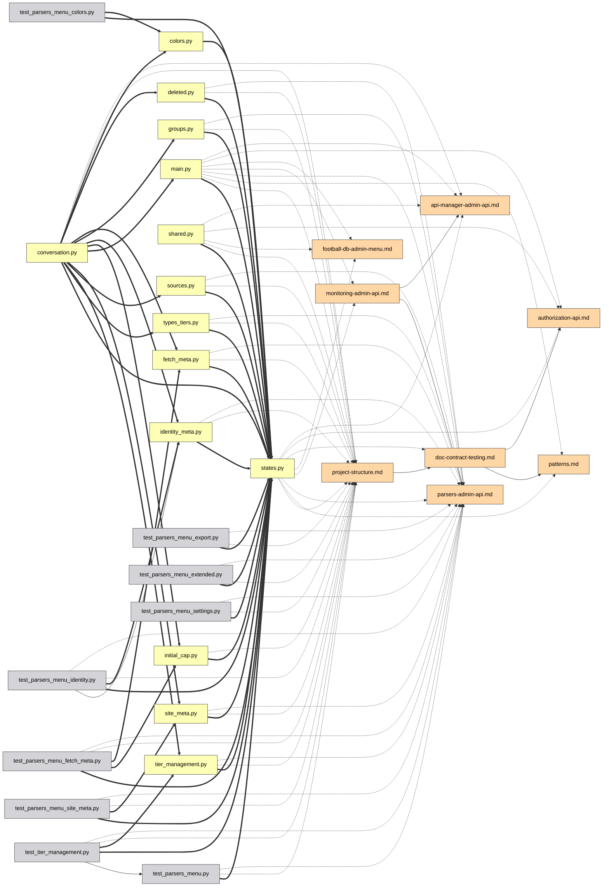

# Guida all'interfaccia

[Deutsch](guide.de.md) | [English](../docs/guide.md) | [Español](guide.es.md) | [Français](guide.fr.md) | **Italiano** | [日本語](guide.ja.md) | [한국어](guide.ko.md) | [Português](guide.pt.md) | [Русский](guide.ru.md) | [中文](guide.zh.md)

Ogni funzione del grafo interattivo, una per una. Provale dal vivo nella
[demo](https://mr-freewan.github.io/build-graph/) — è il grafo del repository
build-graph stesso, con un overlay git sintetico attivato.

---

## Muoversi

Il grafo è un'unica tela: **scorri per zoomare, trascina lo sfondo per spostare
la vista, trascina un nodo per muoverlo**. Le etichette dei nodi compaiono in
dissolvenza man mano che lo zoom supera la soglia *Show at zoom* (il culling del
viewport e il LOD delle etichette mantengono fluidi 1000+ nodi). Il pulsante a
mirino nella barra superiore reimposta la vista; il contatore nell'angolo in
basso a sinistra mostra quanti nodi e archi ci sono sulla mappa.

Passare il cursore su un nodo lo evidenzia insieme ai suoi vicini diretti e
attenua tutto il resto; passare su un arco mostra un tooltip con il tipo di
arco, sorgente → destinazione e i numeri di riga esatti dietro la relazione.

## Pannelli

Tutti e sette i pannelli sono **trascinabili** — afferra la maniglia punteggiata
nell'intestazione. I tre pannelli principali (Graph controls, legenda, Exclude
by name) si **comprimono** nella loro barra del titolo al clic su di essa (il
chevron mostra lo stato). Il pannello info si ridimensiona su entrambi gli assi,
Graph controls — orizzontalmente. Posizioni, dimensioni e stati compressi
persistono in `localStorage` e sopravvivono a un ricaricamento; quando la
finestra si restringe, i pannelli si agganciano nel viewport e tornano al loro
posto salvato quando si allarga di nuovo.

L'angolo in alto a destra ospita gli interruttori dell'aspetto: **10 lingue
dell'interfaccia** (DE / EN / ES / FR / IT / JA / KO / PT / RU / ZH), **tema
scuro / chiaro** e **palette pastello / satura** — le due palette sono allineate
per tonalità, quindi cambiare non rimescola mai quale colore significa cosa.
Anche i colori degli archi e i campioni della legenda seguono la palette. Le FAQ
integrate (il pulsante `?`, 50+ risposte in tutte le 10 lingue) fanno la loro
comparsa anche qui.

## Controlli del grafo

Il pannello di sinistra regola l'immagine e la fisica:

- **Nodes & edges** — contrasto dei colori, scala dei nodi, larghezza degli
  archi, opacità degli archi.
- **Labels** — dimensione del carattere e il livello di zoom al quale compaiono
  le etichette.
- **Physics** — repulsione e forza dei collegamenti; le modifiche riavviano la
  simulazione dal vivo.
- **Release pinned** libera tutti i nodi fissati; **Rebuild physics** riscalda
  il layout (i nodi fissati mantengono il loro posto — il fissaggio vince sulla
  ricostruzione).

## Ricerca ed esclusione

Il campo di ricerca (`Ctrl/Cmd+K`) corrisponde ai nomi dei nodi **e ai
percorsi** — digitare `handlers/` illumina l'intero sottoalbero. Il pulsante `×`
o `Esc` lo cancella.

**Exclude by name** rimuove il rumore: aggiungi un pattern e i nodi
corrispondenti vengono tolti dal tavolo; i nodi esclusi vengono congelati così
il layout non salta. Rebuild physics fa rifluire i superstiti nello spazio
liberato.

## Filtraggio tramite la legenda

La legenda è interattiva:

- **Clic su un tipo di nodo** per nasconderlo/mostrarlo; i pulsanti a occhio
  mostrano/nascondono tutti in una volta.
- **🎯 isolate** su qualsiasi riga mantiene solo quel tipo (clic di nuovo per
  annullare).
- **Clic su un tipo di arco** per nascondere quegli archi — i nodi rimasti senza
  connessioni visibili spariscono anch'essi, così «solo archi `docstring`» ti dà
  un sottografo docstring pulito, non una nuvola di punti scollegati.
- **Orphans only** mostra solo i file a cui nulla si collega.

## Ispezionare un nodo

Passare il cursore su un nodo per un momento mostra un piccolo **tooltip** con
nome e percorso — un'occhiata più rapida che aprire il pannello completo sotto.
In modalità Heat o Coverage aggiunge il numero dietro il colore (numero di
modifiche / % di copertura), altrimenti visibile solo cliccando. Il ritardo è
deliberatamente più lungo di un tipico effetto hover così da non far lampeggiare
un tooltip per ogni nodo mentre spazzi il cursore su molti nodi. I tooltip degli
archi (sotto) si spengono mentre la modalità Heat o Coverage è attiva — lì gli
archi mantengono il loro normale colore di tipo, quindi passarci sopra non ha
nulla di utile da dire.

Clicca su un nodo — si apre il **pannello info** e la selezione resta
evidenziata (fissata) dopo che il cursore l'ha lasciata:

- Il percorso è reso come **breadcrumb cliccabili** — clicca un segmento di
  directory e diventa la query di ricerca.
- Le connessioni sono raggruppate: `filename:line [type] ▸ +N` — espandi per
  vedere ogni riga dove la relazione si verifica.
- Il **selettore IDE** (VS Code / Cursor / PyCharm / Copy path) trasforma ogni
  file in un deep link — apri l'esatto file:line direttamente dal browser.

Con un nodo fissato, passare il cursore su uno qualsiasi dei suoi vicini sbircia
un livello più in profondità: l'evidenziazione diventa l'unione di entrambi i
vicinati — una rapida camminata in due passi lungo la catena delle dipendenze
senza perdere il proprio posto.

## Fissare i nodi al loro posto

Due modi per inchiodare un nodo alla tela:

- **Doppio clic** su di esso, oppure
- premi **B** mentre ci passi sopra — funziona anche a metà trascinamento:
  trascina un nodo di lato, premi B, rilascia — resta.

I nodi fissati mostrano un indicatore 📌, sopravvivono a Rebuild physics e si
liberano con un altro doppio clic o globalmente con **Release pinned**.

## Percorso tra due nodi

**Shift+clic** su due nodi per ottenere il percorso di dipendenze più breve tra
loro (BFS non orientato): gli estremi e gli archi del percorso diventano viola,
il resto si attenua. Se non esiste alcun percorso, un toast lo segnala. `Esc` o
un clic sullo sfondo lo cancella.

## Focalizzare un arco

Clicca su un arco per isolarlo: solo la sorgente e la destinazione restano
illuminate (con le loro etichette forzate), così puoi leggere esattamente quali
due file la relazione lega. `Esc` o un clic sullo sfondo lo rilascia.

## Modalità Git

Il pulsante **Git** commuta i colori dei nodi dai tipi allo **stato dell'albero
di lavoro**: added / modified / renamed / deleted / clean. Compaiono extra che
una semplice colorazione non può mostrare:

- **Nodi fantasma** (contorno tratteggiato) — file eliminati che i doc
  referenziano ancora, e le vecchie metà delle rinomine.
- **Archi di rinomina** (tratteggiati, senza freccia) — vecchio fantasma →
  nuovo nodo vivo.
- La legenda passa agli stati git con lo stesso clic-per-filtrare, gli stessi
  pulsanti a occhio e l'isolamento 🎯.

Il pulsante è disabilitato (con un tooltip) quando git non è disponibile. Per
demo e screenshot, `--mock-git` cuoce un overlay sintetico che copre tutte e
cinque le categorie.

## Diff del grafo

Compila con `--diff-base REF` per confrontare l'albero di lavoro con un
riferimento git (branch, tag, commit) — una vista da code review del grafo delle
dipendenze. La pagina si apre con l'overlay Git già attivo: gli stati dei file
arrivano da git come al solito, mentre gli archi di dipendenza **nuovi dal
riferimento sono resi in verde** e i **rimossi in rosso** (tratteggiati),
ancorati ai nodi fantasma quando il file non c'è più. La legenda git ottiene
contatori di archi +N/−N e il suo titolo mostra l'intervallo confrontato. Le
rinomine sono seguite — un arco che si è semplicemente spostato con un file
rinominato resta neutro.

Aggiungi `--diff-head REF` per confrontare due riferimenti specifici invece
dell'albero di lavoro — entrambi i lati sono costruiti da snapshot `git
archive`, quindi le modifiche all'albero di lavoro fatte dopo il riferimento
head non fanno parte del diff. Senza di esso, `--diff-base` da solo confronta
ancora con l'albero di lavoro come prima.

## Modalità Heat

Il pulsante **Heatmap** commuta i colori dei nodi dai tipi alla **frequenza di
attività git**: un gradiente blu→rosso in base a quanto spesso ogni file è
cambiato, in scala logaritmica così che una manciata di file costantemente
modificati non stemperi tutto il resto nella stessa tonalità. Di default copre
l'intera storia; compila con `--heat-days N` per limitarlo agli ultimi N giorni.
Il pannello **Activity heat** mostra il periodo di raccolta e l'intervallo
grezzo del numero di commit (`0` fino al conteggio del file più caldo), più uno
**slider min-edits** — trascinalo su per nascondere tutto ciò che è più freddo
della soglia scelta (gli archi connessi si nascondono con esso). «Clear filters»
lo reimposta a 0 insieme a tutto il resto.

A differenza della modalità Git, la modalità Heat è additiva: Node types (ed Edge
types, e il resto della legenda) restano esattamente come sono sotto il pannello
Activity heat, ancora filtrabili per tipo come al solito — heat cambia solo di
quale colore un nodo è disegnato, non ridefinisce cosa significa «tipo». Heat e
la modalità Git restano mutuamente esclusive tra loro: entrambe ricolorano i
nodi, quindi attivarne una disattiva l'altra. Il pulsante è disabilitato (con un
tooltip) quando git non è disponibile.

## Modalità Coverage

Il pulsante **Cov.** commuta i colori dei nodi dai tipi alla **copertura delle
righe dai test**: un gradiente verde→rosso da un `coverage.xml` Cobertura
(compila con `--coverage PATH`, ad es. il report da `pytest --cov=your_pkg
--cov-report=xml` — `--cov` ha bisogno del nome del pacchetto; `--cov-report=xml`
da solo non raccoglie nulla).
La direzione è deliberatamente invertita rispetto alla modalità Heat: tutto il
senso di questo overlay è trovare i file mal coperti, quindi il verde (100%,
buono) sta a sinistra e il rosso (0%, cattivo) a destra. Lo slider sotto è un
**soffitto, non un pavimento**: trascinalo giù da 100% e nasconde tutto ciò che
è coperto *più* di quella percentuale, lasciando sullo schermo solo i file
peggio coperti — l'opposto dello slider min-edits di Heat, che invece mantiene i
file più attivi. Stesso comportamento additivo della modalità Heat (Node types
resta utilizzabile sotto) e stessa esclusione mutua a tre vie con Git e Heat —
solo uno dei tre può ricolorare i nodi alla volta.

A differenza di Git e Heat, i cui pulsanti restano nella barra (disabilitati,
con un tooltip) quando la loro fonte dati non è disponibile, il pulsante
Coverage è **completamente nascosto** quando nessun `coverage.xml` è stato
fornito al momento del build — eseguire la copertura è opt-in e molto meno
universale che avere una storia git, quindi un pulsante permanentemente grigio
sarebbe solo ingombro.

Attivare la modalità Coverage nasconde anche automaticamente nella legenda ogni
Node type tranne `code/*` — un report di copertura non può mai dire nulla sui
file di documentazione o configurazione, quindi non ha senso ingombrare la vista
con nodi che saranno sempre resi in grigio neutro. È lo stesso meccanismo di
nascondere che cliccare un tipo nella legenda, solo pre-applicato: qualsiasi
categoria può essere rimostrata da lì.

## Aiuti all'analisi

**💀 Dead code** (legenda, compare quando ci sono candidati) evidenzia i file
senza import in ingresso e senza menzioni nella documentazione. I punti di
ingresso sono esentati automaticamente: `[project.scripts]` da `pyproject.toml`,
`main.py`, `__init__.py`, `conftest.py`, `test_*.py`, più tutto ciò che
corrisponde ai glob `[dead_code].exempt` in `graph.toml`. Il toggle 💀 è mostrato
alla fine del clip della modalità Git qui sopra.

**Cycles** (legenda, compare quando esistono cicli di import) evidenzia le
componenti fortemente connesse nel grafo di import `code->code` a runtime: gli
archi del ciclo diventano corallo, i membri del ciclo ricevono un anello
corallo, tutto il resto svanisce. Gli import solo di tipo (`TYPE_CHECKING`) non
contano — sono il modo legale per rompere un ciclo. Il contatore è il numero di
cicli indipendenti, e mentre una modalità come questa è attiva, i nodi e gli
archi svaniti ignorano il puntatore — passarci sopra non li accende.

**Orphan ring** — i file di grado zero non sono sparpagliati; siedono su un
cerchio attorno al cluster vivo, così «nucleo connesso vs. file sciolti» è
leggibile a colpo d'occhio. I file che l'autorilevamento non ha potuto
classificare ricevono un anello ambra e il proprio pulsante contatore nella
barra superiore.

**Ambiguous group nodes** — un documento che menziona un nome di file nudo come
`__init__.py` o `config.py` senza percorso (e fuori da un listato ad albero dei
file) non può essere risolto a un file specifico quando decine di file
condividono quel nome. Invece di indovinare e ventagliare l'arco verso ogni file
omonimo, quella menzione è attribuita a un unico nodo sintetico nella sua
categoria di legenda `ambiguous`, etichettato con il numero di corrispondenze
(`__init__.py (×N)`). Non ha alcun file reale dietro — cliccare mostra solo
l'etichetta, senza apertura IDE o copia del percorso. La sua lista
**Connections** è però del tutto normale: ogni documento che menziona il nome
nudo è elencato con i numeri di riga esatti, link di apertura IDE incluso —
scorrili, e se la menzione dovrebbe puntare a un file specifico, riscrivila come
percorso esplicito (`dir/config.py` invece di `config.py` nudo) così da
risolversi direttamente a quel file al prossimo build.

## Condivisione ed esportazione

Il **menu File** raccoglie gli output:

- **Copy link** — la vista corrente (lingua, tema, palette, filtri, modalità
  git, ricerca, selezione fissata) codificata nell'hash dell'URL. Apri il link —
  vedi la stessa immagine. Le preferenze personali (posizioni dei pannelli,
  slider, scelta dell'IDE) restano deliberatamente fuori dall'URL.
- **Copy as Mermaid** — il sottografo focalizzato (percorso > focus dell'arco >
  nodo fissato + vicini > risultati di ricerca) come snippet `flowchart LR`, con
  lo stile della freccia che codifica il tipo di arco. Incollalo in una
  descrizione di PR.
- **Copy JSON** — i dati completi del grafo per un agente LLM (gli stessi dati
  dei flag CLI `--json` / `--compact`).
- **Export / Import prefs** — sposta l'intera configurazione (posizioni, slider,
  filtri, tema) su un'altra macchina come file JSON.

Un vero esempio *Copy as Mermaid* — un sottosistema admin isolato tramite
ricerca, esportato, incollato in markdown così com'è:

Il sorgente Mermaid esportato dietro quell'immagine

## FAQ e scorciatoie

Il pulsante `?` apre una FAQ integrata — 50+ risposte in tutte le 10 lingue, che
coprono tutto ciò che è in questa pagina (puoi vederla aperta nel clip Pannelli
qui sopra).

| Tasto | Azione |
|-------|--------|
| `Esc` | chiude le cose, in ordine: menu File → FAQ → pannello info → focus dell'arco → cancella ricerca |
| `Space` | metti in pausa / riprendi la fisica |
| `Ctrl/Cmd+K` | metti a fuoco il campo di ricerca |
| `B` | fissa/sblocca il nodo sotto il cursore (funziona a metà trascinamento) |
| `Shift+clic` × 2 | percorso più breve tra due nodi |
| doppio clic | fissa/sblocca un nodo al suo posto |
