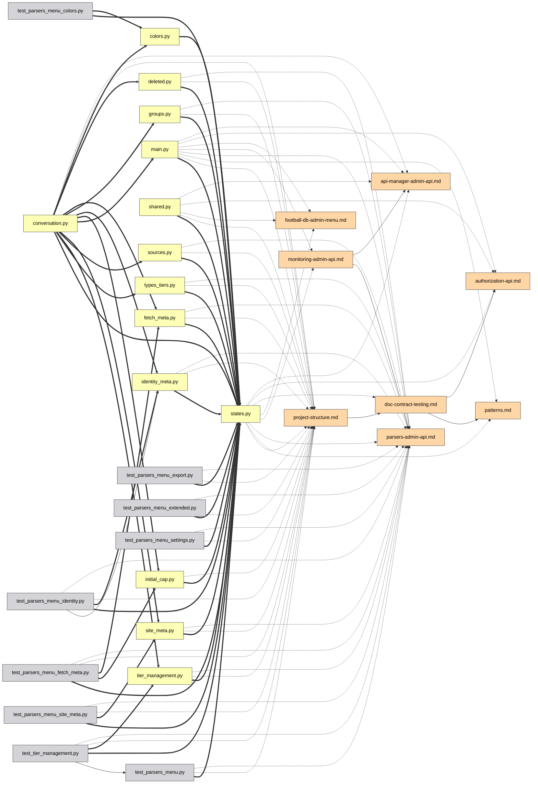

# UIガイド

[Deutsch](guide.de.md) | [English](../docs/guide.md) | [Español](guide.es.md) | [Français](guide.fr.md) | [Italiano](guide.it.md) | **日本語** | [한국어](guide.ko.md) | [Português](guide.pt.md) | [Русский](guide.ru.md) | [中文](guide.zh.md)

インタラクティブなグラフの全機能を一つずつ紹介します。[デモ](https://mr-freewan.github.io/build-graph/)でライブに試せます — これは build-graph リポジトリ自身のグラフで、合成の git オーバーレイが有効になっています。

---

## 操作方法

グラフは単一のキャンバスです：**スクロールでズーム、背景をドラッグでパン、ノードをドラッグで移動**。ノードのラベルは、ズームが *Show at zoom* のしきい値を超えるとフェードインします（ビューポートカリングとラベル LOD により 1000+ ノードでも滑らかに保たれます）。上部バーの十字ボタンでビューをリセット。左下隅のカウンターは、マップ上のノード数とエッジ数を表示します。

ノードにカーソルを合わせると、その直接の隣接ノードとともにハイライトされ、それ以外はすべて暗くなります。エッジにカーソルを合わせると、エッジの種類、ソース → ターゲット、関係の背後にある正確な行番号を示すツールチップが表示されます。

## パネル

7 つのパネルはすべて**ドラッグ可能**です — ヘッダーの点線のハンドルをつかみます。3 つのメインパネル（Graph controls、凡例、Exclude by name）は、ヘッダーをクリックするとタイトルバーに**折りたたまれます**（シェブロンが状態を示します）。情報パネルは両軸でリサイズでき、Graph controls は水平方向のみ。位置、サイズ、折りたたみ状態は `localStorage` に保持され、リロードしても残ります。ウィンドウが縮むとパネルはビューポート内に収まり、再び大きくなると保存された場所に戻ります。

右上隅には外観の切り替えがあります：**10 の UI 言語**（DE / EN / ES / FR / IT / JA / KO / PT / RU / ZH）、**ダーク / ライトテーマ**、**パステル / 鮮やかなパレット** — 2 つのパレットは色相が揃っているため、切り替えてもどの色が何を意味するかが入れ替わることはありません。エッジの色や凡例の見本もパレットに従います。組み込みの FAQ（`?` ボタン、全 10 言語で 50+ の回答）もここに登場します。

## Graph controls

左のパネルは絵と物理を調整します：

- **Nodes & edges** — 色のコントラスト、ノードのスケール、エッジの幅、エッジの不透明度。
- **Labels** — フォントサイズと、ラベルが現れるズームレベル。
- **Physics** — 反発と結合力。変更するとシミュレーションがライブで再起動します。
- **Release pinned** はすべての固定ノードを解放します。**Rebuild physics** はレイアウトを再加熱します（固定ノードは場所を保つ — 固定は再構築に勝ります）。

## 検索と除外

検索フィールド（`Ctrl/Cmd+K`）はノード名**とパス**にマッチします — `handlers/` と入力すると、サブツリー全体が点灯します。`×` ボタンまたは `Esc` でクリアします。

**Exclude by name** はノイズを取り除きます：パターンを追加すると、一致するノードが盤面から外されます。除外されたノードは凍結されるため、レイアウトが飛びません。Rebuild physics は生き残ったノードを空いたスペースに流し込みます。

## 凡例によるフィルタリング

凡例はインタラクティブです：

- **ノードの種類をクリック**すると表示/非表示。目のボタンで一度にすべて表示/非表示。
- 任意の行の **🎯 isolate** は、その種類だけを残します（もう一度クリックで元に戻す）。
- **エッジの種類をクリック**するとそのエッジが非表示になります — 可視の接続がなくなったノードも消えるため、「`docstring` エッジのみ」はきれいな docstring サブグラフを与え、切り離された点の雲にはなりません。
- **Orphans only** は、何もリンクしていないファイルだけを表示します。

## ノードの調査

ノードに少しカーソルを合わせると、その名前とパスを示す小さな**ツールチップ**が表示されます — 下の完全なパネルを開くよりも素早い一瞥です。Heat または Coverage モードでは、色の背後にある数値（編集回数 / カバレッジ %）が追加されます。これは通常クリックしないと見えません。遅延は一般的なホバー効果より意図的に長くしてあり、多くのノード上でカーソルをさっと動かしてもノードごとにツールチップが点滅しないようにしています。エッジのツールチップ（下記）は Heat または Coverage モードが有効な間はオフになります — そこではエッジは通常の種類の色を保つため、ホバーしても有用なことは言えません。

ノードをクリックすると — **情報パネル**が開き、カーソルが離れても選択はハイライト（ピン留め）されたままになります：

- パスは**クリック可能なパンくずリスト**として表示されます — ディレクトリのセグメントをクリックすると、それが検索クエリになります。
- 接続はグループ化されます：`filename:line [type] ▸ +N` — 展開すると、関係が発生するすべての行が見えます。
- **IDE セレクター**（VS Code / Cursor / PyCharm / Copy path）は、各ファイルをディープリンクに変えます — 正確な file:line をブラウザから直接開けます。

ノードをピン留めした状態で、その隣接ノードのいずれかにカーソルを合わせると、1 段深くのぞきます：ハイライトは両方の近傍の和集合になります — 自分の場所を失わずに、依存関係チェーンを素早く 2 歩たどれます。

## ノードを固定する

ノードをキャンバスに留める 2 つの方法：

- **ダブルクリック**する、または
- カーソルを合わせながら **B** を押す — ドラッグの途中でも機能します：ノードを脇にドラッグし、B を押して、離す — 留まります。

ピン留めされたノードは 📌 マーカーを表示し、Rebuild physics を生き延び、もう一度ダブルクリックするか、**Release pinned** でまとめて解放されます。

## 2 つのノード間のパス

2 つのノードを **Shift+クリック**すると、それらの間の最短依存パスが得られます（無向 BFS）：端点とパスのエッジが紫になり、残りは暗くなります。パスが存在しない場合は、トーストで知らせます。`Esc` または背景クリックでクリアします。

## エッジにフォーカスする

エッジをクリックして分離します：ソースとターゲットだけが点灯したまま（ラベルは強制表示）になるため、その関係がどの 2 つのファイルを結ぶのかを正確に読み取れます。`Esc` または背景クリックで解除します。

## Git モード

**Git** ボタンは、ノードの色を種類から**作業ツリーのステータス**に切り替えます：added / modified / renamed / deleted / clean。単純な色分けでは示せない追加要素が現れます：

- **ゴーストノード**（破線の輪郭）— ドキュメントがまだ参照している削除済みファイル、およびリネームの古い側。
- **リネームエッジ**（破線、矢印なし）— 古いゴースト → 新しい生きたノード。
- 凡例は git ステータスに切り替わり、同じクリックでのフィルタリング、目のボタン、🎯 分離が使えます。

git が利用できない場合、ボタンは無効化されます（ツールチップ付き）。デモやスクリーンショット用に、`--mock-git` は 5 つのカテゴリすべてをカバーする合成オーバーレイを焼き込みます。

## グラフの差分

`--diff-base REF` でビルドすると、作業ツリーを git 参照（ブランチ、タグ、コミット）と比較できます — 依存関係グラフのコードレビュー的なビュー。ページは Git オーバーレイが既にオンの状態で開きます：ファイルのステータスは通常どおり git から来ますが、**参照以降に新しくなった**依存エッジは**緑でレンダリング**され、**削除されたもの**は**赤**（破線）で、ファイルが消えている場合はゴーストノードにアンカーされます。git 凡例には +N/−N のエッジカウンターが加わり、そのタイトルは比較範囲を示します。リネームは追跡されます — リネームされたファイルとともに単に移動しただけのエッジは中立のままです。

`--diff-head REF` を追加すると、作業ツリーの代わりに 2 つの特定の参照を比較できます — 両側は `git archive` スナップショットから構築されるため、head 参照より後に作業ツリーで行った変更は差分に含まれません。これを付けない場合、`--diff-base` 単独では従来どおり作業ツリーと比較します。

## Heat モード

**Heatmap** ボタンは、ノードの色を種類から **git アクティビティの頻度**に切り替えます：各ファイルがどれだけ頻繁に変更されたかによる青→赤のグラデーションで、対数スケールにより、ごく一部の常に編集されるファイルが他のすべてを同じ色調に押し流さないようにしています。デフォルトでは全履歴をカバーします。`--heat-days N` でビルドすると、代わりに直近 N 日に制限できます。**Activity heat** パネルは収集期間と生のコミット数の範囲（`0` から最もホットなファイルの数まで）、さらに **min-edits スライダー**を表示します — 上にドラッグすると、選んだしきい値より冷たいものをすべて隠します（接続されたエッジも一緒に隠れます）。「Clear filters」はこれを他のすべてと一緒に 0 に戻します。

Git モードと違い、Heat モードは加算的です：Node types（および Edge types、その他の凡例）は Activity heat パネルの下でそのまま残り、これまでどおり種類でフィルターできます — heat はノードがどの色で描かれるかを変えるだけで、「種類」の意味を再定義しません。Heat と Git モードは依然として互いに排他的です：どちらもノードを塗り替えるため、一方をオンにすると他方はオフになります。git が利用できない場合、ボタンは無効化されます（ツールチップ付き）。

## Coverage モード

**Cov.** ボタンは、ノードの色を種類から**テスト行カバレッジ**に切り替えます：Cobertura の `coverage.xml` からの緑→赤のグラデーション（`--coverage PATH` でビルド。例えば `pytest --cov=your_pkg --cov-report=xml` のレポート — `--cov` にはパッケージ名が必要です。`--cov-report=xml` 単独では何も収集しません）。
方向は意図的に Heat モードと逆になっています：このオーバーレイの目的はカバレッジの低いファイルを見つけることなので、緑（100%、良い）が左、赤（0%、悪い）が右にあります。その下のスライダーは**下限ではなく上限**です：100% から下にドラッグすると、その割合より*多く*カバーされているものをすべて隠し、画面上には最もカバレッジの低いファイルだけが残ります — 最も忙しいファイルを残す Heat の min-edits スライダーの逆です。Heat モードと同じ加算的な挙動（Node types は下で引き続き使用可能）、および Git・Heat との同じ 3 者間の相互排他 — 3 つのうち一度にノードを塗り替えられるのは 1 つだけです。

データソースが利用できないときにボタンがバーに残る（無効化、ツールチップ付き）Git や Heat と違い、Coverage ボタンはビルド時に `coverage.xml` が指定されなかった場合、**完全に非表示**になります — カバレッジの実行はオプトインで、git 履歴を持つことよりはるかに一般的ではないため、常にグレーアウトしたボタンは単なる雑然さになるからです。

Coverage モードをオンにすると、凡例内の `code/*` を除くすべての Node type も自動的に非表示になります — カバレッジレポートはドキュメントや設定ファイルについて何も語れないため、常に中立のグレーでレンダリングされるノードでビューを散らかす意味はありません。これは凡例で種類をクリックするのと同じ非表示メカニズムで、あらかじめ適用されているだけです：どのカテゴリもそこから再び表示できます。

## 分析補助

**💀 Dead code**（凡例、候補があるときに現れる）は、入ってくるインポートがなく、ドキュメントでの言及もないファイルをハイライトします。エントリーポイントは自動的に免除されます：`pyproject.toml` の `[project.scripts]`、`main.py`、`__init__.py`、`conftest.py`、`test_*.py`、さらに `graph.toml` の `[dead_code].exempt` グロブに一致するもの。💀 トグルは上の Git モードのクリップの最後に示されています。

**Cycles**（凡例、インポートループが存在するときに現れる）は、ランタイムの `code->code` インポートグラフ内の強連結成分をハイライトします：ループのエッジがコーラルになり、ループのメンバーはコーラルのリングを得て、他はすべて薄くなります。型のみ（`TYPE_CHECKING`）のインポートはカウントされません — それらは循環を断ち切る正当な方法です。カウンターは独立したループの数で、このようなモードがアクティブな間、薄くなったノードとエッジはポインターを無視します — 上を通ってもハイライトされません。

**Orphan ring** — 次数ゼロのファイルは散らばりません。生きているクラスターの周りの円に配置されるため、「接続されたコア vs. 孤立したファイル」が一目で読み取れます。自動検出が分類できなかったファイルは、琥珀色のリングと、上部バーに独自のカウンターボタンを得ます。

**Ambiguous group nodes** — パスなしで `__init__.py` や `config.py` のような裸のファイル名に言及するドキュメント（かつファイルツリーのリスト外）は、その名前を数十のファイルが共有している場合、特定の 1 ファイルに解決できません。推測してエッジを同名のすべてのファイルに扇状に広げる代わりに、その言及は独自の `ambiguous` 凡例カテゴリ内の単一の合成ノードに帰属され、一致数（`__init__.py (×N)`）でラベル付けされます。背後に実ファイルはありません — クリックするとラベルのみが表示され、IDE で開いたりパスをコピーしたりはできません。ただしその **Connections** リストは完全に通常どおりです：裸の名前に言及する各ドキュメントが、正確な行番号と IDE で開くリンク付きで列挙されます — それをたどり、もし言及が特定のファイルを指すべきなら、明示的なパス（裸の `config.py` の代わりに `dir/config.py`）に書き換えれば、次のビルドで直接そのファイルに解決されます。

## 共有とエクスポート

**File メニュー**は出力をまとめます：

- **Copy link** — 現在のビュー（言語、テーマ、パレット、フィルター、git モード、検索、ピン留めされた選択）を URL ハッシュにエンコードしたもの。リンクを開く — 同じ絵が見えます。個人設定（パネルの位置、スライダー、IDE の選択）は意図的に URL の外に置かれます。
- **Copy as Mermaid** — フォーカスされたサブグラフ（パス > エッジフォーカス > ピン留めノード + 隣接 > 検索結果）を `flowchart LR` スニペットとして、矢印のスタイルがエッジの種類をエンコードします。PR の説明に貼り付けます。
- **Copy JSON** — LLM エージェント向けの完全なグラフデータ（CLI フラグ `--json` / `--compact` と同じデータ）。
- **Export / Import prefs** — セットアップ全体（位置、スライダー、フィルター、テーマ）を JSON ファイルとして別のマシンに移動します。

実際の *Copy as Mermaid* の例 — 検索で分離した 1 つの admin サブシステムを、エクスポートして markdown にそのまま貼り付けたもの：

その画像の背後にあるエクスポートされた Mermaid ソース

## FAQ とショートカット

`?` ボタンは組み込みの FAQ を開きます — 全 10 言語で 50+ の回答があり、このページのすべてをカバーします（上の Panels のクリップで開いた状態を見られます）。

| キー | アクション |
|------|-----------|
| `Esc` | 順番に閉じる：File メニュー → FAQ → 情報パネル → エッジフォーカス → 検索をクリア |
| `Space` | 物理を一時停止 / 再開 |
| `Ctrl/Cmd+K` | 検索フィールドにフォーカス |
| `B` | カーソル下のノードをピン留め/解除（ドラッグ途中でも機能） |
| `Shift+クリック` × 2 | 2 つのノード間の最短パス |
| ダブルクリック | ノードをその場でピン留め/解除 |
