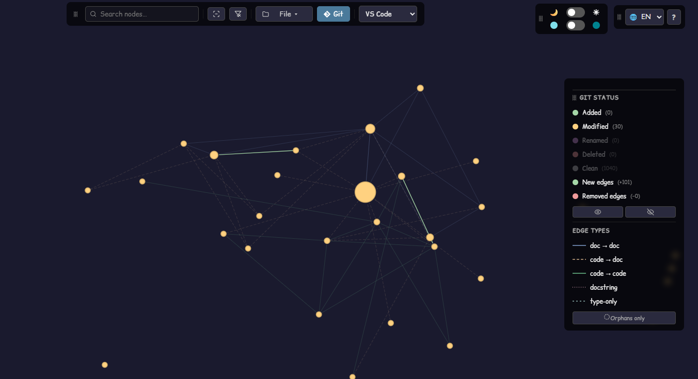
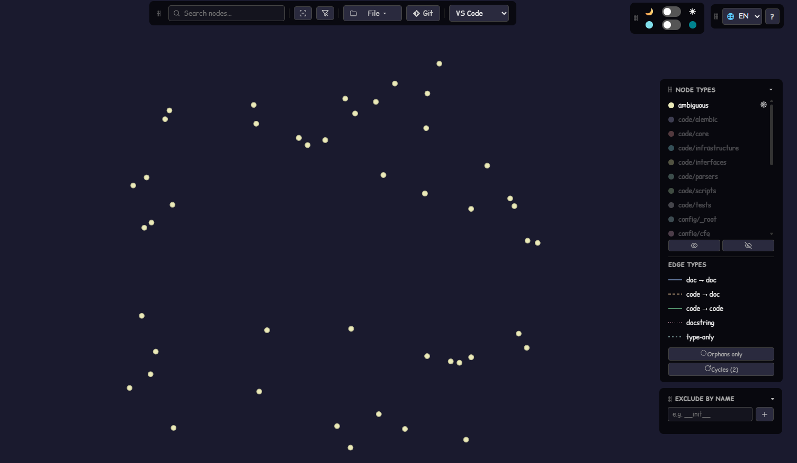
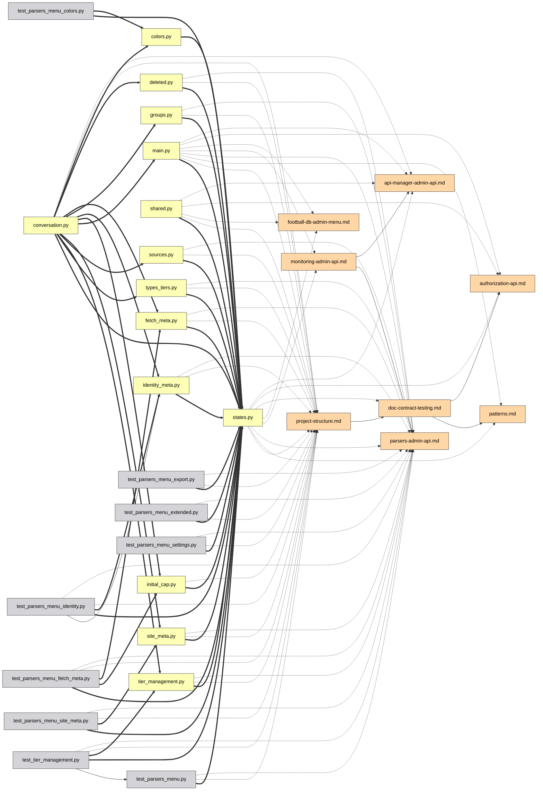

# UI 가이드

[Deutsch](guide.de.md) | [English](../docs/guide.md) | [Español](guide.es.md) | [Français](guide.fr.md) | [Italiano](guide.it.md) | [日本語](guide.ja.md) | **한국어** | [Português](guide.pt.md) | [Русский](guide.ru.md) | [中文](guide.zh.md)

인터랙티브 그래프의 모든 기능을 하나씩 소개합니다. [데모](https://mr-freewan.github.io/build-graph/)에서 직접 사용해 보세요 — build-graph 저장소 자체의 그래프이며, 합성 git 오버레이가 활성화되어 있습니다.

---

## 둘러보기

그래프는 단일 캔버스입니다: **스크롤로 줌, 배경을 드래그해 팬, 노드를 드래그해 이동**. 노드 레이블은 줌이 *Show at zoom* 임계값을 넘으면 페이드인됩니다(뷰포트 컬링과 레이블 LOD가 1000개 이상의 노드를 매끄럽게 유지합니다). 상단 바의 십자 버튼은 뷰를 초기화하고, 좌하단 모서리의 카운터는 맵에 몇 개의 노드와 엣지가 있는지 표시합니다.

노드에 마우스를 올리면 직접 이웃과 함께 강조되고 나머지는 모두 흐려집니다. 엣지에 마우스를 올리면 엣지 유형, 소스 → 타깃, 관계 뒤에 있는 정확한 줄 번호를 담은 툴팁이 표시됩니다.

## 패널

일곱 개의 패널은 모두 **드래그할 수 있습니다** — 헤더의 점선 손잡이를 잡으세요. 세 개의 주요 패널(Graph controls, 범례, Exclude by name)은 헤더를 클릭하면 제목 표시줄로 **접힙니다**(쉐브론이 상태를 표시). 정보 패널은 양축으로 크기를 조절할 수 있고, Graph controls는 수평으로만. 위치, 크기, 접힘 상태는 `localStorage`에 유지되어 새로고침해도 남습니다. 창이 줄어들면 패널은 뷰포트 안으로 고정되고, 다시 커지면 저장된 자리로 돌아갑니다.

우측 상단 모서리에는 외관 스위치가 있습니다: **10개 UI 언어**(DE / EN / ES / FR / IT / JA / KO / PT / RU / ZH), **다크 / 라이트 테마**, **파스텔 / 채도 팔레트** — 두 팔레트는 색조가 정렬되어 있어 전환해도 어떤 색이 무엇을 의미하는지 뒤섞이지 않습니다. 엣지 색과 범례 견본도 팔레트를 따릅니다. 내장 FAQ(`?` 버튼, 10개 언어로 50개 이상의 답변)도 여기에 등장합니다.

## Graph controls

왼쪽 패널은 그림과 물리를 조정합니다:

- **Nodes & edges** — 색 대비, 노드 크기, 엣지 너비, 엣지 불투명도.
- **Labels** — 글꼴 크기와 레이블이 나타나는 줌 레벨.
- **Physics** — 반발력과 링크 힘. 변경하면 시뮬레이션이 실시간으로 재시작됩니다.
- **Release pinned**는 고정된 모든 노드를 해제합니다. **Rebuild physics**는 레이아웃을 다시 가열합니다(고정된 노드는 자리를 유지 — 고정이 재구성보다 우선).

## 검색과 제외

검색 필드(`Ctrl/Cmd+K`)는 노드 이름 **과 경로**에 매칭됩니다 — `handlers/`를 입력하면 하위 트리 전체가 켜집니다. `×` 버튼이나 `Esc`가 지웁니다.

**Exclude by name**은 잡음을 제거합니다: 패턴을 추가하면 일치하는 노드가 판에서 제거됩니다. 제외된 노드는 얼려져 레이아웃이 튀지 않습니다. Rebuild physics는 살아남은 노드를 비워진 공간으로 흘려보냅니다.

## 범례 필터링

범례는 인터랙티브합니다:

- **노드 유형을 클릭**하면 숨기기/표시. 눈 버튼은 한 번에 모두 표시/숨기기.
- 임의의 행에서 **🎯 isolate**는 그 유형만 남깁니다(다시 클릭하면 취소).
- **엣지 유형을 클릭**하면 그 엣지가 숨겨집니다 — 보이는 연결이 없어진 노드도 함께 사라지므로, 「`docstring` 엣지만」은 끊어진 점의 구름이 아니라 깔끔한 docstring 서브그래프를 줍니다.
- **Orphans only**는 아무것도 링크하지 않는 파일만 표시합니다.

## 노드 검사

노드에 잠시 마우스를 올리면 이름과 경로를 담은 작은 **툴팁**이 표시됩니다 — 아래의 전체 패널을 여는 것보다 빠른 일별입니다. Heat 또는 Coverage 모드에서는 색 뒤의 숫자(편집 횟수 / 커버리지 %)가 추가되는데, 그렇지 않으면 클릭해야만 보입니다. 지연은 일반적인 호버 효과보다 의도적으로 길게 두어, 여러 노드 위로 커서를 훑을 때 노드마다 툴팁이 깜빡이지 않게 합니다. 엣지 툴팁(아래)은 Heat 또는 Coverage 모드가 활성인 동안 꺼집니다 — 거기서 엣지는 일반 유형 색을 유지하므로, 위에 올려도 유용하게 말할 것이 없습니다.

노드를 클릭하면 — **정보 패널**이 열리고, 커서가 떠난 뒤에도 선택은 강조(고정)된 채로 남습니다:

- 경로는 **클릭 가능한 이동 경로(breadcrumbs)**로 렌더링됩니다 — 디렉터리 세그먼트를 클릭하면 검색 쿼리가 됩니다.
- 연결은 그룹화됩니다: `filename:line [type] ▸ +N` — 펼치면 관계가 발생하는 모든 줄을 볼 수 있습니다.
- **IDE 선택기**(VS Code / Cursor / PyCharm / Copy path)는 각 파일을 딥 링크로 바꿉니다 — 정확한 file:line을 브라우저에서 바로 엽니다.

노드가 고정된 상태에서 그 이웃 중 하나에 마우스를 올리면 한 단계 더 깊이 들여다봅니다: 강조는 두 이웃의 합집합이 됩니다 — 자기 자리를 잃지 않고 의존성 체인을 빠르게 두 걸음 걷는 것입니다.

## 노드를 제자리에 고정

노드를 캔버스에 못 박는 두 가지 방법:

- **더블 클릭**하거나,
- 마우스를 올린 채 **B**를 누르세요 — 드래그 도중에도 작동합니다: 노드를 옆으로 드래그하고, B를 누르고, 놓으면 — 남습니다.

고정된 노드는 📌 마커를 표시하고, Rebuild physics를 견디며, 또 한 번의 더블 클릭이나 전역적으로 **Release pinned**로 해제됩니다.

## 두 노드 사이의 경로

두 노드를 **Shift+클릭**하면 그 사이의 최단 의존성 경로를 얻습니다(무방향 BFS): 끝점과 경로 엣지가 보라색이 되고 나머지는 흐려집니다. 경로가 없으면 토스트가 알려줍니다. `Esc`나 배경 클릭이 지웁니다.

## 엣지에 초점

엣지를 클릭해 분리합니다: 소스와 타깃만 켜진 채로(레이블 강제 표시) 남아, 그 관계가 어떤 두 파일을 묶는지 정확히 읽을 수 있습니다. `Esc`나 배경 클릭이 해제합니다.

## Git 모드

**Git** 버튼은 노드 색을 유형에서 **작업 트리 상태**로 전환합니다: added / modified / renamed / deleted / clean. 단순한 색칠로는 보여줄 수 없는 추가 요소가 나타납니다:

- **고스트 노드**(파선 윤곽) — 문서가 아직 참조하는 삭제된 파일, 그리고 이름 변경의 옛 절반.
- **이름 변경 엣지**(파선, 화살표 없음) — 옛 고스트 → 새 살아 있는 노드.
- 범례는 git 상태로 전환되며, 동일한 클릭-필터, 눈 버튼, 🎯 분리를 사용합니다.

git을 사용할 수 없을 때 버튼은 비활성화됩니다(툴팁 포함). 데모와 스크린샷용으로 `--mock-git`은 다섯 카테고리를 모두 덮는 합성 오버레이를 구워 넣습니다.

## 그래프 diff

`--diff-base REF`로 빌드하면 작업 트리를 git 참조(브랜치, 태그, 커밋)와 비교합니다 — 의존성 그래프의 코드 리뷰 뷰입니다. 페이지는 Git 오버레이가 이미 켜진 상태로 열립니다: 파일 상태는 평소처럼 git에서 오고, **참조 이후 새로 생긴** 의존성 엣지는 **초록으로 렌더링**되며 **제거된 것**은 **빨강**(파선)으로, 파일이 사라진 경우 고스트 노드에 고정됩니다. git 범례에는 +N/−N 엣지 카운터가 추가되고, 제목은 비교 범위를 표시합니다. 이름 변경은 추적됩니다 — 이름이 바뀐 파일과 함께 단지 이동한 엣지는 중립으로 남습니다.

`--diff-head REF`를 추가하면 작업 트리 대신 두 개의 특정 참조를 비교합니다 — 양쪽 모두 `git archive` 스냅샷에서 구성되므로, head 참조 이후 작업 트리에서 만든 변경은 diff에 포함되지 않습니다. 이것을 붙이지 않으면 `--diff-base` 단독으로는 예전처럼 작업 트리와 비교합니다.

## Heat 모드

**Heatmap** 버튼은 노드 색을 유형에서 **git 활동 빈도**로 전환합니다: 각 파일이 얼마나 자주 바뀌었는지에 따른 파랑→빨강 그라디언트로, 로그 스케일이라 끊임없이 편집되는 소수의 파일이 나머지 전부를 같은 색조로 씻어내지 않습니다. 기본적으로 전체 이력을 덮습니다. `--heat-days N`으로 빌드하면 최근 N일로 제한합니다. **Activity heat** 패널은 수집 기간과 원시 커밋 수 범위(`0`부터 가장 뜨거운 파일의 수까지), 그리고 **min-edits 슬라이더**를 표시합니다 — 위로 드래그하면 선택한 임계값보다 차가운 것을 모두 숨깁니다(연결된 엣지도 함께 숨겨짐). 「Clear filters」는 나머지 전부와 함께 이를 0으로 되돌립니다.

Git 모드와 달리 Heat 모드는 가산적입니다: Node types(그리고 Edge types, 나머지 범례)는 Activity heat 패널 아래에 그대로 남아, 평소처럼 유형으로 필터할 수 있습니다 — heat는 노드가 어떤 색으로 그려지는지만 바꿀 뿐, 「유형」의 의미를 재정의하지 않습니다. Heat와 Git 모드는 여전히 서로 배타적입니다: 둘 다 노드를 다시 칠하므로, 하나를 켜면 다른 하나는 꺼집니다. git을 사용할 수 없을 때 버튼은 비활성화됩니다(툴팁 포함).

## Coverage 모드

**Cov.** 버튼은 노드 색을 유형에서 **테스트 줄 커버리지**로 전환합니다: Cobertura `coverage.xml`에서 온 초록→빨강 그라디언트(`--coverage PATH`로 빌드, 예: `pytest --cov=your_pkg --cov-report=xml`의 리포트 — `--cov`에는 패키지 이름이 필요하고, `--cov-report=xml` 단독으로는 아무것도 수집하지 않습니다).
방향은 의도적으로 Heat 모드와 반대입니다: 이 오버레이의 요점은 커버리지가 낮은 파일을 찾는 것이므로, 초록(100%, 좋음)이 왼쪽, 빨강(0%, 나쁨)이 오른쪽에 있습니다. 그 아래 슬라이더는 **바닥이 아니라 천장**입니다: 100%에서 아래로 드래그하면 그 비율보다 *더* 많이 커버된 것을 모두 숨겨, 화면에 가장 덜 커버된 파일만 남깁니다 — 가장 바쁜 파일을 남기는 Heat의 min-edits 슬라이더와 반대입니다. Heat 모드와 같은 가산적 동작(Node types는 아래에서 여전히 사용 가능), 그리고 Git·Heat와의 같은 3자 상호 배타 — 셋 중 한 번에 노드를 다시 칠할 수 있는 것은 하나뿐입니다.

데이터 소스를 사용할 수 없을 때 버튼이 바에 남는(비활성화, 툴팁 포함) Git·Heat와 달리, Coverage 버튼은 빌드 시 `coverage.xml`이 주어지지 않으면 **완전히 숨겨집니다** — 커버리지 실행은 옵트인이고 git 이력을 갖는 것보다 훨씬 덜 보편적이므로, 영구히 회색 처리된 버튼은 그저 잡동사니가 될 것이기 때문입니다.

Coverage 모드를 켜면 범례에서 `code/*`를 제외한 모든 Node type도 자동으로 숨겨집니다 — 커버리지 리포트는 문서나 설정 파일에 대해 아무것도 말할 수 없으므로, 항상 중립 회색으로 렌더링될 노드로 뷰를 어지럽힐 이유가 없습니다. 이는 범례에서 유형을 클릭하는 것과 같은 숨김 메커니즘이며, 미리 적용된 것뿐입니다: 어떤 카테고리든 거기서 다시 표시할 수 있습니다.

## 분석 보조

**💀 Dead code**(범례, 후보가 있을 때 나타남)는 들어오는 임포트가 없고 문서 언급도 없는 파일을 강조합니다. 진입점은 자동으로 면제됩니다: `pyproject.toml`의 `[project.scripts]`, `main.py`, `__init__.py`, `conftest.py`, `test_*.py`, 그리고 `graph.toml`의 `[dead_code].exempt` 글롭에 일치하는 모든 것. 💀 토글은 위 Git 모드 클립 끝에 나옵니다.

**Cycles**(범례, 임포트 루프가 존재할 때 나타남)는 런타임 `code->code` 임포트 그래프에서 강하게 연결된 성분을 강조합니다: 루프 엣지는 산호색이 되고, 루프 멤버는 산호색 링을 얻으며, 나머지는 모두 흐려집니다. 유형 전용(`TYPE_CHECKING`) 임포트는 세지 않습니다 — 그것은 순환을 끊는 합법적인 방법입니다. 카운터는 독립적인 루프의 수이며, 이런 모드가 활성인 동안 흐려진 노드와 엣지는 포인터를 무시합니다 — 위로 지나가도 켜지지 않습니다.

**Orphan ring** — 차수가 0인 파일은 흩어지지 않습니다. 살아 있는 클러스터 주위의 원에 앉으므로 「연결된 코어 vs. 느슨한 파일」이 한눈에 읽힙니다. 자동 발견이 분류하지 못한 파일은 호박색 링과 상단 바에 자체 카운터 버튼을 얻습니다.

**Ambiguous group nodes** — 경로 없이 `__init__.py`나 `config.py` 같은 벌거벗은 파일 이름을 언급하는 문서(그리고 파일 트리 목록 바깥)는, 수십 개의 파일이 그 이름을 공유할 때 특정한 한 파일로 해석될 수 없습니다. 추측해서 엣지를 동명의 모든 파일로 부채꼴로 펴는 대신, 그 언급은 자체 `ambiguous` 범례 카테고리 안의 단일 합성 노드에 귀속되고, 일치 수(`__init__.py (×N)`)로 레이블링됩니다. 뒤에 실제 파일은 없습니다 — 클릭하면 레이블만 표시되고 IDE 열기나 경로 복사는 없습니다. 다만 그 **Connections** 목록은 완전히 정상입니다: 벌거벗은 이름을 언급하는 각 문서가 정확한 줄 번호와 IDE 열기 링크와 함께 나열됩니다 — 따라가 보고, 만약 그 언급이 특정 파일을 가리켜야 한다면 명시적 경로(벌거벗은 `config.py` 대신 `dir/config.py`)로 다시 쓰면 다음 빌드에서 바로 그 파일로 해석됩니다.

## 공유와 내보내기

**File 메뉴**는 출력을 모읍니다:

- **Copy link** — 현재 뷰(언어, 테마, 팔레트, 필터, git 모드, 검색, 고정된 선택)를 URL 해시에 인코딩한 것. 링크를 열면 — 같은 그림이 보입니다. 개인 환경설정(패널 위치, 슬라이더, IDE 선택)은 의도적으로 URL 밖에 둡니다.
- **Copy as Mermaid** — 초점 서브그래프(경로 > 엣지 초점 > 고정 노드 + 이웃 > 검색 결과)를 `flowchart LR` 스니펫으로, 화살표 스타일이 엣지 유형을 인코딩합니다. PR 설명에 붙여 넣으세요.
- **Copy JSON** — LLM 에이전트를 위한 전체 그래프 데이터(CLI 플래그 `--json` / `--compact`와 동일한 데이터).
- **Export / Import prefs** — 전체 설정(위치, 슬라이더, 필터, 테마)을 JSON 파일로 다른 기기에 옮깁니다.

실제 *Copy as Mermaid* 예 — 검색으로 분리한 하나의 admin 서브시스템을 내보내 markdown에 그대로 붙여 넣은 것:

그 그림 뒤에 있는 내보낸 Mermaid 소스

## FAQ와 단축키

`?` 버튼은 내장 FAQ를 엽니다 — 10개 언어로 50개 이상의 답변이 있으며 이 페이지의 모든 것을 다룹니다(위 Panels 클립에서 열린 상태를 볼 수 있습니다).

| 키 | 동작 |
|----|------|
| `Esc` | 순서대로 닫기: File 메뉴 → FAQ → 정보 패널 → 엣지 초점 → 검색 지우기 |
| `Space` | 물리 일시정지 / 재개 |
| `Ctrl/Cmd+K` | 검색 필드에 초점 |
| `B` | 커서 아래 노드 고정/해제(드래그 도중에도 작동) |
| `Shift+클릭` × 2 | 두 노드 사이의 최단 경로 |
| 더블 클릭 | 노드를 제자리에 고정/해제 |
