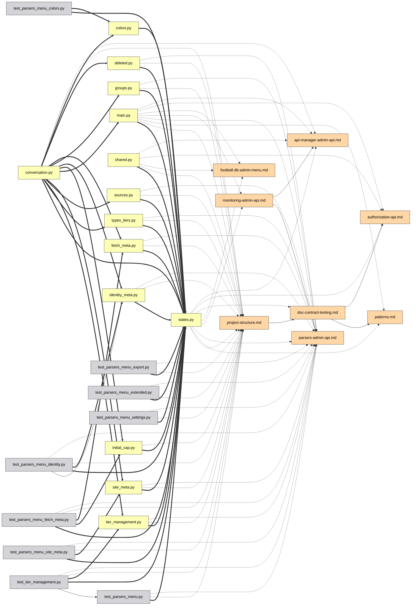

# Guia da interface

[Deutsch](guide.de.md) | [English](../docs/guide.md) | [Español](guide.es.md) | [Français](guide.fr.md) | [Italiano](guide.it.md) | [日本語](guide.ja.md) | [한국어](guide.ko.md) | **Português** | [Русский](guide.ru.md) | [中文](guide.zh.md)

Cada funcionalidade do grafo interativo, uma por uma. Experimente-as ao vivo na
[demo](https://mr-freewan.github.io/build-graph/) — é o grafo do próprio
repositório build-graph, com uma sobreposição git sintética ativada.

---

## Como se mover

O grafo é uma única tela: **role para dar zoom, arraste o fundo para deslocar a
vista, arraste um nó para movê-lo**. Os rótulos dos nós surgem à medida que o
zoom ultrapassa o limiar *Show at zoom* (o descarte por viewport e o LOD de
rótulos mantêm 1000+ nós fluidos). O botão de mira na barra superior redefine a
vista; o contador no canto inferior esquerdo mostra quantos nós e arestas há no
mapa.

Passar o cursor sobre um nó o realça junto com seus vizinhos diretos e escurece
todo o resto; passar sobre uma aresta mostra uma dica com o tipo da aresta,
origem → destino e os números de linha exatos por trás da relação.

## Painéis

Todos os sete painéis são **arrastáveis** — agarre a alça pontilhada no
cabeçalho. Os três painéis principais (Graph controls, legenda, Exclude by name)
**recolhem** na sua barra de título ao clicar nela (o chevron mostra o estado).
O painel de informações redimensiona em ambos os eixos, Graph controls —
horizontalmente. Posições, tamanhos e estados recolhidos persistem em
`localStorage` e sobrevivem a um recarregamento; quando a janela encolhe, os
painéis se prendem ao viewport e voltam ao seu lugar salvo quando ela cresce de
novo.

O canto superior direito hospeda os interruptores de aparência: **10 idiomas de
interface** (DE / EN / ES / FR / IT / JA / KO / PT / RU / ZH), **tema escuro /
claro** e **paleta pastel / saturada** — as duas paletas estão alinhadas por
matiz, então trocar nunca reembaralha qual cor significa o quê. As cores das
arestas e as amostras da legenda também seguem a paleta. As FAQ integradas (o
botão `?`, mais de 50 respostas nos 10 idiomas) também aparecem aqui.

## Controles do grafo

O painel esquerdo ajusta a imagem e a física:

- **Nodes & edges** — contraste de cor, escala dos nós, largura das arestas,
  opacidade das arestas.
- **Labels** — tamanho da fonte e o nível de zoom em que os rótulos aparecem.
- **Physics** — repulsão e força de ligação; as mudanças reiniciam a simulação
  ao vivo.
- **Release pinned** libera todos os nós fixados; **Rebuild physics** reaquece o
  layout (os nós fixados mantêm seu lugar — a fixação vence a reconstrução).

## Busca e exclusão

O campo de busca (`Ctrl/Cmd+K`) corresponde a nomes de nós **e caminhos** —
digitar `handlers/` acende toda a subárvore. O botão `×` ou `Esc` o limpa.

**Exclude by name** remove ruído: adicione um padrão e os nós correspondentes
são retirados do tabuleiro; os nós excluídos são congelados para que o layout
não salte. Rebuild physics faz os sobreviventes fluírem para o espaço liberado.

## Filtragem pela legenda

A legenda é interativa:

- **Clique num tipo de nó** para ocultá-lo/mostrá-lo; os botões de olho
  mostram/ocultam todos de uma vez.
- **🎯 isolate** em qualquer linha mantém apenas esse tipo (clique de novo para
  desfazer).
- **Clique num tipo de aresta** para ocultar essas arestas — os nós que ficam
  sem conexões visíveis também desaparecem, então «apenas arestas `docstring`»
  lhe dá um subgrafo docstring limpo, não uma nuvem de pontos desconexos.
- **Orphans only** mostra apenas os arquivos aos quais nada se liga.

## Inspecionar um nó

Passar o cursor sobre um nó por um momento mostra uma pequena **dica** com seu
nome e caminho — uma olhada mais rápida que abrir o painel completo abaixo. No
modo Heat ou Coverage ela acrescenta o número por trás da cor (número de edições
/ % de cobertura), que de outra forma só é visível ao clicar. O atraso é
deliberadamente mais longo que um efeito de hover típico para que varrer o
cursor por muitos nós não pisque uma dica por nó. As dicas de arestas (abaixo)
se desligam enquanto o modo Heat ou Coverage está ativo — ali as arestas mantêm
sua cor de tipo normal, então passar o cursor por uma não tem nada de útil a
dizer.

Clique num nó — o **painel de informações** abre e a seleção permanece realçada
(fixada) depois que o cursor a deixa:

- O caminho é renderizado como **trilhas clicáveis** — clique num segmento de
  diretório e ele vira a consulta de busca.
- As conexões são agrupadas: `filename:line [type] ▸ +N` — expanda para ver cada
  linha onde a relação ocorre.
- O **seletor de IDE** (VS Code / Cursor / PyCharm / Copy path) transforma cada
  arquivo num deep link — abra o file:line exato direto do navegador.

Com um nó fixado, passar o cursor por qualquer um de seus vizinhos espia um
nível mais fundo: o realce vira a união de ambas as vizinhanças — uma rápida
caminhada em dois passos pela cadeia de dependências sem perder seu lugar.

## Fixar nós no lugar

Duas formas de pregar um nó à tela:

- **Duplo clique** nele, ou
- pressione **B** enquanto passa o cursor — funciona até no meio de um arraste:
  arraste um nó para o lado, pressione B, solte — ele fica.

Os nós fixados mostram um marcador 📌, sobrevivem a Rebuild physics e são
liberados com outro duplo clique ou globalmente com **Release pinned**.

## Caminho entre dois nós

**Shift+clique** em dois nós para obter o caminho de dependências mais curto
entre eles (BFS não direcionado): as extremidades e as arestas do caminho ficam
roxas, o resto escurece. Se não existir caminho, um toast avisa. `Esc` ou um
clique no fundo o limpa.

## Focar uma aresta

Clique numa aresta para isolá-la: apenas a origem e o destino permanecem
iluminados (com seus rótulos forçados), assim você lê exatamente quais dois
arquivos a relação liga. `Esc` ou um clique no fundo a libera.

## Modo Git

O botão **Git** troca as cores dos nós de tipos para **status da árvore de
trabalho**: added / modified / renamed / deleted / clean. Aparecem extras que
uma coloração simples não pode mostrar:

- **Nós fantasma** (contorno tracejado) — arquivos excluídos que os docs ainda
  referenciam, e as metades antigas de renomeações.
- **Arestas de renomeação** (tracejadas, sem seta) — fantasma antigo → novo nó
  vivo.
- A legenda troca para status git com o mesmo clique-para-filtrar, botões de
  olho e isolamento 🎯.

O botão fica desabilitado (com uma dica) quando git não está disponível. Para
demos e capturas, `--mock-git` assa uma sobreposição sintética cobrindo todas as
cinco categorias.

## Diff do grafo

Compile com `--diff-base REF` para comparar a árvore de trabalho com uma
referência git (branch, tag, commit) — uma vista de revisão de código do grafo
de dependências. A página abre com a sobreposição Git já ativada: os status dos
arquivos vêm do git como de costume, enquanto as arestas de dependência **novas
desde a referência são renderizadas em verde** e as **removidas em vermelho**
(tracejadas), ancoradas a nós fantasma quando o arquivo se foi. A legenda git
ganha contadores de arestas +N/−N e seu título mostra o intervalo comparado.
Renomeações são seguidas — uma aresta que apenas se moveu com um arquivo
renomeado permanece neutra.

Adicione `--diff-head REF` para comparar duas referências específicas em vez da
árvore de trabalho — ambos os lados são construídos a partir de snapshots `git
archive`, então mudanças na árvore de trabalho feitas após a referência head não
fazem parte do diff. Sem ele, `--diff-base` sozinho ainda compara com a árvore
de trabalho como antes.

## Modo Heat

O botão **Heatmap** troca as cores dos nós de tipos para **frequência de
atividade git**: um gradiente azul→vermelho por quão frequentemente cada arquivo
mudou, em escala logarítmica para que um punhado de arquivos constantemente
editados não dilua todo o resto no mesmo tom. Por padrão cobre todo o histórico;
compile com `--heat-days N` para restringi-lo aos últimos N dias. O painel
**Activity heat** mostra o período de coleta e o intervalo bruto de número de
commits (`0` até a contagem do arquivo mais quente), mais um **controle
deslizante min-edits** — arraste-o para cima para ocultar tudo mais frio que o
limiar escolhido (as arestas conectadas se ocultam com ele). «Clear filters» o
redefine para 0 junto com todo o resto.

Ao contrário do modo Git, o modo Heat é aditivo: Node types (e Edge types, e o
resto da legenda) permanecem exatamente como estão sob o painel Activity heat,
ainda filtráveis por tipo como sempre — heat só muda de que cor um nó é
desenhado, não redefine o que «tipo» significa. Heat e o modo Git continuam
mutuamente exclusivos entre si: ambos recolorem nós, então ligar um desliga o
outro. O botão fica desabilitado (com uma dica) quando git não está disponível.

## Modo Coverage

O botão **Cov.** troca as cores dos nós de tipos para **cobertura de linhas por
testes**: um gradiente verde→vermelho de um `coverage.xml` Cobertura (compile
com `--coverage PATH`, p. ex. o relatório de `pytest --cov=your_pkg
--cov-report=xml` — `--cov` precisa do nome do pacote; `--cov-report=xml`
sozinho não coleta nada).
A direção é deliberadamente invertida em relação ao modo Heat: o propósito desta
sobreposição é encontrar arquivos mal cobertos, então o verde (100%, bom) fica à
esquerda e o vermelho (0%, ruim) à direita. O controle deslizante abaixo é um
**teto, não um piso**: arraste-o para baixo de 100% e ele oculta tudo coberto
*mais* que essa porcentagem, deixando na tela apenas os arquivos pior cobertos —
o oposto do controle min-edits do Heat, que em vez disso mantém os arquivos mais
ativos. Mesmo comportamento aditivo do modo Heat (Node types continua utilizável
abaixo) e a mesma exclusão mútua de três vias com Git e Heat — apenas um dos três
pode recolorir nós de cada vez.

Ao contrário de Git e Heat, cujos botões permanecem na barra (desabilitados, com
uma dica) quando sua fonte de dados não está disponível, o botão Coverage fica
**inteiramente oculto** quando nenhum `coverage.xml` foi fornecido no momento do
build — rodar cobertura é opt-in e muito menos universal que ter um histórico
git, então um botão permanentemente acinzentado seria só bagunça.

Ativar o modo Coverage também oculta automaticamente na legenda todos os Node
types exceto `code/*` — um relatório de cobertura nunca pode dizer nada sobre
arquivos de documentação ou configuração, então não faz sentido lotar a vista
com nós que sempre serão renderizados em cinza neutro. É o mesmo mecanismo de
ocultar que clicar num tipo na legenda, só que pré-aplicado: qualquer categoria
pode ser mostrada de novo a partir dali.

## Auxílios de análise

**💀 Dead code** (legenda, aparece quando há candidatos) realça arquivos sem
imports de entrada e sem menções na documentação. Os pontos de entrada são
isentos automaticamente: `[project.scripts]` de `pyproject.toml`, `main.py`,
`__init__.py`, `conftest.py`, `test_*.py`, mais tudo que corresponda aos globs
`[dead_code].exempt` em `graph.toml`. O botão 💀 é mostrado no fim do clipe do
modo Git acima.

**Cycles** (legenda, aparece quando existem laços de import) realça os
componentes fortemente conexos no grafo de imports `code->code` em tempo de
execução: as arestas do laço ficam coral, os membros do laço recebem um anel
coral, todo o resto se desvanece. Imports apenas de tipo (`TYPE_CHECKING`) não
contam — são a forma legal de quebrar um ciclo. O contador é o número de laços
independentes, e enquanto um modo como este está ativo, os nós e arestas
desvanecidos ignoram o ponteiro — passar o cursor por eles não os acende.

**Orphan ring** — arquivos de grau zero não ficam espalhados; eles ficam num
círculo em torno do cluster vivo, então «núcleo conectado vs. arquivos soltos» é
legível num relance. Os arquivos que a autodetecção não conseguiu classificar
recebem um anel âmbar e seu próprio botão contador na barra superior.

**Ambiguous group nodes** — um documento que menciona um nome de arquivo nu como
`__init__.py` ou `config.py` sem caminho (e fora de uma listagem em árvore de
arquivos) não pode ser resolvido para um arquivo específico quando dezenas de
arquivos compartilham esse nome. Em vez de adivinhar e abrir a aresta em leque
para cada arquivo homônimo, essa menção é atribuída a um único nó sintético na
sua própria categoria de legenda `ambiguous`, rotulado com o número de
correspondências (`__init__.py (×N)`). Não há arquivo real por trás — clicar
mostra apenas o rótulo, sem abrir na IDE ou copiar caminho. Sua lista de
**Connections**, porém, é totalmente normal: cada documento que menciona o nome
nu é listado com os números de linha exatos, link de abrir na IDE incluído —
percorra-os, e se a menção deve apontar para um arquivo específico, reescreva-a
como caminho explícito (`dir/config.py` em vez de `config.py` nu) para que ela
se resolva direto para esse arquivo no próximo build.

## Compartilhamento e exportação

O **menu File** reúne as saídas:

- **Copy link** — a vista atual (idioma, tema, paleta, filtros, modo git, busca,
  seleção fixada) codificada no hash da URL. Abra o link — veja a mesma imagem.
  As preferências pessoais (posições dos painéis, controles deslizantes, escolha
  de IDE) ficam deliberadamente fora da URL.
- **Copy as Mermaid** — o subgrafo focado (caminho > foco de aresta > nó fixado
  + vizinhos > resultados de busca) como um trecho `flowchart LR`, com o estilo
  da seta codificando o tipo da aresta. Cole-o numa descrição de PR.
- **Copy JSON** — os dados completos do grafo para um agente LLM (os mesmos
  dados dos flags de CLI `--json` / `--compact`).
- **Export / Import prefs** — mova toda a sua configuração (posições, controles
  deslizantes, filtros, tema) para outra máquina como arquivo JSON.

Um exemplo real de *Copy as Mermaid* — um subsistema admin isolado via busca,
exportado, colado em markdown como está:

O código-fonte Mermaid exportado por trás dessa imagem

## FAQ e atalhos

O botão `?` abre uma FAQ integrada — mais de 50 respostas nos 10 idiomas,
cobrindo tudo nesta página (você pode vê-la aberta no clipe Painéis acima).

| Tecla | Ação |
|-------|------|
| `Esc` | fecha as coisas, em ordem: menu File → FAQ → painel de informações → foco de aresta → limpar busca |
| `Space` | pausar / retomar a física |
| `Ctrl/Cmd+K` | focar o campo de busca |
| `B` | fixar/desafixar o nó sob o cursor (funciona no meio de um arraste) |
| `Shift+clique` × 2 | caminho mais curto entre dois nós |
| duplo clique | fixar/desafixar um nó no lugar |
