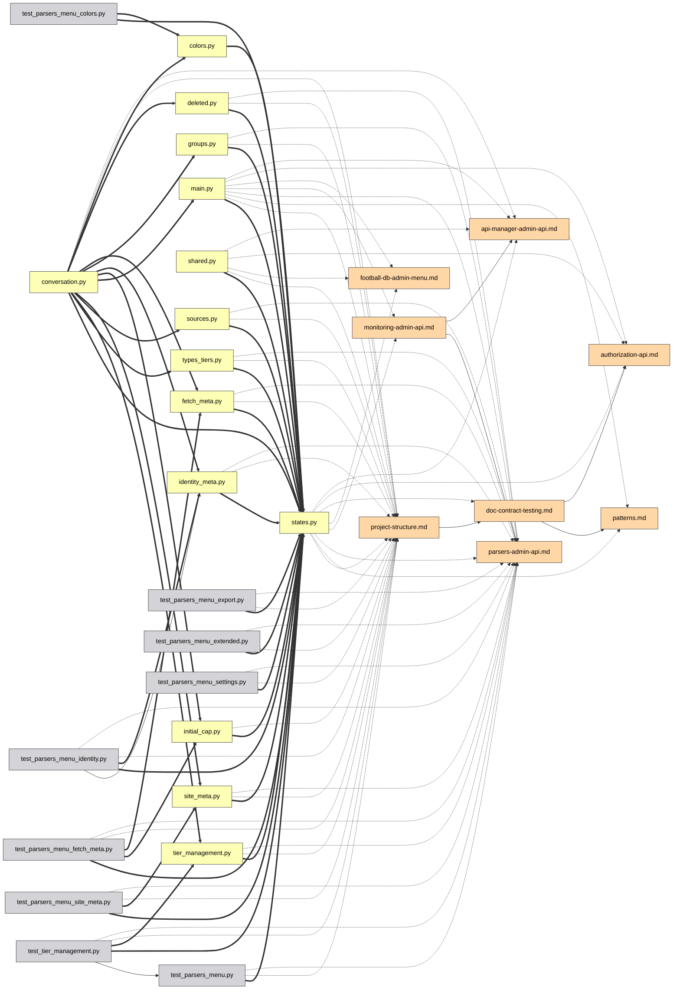

# Руководство по интерфейсу

[Deutsch](guide.de.md) | [English](../docs/guide.md) | [Español](guide.es.md) | [Français](guide.fr.md) | [Italiano](guide.it.md) | [日本語](guide.ja.md) | [한국어](guide.ko.md) | [Português](guide.pt.md) | **Русский** | [中文](guide.zh.md)

Каждая функция интерактивного графа, по порядку. Попробуйте их вживую на
[демо](https://mr-freewan.github.io/build-graph/) — это граф самого
репозитория build-graph с включённым синтетическим git-оверлеем.

---

## Навигация

Граф — это единый холст: **прокрутка масштабирует, перетаскивание фона
панорамирует, перетаскивание узла двигает его**. Подписи узлов проявляются,
когда масштаб переходит порог *Show at zoom* (отсечение по вьюпорту и LOD
подписей держат 1000+ узлов плавными). Кнопка-перекрестие в верхней панели
сбрасывает вид; счётчик в левом нижнем углу показывает, сколько узлов и рёбер
на карте.

Наведение на узел подсвечивает его вместе с прямыми соседями и приглушает всё
остальное; наведение на ребро показывает подсказку с типом ребра, направлением
источник → цель и точными номерами строк, стоящими за связью.

## Панели

Все семь панелей **перетаскиваются** — возьмитесь за пунктирный хват в
заголовке. Три основные панели (Graph controls, легенда, Exclude by name)
**сворачиваются** в свой заголовок по клику на нём (шеврон показывает
состояние). Инфо-панель меняет размер по обеим осям, Graph controls — по
горизонтали. Позиции, размеры и свёрнутость сохраняются в `localStorage` и
переживают перезагрузку; когда окно сжимается, панели зажимаются в пределах
вьюпорта и возвращаются на сохранённое место, когда оно снова растёт.

В правом верхнем углу — переключатели внешнего вида: **10 языков интерфейса**
(DE / EN / ES / FR / IT / JA / KO / PT / RU / ZH), **тёмная / светлая тема** и
**пастельная / насыщенная палитра** — обе палитры выровнены по тону, поэтому
переключение никогда не перетасовывает, какой цвет что значит. Цвета рёбер и
образцы в легенде тоже следуют палитре. Встроенный FAQ (кнопка `?`, 50+ ответов
на всех 10 языках) появляется здесь же.

## Управление графом

Левая панель настраивает картинку и физику:

- **Nodes & edges** — контраст цвета, масштаб узлов, толщина рёбер,
  прозрачность рёбер.
- **Labels** — размер шрифта и уровень масштаба, на котором появляются подписи.
- **Physics** — отталкивание и сила связей; изменения перезапускают симуляцию
  на лету.
- **Release pinned** освобождает все закреплённые узлы; **Rebuild physics**
  разогревает раскладку заново (закреплённые узлы сохраняют место — закрепление
  важнее пересборки).

## Поиск и исключение

Поле поиска (`Ctrl/Cmd+K`) сопоставляет имена узлов **и пути** — набрав
`handlers/`, вы подсветите всё поддерево. Кнопка `×` или `Esc` очищают его.

**Exclude by name** убирает шум: добавьте шаблон — и подходящие узлы снимаются
с поля; исключённые узлы заморожены, чтобы раскладка не прыгала. Rebuild physics
перетекает оставшиеся узлы в освободившееся пространство.

## Фильтрация через легенду

Легенда интерактивна:

- **Клик по типу узла** скрывает/показывает его; кнопки-глаза показывают/скрывают
  все сразу.
- **🎯 isolate** в любой строке оставляет только этот тип (повторный клик
  отменяет).
- **Клик по типу ребра** скрывает такие рёбра — узлы, оставшиеся без видимых
  связей, тоже исчезают, поэтому «только рёбра `docstring`» дают чистый подграф
  docstring, а не облако несвязанных точек.
- **Orphans only** показывает только файлы, на которые ничто не ссылается.

## Инспекция узла

Наведение на узел на мгновение показывает небольшую **подсказку** с его именем
и путём — быстрее, чем открывать полную панель ниже. В режиме Heat или Coverage
она добавляет число, стоящее за цветом (количество правок / % покрытия), которое
иначе видно только после клика. Задержка намеренно дольше обычного эффекта
наведения, чтобы проведение курсором по множеству узлов не вспыхивало подсказкой
на каждом. Подсказки рёбер (ниже) отключаются, пока активен режим Heat или
Coverage — рёбра там сохраняют обычный цвет типа, так что при наведении сказать
нечего.

Клик по узлу — открывается **инфо-панель**, и выделение остаётся подсвеченным
(закреплённым) после ухода курсора:

- Путь отрисован как **кликабельные хлебные крошки** — клик по сегменту каталога
  делает его поисковым запросом.
- Связи сгруппированы: `filename:line [type] ▸ +N` — разверните, чтобы увидеть
  каждую строку, где встречается связь.
- **Селектор IDE** (VS Code / Cursor / PyCharm / Copy path) превращает каждый
  файл в deep link — откройте точный file:line прямо из браузера.

Когда узел закреплён, наведение на любого его соседа заглядывает на уровень
глубже: подсветка становится объединением обеих окрестностей — быстрый
двухшаговый проход по цепочке зависимостей, не теряя своего места.

## Закрепление узлов

Два способа приколоть узел к холсту:

- **Двойной клик** по нему, или
- нажмите **B** при наведении — работает даже во время перетаскивания: отведите
  узел в сторону, нажмите B, отпустите — он останется.

Закреплённые узлы отмечены значком 📌, переживают Rebuild physics и освобождаются
либо повторным двойным кликом, либо глобально через **Release pinned**.

## Путь между двумя узлами

**Shift+клик** по двум узлам даёт кратчайший путь зависимостей между ними
(ненаправленный BFS): концы и рёбра пути становятся фиолетовыми, остальное
приглушается. Если пути нет, об этом сообщает всплывающее уведомление. `Esc` или
клик по фону очищают его.

## Фокус на ребре

Клик по ребру изолирует его: подсвеченными остаются только источник и цель (с
принудительно включёнными подписями), так что видно точно, какие два файла
связывает отношение. `Esc` или клик по фону снимают фокус.

## Режим Git

Кнопка **Git** переключает цвета узлов с типов на **статус рабочего дерева**:
added / modified / renamed / deleted / clean. Появляется то, что обычная
раскраска показать не может:

- **Призрачные узлы** (пунктирный контур) — удалённые файлы, на которые ещё
  ссылается документация, и старые половины переименований.
- **Рёбра переименования** (пунктир, без стрелки) — старый призрак → новый живой
  узел.
- Легенда переключается на git-статусы с теми же клик-фильтром, кнопками-глазами
  и изоляцией 🎯.

Кнопка отключена (с подсказкой), когда git недоступен. Для демо и скриншотов
`--mock-git` запекает синтетический оверлей, покрывающий все пять категорий.

## Дифф графа

Соберите с `--diff-base REF`, чтобы сравнить рабочее дерево с git-ссылкой
(ветка, тег, коммит) — вид графа зависимостей для код-ревью. Страница
открывается с уже включённым Git-оверлеем: статусы файлов приходят из git как
обычно, а рёбра зависимостей, **появившиеся после ссылки, рисуются зелёными**,
**удалённые — красными** (пунктир), привязанные к призрачным узлам, если файл
исчез. Git-легенда получает счётчики рёбер +N/−N, а её заголовок показывает
сравниваемый диапазон. Переименования отслеживаются — ребро, которое просто
переехало вместе с переименованным файлом, остаётся нейтральным.

Добавьте `--diff-head REF`, чтобы сравнить две конкретные ссылки вместо рабочего
дерева — обе стороны собираются из снапшотов `git archive`, поэтому изменения в
рабочем дереве, сделанные после head-ссылки, в дифф не попадают. Без него
`--diff-base` по-прежнему сравнивает с рабочим деревом, как раньше.

## Режим Heat

Кнопка **Heatmap** переключает цвета узлов с типов на **частоту
git-активности**: градиент синий→красный по тому, как часто менялся каждый
файл, в логарифмической шкале, чтобы горстка постоянно правимых файлов не
размывала всё остальное в один оттенок. По умолчанию охватывает всю историю;
соберите с `--heat-days N`, чтобы ограничить последними N днями. Панель
**Activity heat** показывает период сбора и сырой диапазон числа коммитов (`0`
до счётчика самого горячего файла), плюс **ползунок min-edits** — потяните его
вверх, чтобы скрыть всё холоднее выбранного порога (связанные рёбра скрываются
вместе с ним). «Clear filters» сбрасывает его обратно к 0 вместе со всем
остальным.

В отличие от режима Git, режим Heat аддитивен: Node types (и Edge types, и
остальная легенда) остаются ровно как есть под панелью Activity heat,
по-прежнему фильтруются по типу как обычно — heat лишь меняет, каким цветом
рисуется узел, не переопределяя, что значит «тип». Heat и Git по-прежнему
взаимоисключающи: оба перекрашивают узлы, поэтому включение одного выключает
другой. Кнопка отключена (с подсказкой), когда git недоступен.

## Режим Coverage

Кнопка **Cov.** переключает цвета узлов с типов на **покрытие строк тестами**:
градиент зелёный→красный из Cobertura-файла `coverage.xml` (соберите с
`--coverage PATH`, например из отчёта `pytest --cov=your_pkg --cov-report=xml`
— `--cov` требует имя пакета; `--cov-report=xml` сам по себе ничего не
собирает).
Направление намеренно обратно режиму Heat: весь смысл этого оверлея — находить
плохо покрытые файлы, поэтому зелёный (100%, хорошо) слева, а красный (0%,
плохо) справа. Ползунок под ним — **потолок, а не пол**: потяните его вниз от
100%, и он скроет всё, покрытое *больше* этого процента, оставив на экране
только худшие по покрытию файлы — противоположность ползунку min-edits в Heat,
который, наоборот, оставляет самые активные файлы. То же аддитивное поведение,
что и в режиме Heat (Node types остаются доступны снизу), и та же трёхсторонняя
взаимоисключаемость с Git и Heat — перекрашивать узлы может только один из трёх
за раз.

В отличие от Git и Heat, чьи кнопки остаются в панели (отключёнными, с
подсказкой), когда их источник данных недоступен, кнопка Coverage **полностью
скрыта**, если при сборке не передан `coverage.xml` — прогон покрытия
опционален и куда менее универсален, чем наличие git-истории, так что вечно
серая кнопка была бы просто мусором.

Включение режима Coverage также автоматически скрывает в легенде все Node types,
кроме `code/*` — отчёт о покрытии ничего не может сказать о документации или
конфигах, так что нет смысла засорять вид узлами, которые всегда будут
нейтрально-серыми. Это тот же механизм скрытия, что и клик по типу в легенде,
просто применённый заранее: любую категорию можно снова показать оттуда.

## Средства анализа

**💀 Dead code** (в легенде, появляется при наличии кандидатов) подсвечивает
файлы без входящих импортов и без упоминаний в документации. Точки входа
исключаются автоматически: `[project.scripts]` из `pyproject.toml`, `main.py`,
`__init__.py`, `conftest.py`, `test_*.py`, плюс всё, что подпадает под глобы
`[dead_code].exempt` в `graph.toml`. Переключатель 💀 показан в конце клипа про
режим Git выше.

**Cycles** (в легенде, появляется при наличии циклов импорта) подсвечивает
компоненты сильной связности в рантайм-графе импортов `code->code`: рёбра цикла
становятся коралловыми, участники цикла получают коралловое кольцо, всё
остальное гаснет. Импорты только для типов (`TYPE_CHECKING`) не считаются — это
легальный способ разорвать цикл. Счётчик — число независимых циклов, и пока
такой режим активен, погасшие узлы и рёбра игнорируют курсор — проведя по ним,
вы их не подсветите.

**Orphan ring** — файлы нулевой степени не разбросаны; они сидят на окружности
вокруг живого кластера, так что «связное ядро против отдельных файлов» читается
с одного взгляда. Файлы, которые автообнаружение не смогло классифицировать,
получают янтарное кольцо и собственную кнопку-счётчик в верхней панели.

**Ambiguous group nodes** — документ, упоминающий голое имя файла вроде
`__init__.py` или `config.py` без пути (и вне листинга файлового дерева), нельзя
разрешить в один конкретный файл, когда это имя носят десятки файлов. Вместо
того чтобы гадать и раздувать ребро на каждый одноимённый файл, такое упоминание
приписывается одному синтетическому узлу в собственной категории легенды
`ambiguous`, помеченному числом совпадений (`__init__.py (×N)`). За ним нет
реального файла — клик показывает только метку, без открытия в IDE или
копирования пути. Зато его список **Connections** вполне обычен: каждый
документ, упоминающий голое имя, перечислен с точными номерами строк и ссылкой
на открытие в IDE — пройдите по ней, и, если упоминание должно указывать на
один конкретный файл, перепишите его явным путём (`dir/config.py` вместо голого
`config.py`), чтобы при следующей сборке оно разрешалось прямо в этот файл.

## Обмен и экспорт

**Меню File** собирает выгрузки:

- **Copy link** — текущий вид (язык, тема, палитра, фильтры, режим git, поиск,
  закреплённое выделение), закодированный в hash URL. Откройте ссылку — увидите
  ту же картинку. Личные настройки (позиции панелей, ползунки, выбор IDE)
  намеренно остаются вне URL.
- **Copy as Mermaid** — сфокусированный подграф (путь > фокус ребра >
  закреплённый узел + соседи > результаты поиска) как сниппет `flowchart LR`,
  где стиль стрелки кодирует тип ребра. Вставьте его в описание PR.
- **Copy JSON** — полные данные графа для LLM-агента (те же данные, что у
  CLI-флагов `--json` / `--compact`).
- **Export / Import prefs** — перенесите всю свою конфигурацию (позиции,
  ползунки, фильтры, тему) на другую машину в виде JSON-файла.

Реальный пример *Copy as Mermaid* — одна admin-подсистема, изолированная через
поиск, экспортированная и вставленная в markdown как есть:

Исходник Mermaid, стоящий за этой картинкой

## FAQ и горячие клавиши

Кнопка `?` открывает встроенный FAQ — 50+ ответов на всех 10 языках,
покрывающих всё на этой странице (его можно увидеть открытым в клипе про Панели
выше).

| Клавиша | Действие |
|---------|----------|
| `Esc` | закрывает по порядку: меню File → FAQ → инфо-панель → фокус ребра → очистка поиска |
| `Space` | пауза / возобновление физики |
| `Ctrl/Cmd+K` | фокус на поле поиска |
| `B` | закрепить/открепить узел под курсором (работает во время перетаскивания) |
| `Shift+клик` × 2 | кратчайший путь между двумя узлами |
| двойной клик | закрепить/открепить узел на месте |
