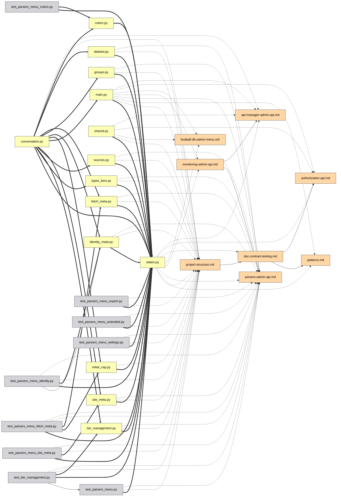

# 界面指南

[Deutsch](guide.de.md) | [English](../docs/guide.md) | [Español](guide.es.md) | [Français](guide.fr.md) | [Italiano](guide.it.md) | [日本語](guide.ja.md) | [한국어](guide.ko.md) | [Português](guide.pt.md) | [Русский](guide.ru.md) | **中文**

交互式图谱的每一项功能，逐一介绍。可在[演示](https://mr-freewan.github.io/build-graph/)中实时试用 —— 这是 build-graph 仓库自身的图谱，并启用了合成的 git 叠加层。

---

## 浏览

图谱是单一画布：**滚动缩放，拖拽背景平移，拖拽节点移动它**。当缩放越过 *Show at zoom* 阈值时，节点标签会淡入（视口剔除和标签 LOD 让 1000+ 节点保持流畅）。顶部栏的十字准星按钮重置视图；左下角的计数器显示地图上有多少节点和边。

悬停一个节点会将其与其直接邻居一起高亮，并让其他一切变暗；悬停一条边会显示一个提示，包含边的类型、源 → 目标以及该关系背后的精确行号。

## 面板

全部七个面板都**可拖拽** —— 抓住标题栏中的点状手柄。三个主面板（Graph controls、图例、Exclude by name）在点击标题栏时**折叠**进标题栏（尖角符号显示状态）。信息面板可在两个轴上调整大小，Graph controls —— 仅水平方向。位置、大小和折叠状态都保存在 `localStorage` 中，重新加载后依然存在；当窗口缩小时，面板会被夹进视口，窗口再变大时回到保存的位置。

右上角是外观开关：**10 种界面语言**（DE / EN / ES / FR / IT / JA / KO / PT / RU / ZH）、**深色 / 浅色主题**，以及**柔和 / 饱和调色板** —— 两套调色板色相对齐，因此切换绝不会重新打乱哪种颜色代表什么。边的颜色和图例色块也跟随调色板。内置 FAQ（`?` 按钮，全 10 种语言 50+ 条答案）也在此出现。

## Graph controls

左侧面板调节画面与物理：

- **Nodes & edges** —— 颜色对比度、节点比例、边宽、边不透明度。
- **Labels** —— 字号以及标签出现的缩放级别。
- **Physics** —— 排斥力与连接力；更改会实时重启模拟。
- **Release pinned** 释放所有钉住的节点；**Rebuild physics** 重新加热布局（钉住的节点保持其位置 —— 钉住优先于重建）。

## 搜索与排除

搜索框（`Ctrl/Cmd+K`）匹配节点名称**和路径** —— 输入 `handlers/` 会点亮整个子树。`×` 按钮或 `Esc` 清除它。

**Exclude by name** 去除噪声：添加一个模式，匹配的节点就从盘面上移除；被排除的节点被冻结，以免布局跳动。Rebuild physics 让幸存者流入腾出的空间。

## 图例过滤

图例是交互式的：

- **点击一个节点类型**以隐藏/显示它；眼睛按钮一次性显示/隐藏全部。
- 任意行上的 **🎯 isolate** 只保留该类型（再次点击撤销）。
- **点击一个边类型**以隐藏那些边 —— 失去可见连接的节点也会消失，因此「仅 `docstring` 边」会给你一个干净的 docstring 子图，而不是一堆断开的散点。
- **Orphans only** 只显示没有任何东西链接到的文件。

## 检查节点

在节点上悬停片刻会显示一个包含其名称和路径的小**提示** —— 比打开下方完整面板更快的一瞥。在 Heat 或 Coverage 模式下，它会加上颜色背后的数字（编辑次数 / 覆盖率 %），否则只有点击才可见。延迟被有意设得比典型悬停效果更长，这样在众多节点上扫过光标时不会每个节点都闪出一个提示。边提示（下方）在 Heat 或 Coverage 模式激活时关闭 —— 那里边保持其正常的类型颜色，因此悬停其上没有有用的信息可说。

点击一个节点 —— **信息面板**打开，光标离开后所选项仍保持高亮（钉住）：

- 路径被渲染为**可点击的面包屑** —— 点击一个目录段，它就成为搜索查询。
- 连接被分组：`filename:line [type] ▸ +N` —— 展开可查看该关系出现的每一行。
- **IDE 选择器**（VS Code / Cursor / PyCharm / Copy path）把每个文件变成深链接 —— 直接从浏览器打开精确的 file:line。

在节点被钉住时，悬停它的任一邻居会向深一层窥视：高亮变为两个邻域的并集 —— 快速两步地沿依赖链行走，而不丢失你的位置。

## 将节点钉在原处

把节点钉到画布上的两种方式：

- **双击**它，或
- 悬停时按 **B** —— 即使在拖拽途中也有效：把节点拖到一旁，按 B，松开 —— 它留下。

钉住的节点显示一个 📌 标记，能挺过 Rebuild physics，并通过再次双击或用 **Release pinned** 全局释放。

## 两个节点之间的路径

**Shift+点击**两个节点可获得它们之间的最短依赖路径（无向 BFS）：端点和路径边变紫，其余变暗。若不存在路径，会有一个 toast 提示。`Esc` 或点击背景清除它。

## 聚焦一条边

点击一条边以隔离它：只有源和目标保持点亮（其标签被强制显示），这样你能准确读出该关系连接的是哪两个文件。`Esc` 或点击背景解除。

## Git 模式

**Git** 按钮把节点颜色从类型切换为**工作树状态**：added / modified / renamed / deleted / clean。会出现单纯着色无法展示的额外内容：

- **幽灵节点**（虚线轮廓）—— 文档仍在引用的已删除文件，以及重命名的旧一半。
- **重命名边**（虚线，无箭头）—— 旧幽灵 → 新的活节点。
- 图例切换为 git 状态，具有相同的点击过滤、眼睛按钮和 🎯 隔离。

当 git 不可用时，按钮被禁用（带提示）。用于演示和截图时，`--mock-git` 会烘焙一个覆盖全部五个类别的合成叠加层。

## 图谱 diff

用 `--diff-base REF` 构建可将工作树与一个 git 引用（分支、标签、提交）进行比较 —— 依赖图谱的代码评审视图。页面打开时 Git 叠加层已开启：文件状态照常来自 git，而**自该引用以来新增的**依赖边**渲染为绿色**，**被移除的**为**红色**（虚线），当文件不在时锚定到幽灵节点。git 图例增加 +N/−N 边计数器，其标题显示所比较的范围。重命名会被跟踪 —— 仅仅随重命名文件一起移动的边保持中立。

加上 `--diff-head REF` 可比较两个特定引用而非工作树 —— 两侧都从 `git archive` 快照构建，因此在 head 引用之后对工作树所做的更改不属于 diff。不加它时，`--diff-base` 单独仍如以往那样与工作树比较。

## Heat 模式

**Heatmap** 按钮把节点颜色从类型切换为 **git 活动频率**：按每个文件更改的频繁程度呈蓝→红渐变，采用对数刻度，使少数不断被编辑的文件不会把其他一切都冲淡成同一个色调。默认覆盖全部历史；用 `--heat-days N` 构建可将其限制为最近 N 天。**Activity heat** 面板显示采集周期和原始提交次数范围（`0` 到最热文件的次数），外加一个 **min-edits 滑块** —— 向上拖动可隐藏一切比所选阈值更冷的内容（相连的边随之隐藏）。「Clear filters」将其连同其他一切一起重置为 0。

与 Git 模式不同，Heat 模式是叠加式的：Node types（以及 Edge types 和图例的其余部分）在 Activity heat 面板下方原样保留，仍可像往常一样按类型过滤 —— heat 只改变节点以何种颜色绘制，并不重新定义「类型」的含义。Heat 与 Git 模式彼此仍然互斥：两者都会重新着色节点，因此开启一个会关闭另一个。当 git 不可用时，按钮被禁用（带提示）。

## Coverage 模式

**Cov.** 按钮把节点颜色从类型切换为**测试行覆盖率**：来自 Cobertura `coverage.xml` 的绿→红渐变（用 `--coverage PATH` 构建，例如 `pytest --cov=your_pkg --cov-report=xml` 的报告 —— `--cov` 需要包名；`--cov-report=xml` 单独不收集任何东西）。
方向被有意设为与 Heat 模式相反：这个叠加层的全部意义在于找出覆盖差的文件，所以绿色（100%，好）在左，红色（0%，差）在右。它下方的滑块是**上限，而非下限**：从 100% 向下拖动，它会隐藏覆盖率*高于*该百分比的一切，只把覆盖最差的文件留在屏幕上 —— 与 Heat 的 min-edits 滑块相反，后者保留的是最繁忙的文件。与 Heat 模式相同的叠加行为（Node types 在下方仍可用），以及与 Git 和 Heat 相同的三方互斥 —— 三者中一次只有一个能重新着色节点。

与 Git 和 Heat（其按钮在数据源不可用时留在栏中、被禁用、带提示）不同，Coverage 按钮在构建时未提供 `coverage.xml` 时**完全隐藏** —— 运行覆盖率是可选的，且远不如拥有 git 历史那样普遍，因此一个永久变灰的按钮只会是杂乱。

开启 Coverage 模式还会自动隐藏图例中除 `code/*` 以外的所有 Node type —— 覆盖率报告永远无法就文档或配置文件说什么，因此没必要用那些永远渲染为中性灰的节点来堆满视图。这与在图例中点击某类型是同一套隐藏机制，只是预先应用了：任何类别都可从那里重新显示。

## 分析辅助

**💀 Dead code**（图例，有候选时出现）高亮没有传入导入且没有文档提及的文件。入口点会被自动豁免：`pyproject.toml` 中的 `[project.scripts]`、`main.py`、`__init__.py`、`conftest.py`、`test_*.py`，外加任何匹配 `graph.toml` 中 `[dead_code].exempt` 通配的内容。💀 开关在上面 Git 模式片段的末尾展示。

**Cycles**（图例，存在导入环时出现）高亮运行时 `code->code` 导入图中的强连通分量：环的边变珊瑚色，环的成员获得一个珊瑚色环圈，其他一切淡出。仅类型（`TYPE_CHECKING`）的导入不计入 —— 它们正是打破循环的合法方式。计数器是独立环的数量，而在这样的模式激活期间，淡出的节点和边会忽略指针 —— 从它们上方经过不会将其点亮。

**Orphan ring** —— 零度文件不会被散落各处；它们坐落在活簇周围的一个圆上，因此「相连的核心 vs. 松散的文件」一目了然。自动发现无法分类的文件获得一个琥珀色环圈，以及顶部栏中它们自己的计数器按钮。

**Ambiguous group nodes** —— 一个提及像 `__init__.py` 或 `config.py` 这样不带路径的裸文件名的文档（且在文件树列表之外），当数十个文件共用该名称时，无法解析到某个特定文件。它不去猜测并把边扇出到每个同名文件，而是把该提及归于其专属 `ambiguous` 图例类别中的单个合成节点，并以匹配数（`__init__.py (×N)`）标注。它背后没有真实文件 —— 点击只显示标签，没有 IDE 打开或复制路径。不过它的 **Connections** 列表完全正常：每个提及该裸名称的文档都以精确行号列出，包含 IDE 打开链接 —— 点进去，如果该提及应指向某个特定文件，就把它改写为显式路径（用 `dir/config.py` 代替裸的 `config.py`），这样下次构建时它就直接解析到那个文件。

## 分享与导出

**File 菜单**汇集各项输出：

- **Copy link** —— 当前视图（语言、主题、调色板、过滤器、git 模式、搜索、钉住的选择）编码在 URL 哈希中。打开链接 —— 看到同样的画面。个人偏好（面板位置、滑块、IDE 选择）被有意排除在 URL 之外。
- **Copy as Mermaid** —— 聚焦子图（路径 > 边聚焦 > 钉住节点 + 邻居 > 搜索结果）作为 `flowchart LR` 片段，箭头样式编码边的类型。把它粘贴到 PR 描述中。
- **Copy JSON** —— 供 LLM 代理使用的完整图谱数据（与 CLI 标志 `--json` / `--compact` 相同的数据）。
- **Export / Import prefs** —— 把你的整套设置（位置、滑块、过滤器、主题）作为 JSON 文件迁移到另一台机器。

一个真实的 *Copy as Mermaid* 示例 —— 通过搜索隔离出的一个 admin 子系统，导出后原样粘贴进 markdown：

那张图片背后导出的 Mermaid 源码

## FAQ 与快捷键

`?` 按钮打开内置 FAQ —— 全 10 种语言 50+ 条答案，涵盖本页的一切（你可以在上面的 Panels 片段中看到它被打开）。

| 键 | 操作 |
|----|------|
| `Esc` | 依次关闭：File 菜单 → FAQ → 信息面板 → 边聚焦 → 清除搜索 |
| `Space` | 暂停 / 恢复物理 |
| `Ctrl/Cmd+K` | 聚焦搜索框 |
| `B` | 钉住/取消钉住光标下的节点（拖拽途中也有效） |
| `Shift+点击` × 2 | 两个节点之间的最短路径 |
| 双击 | 将节点钉在/取消钉在原处 |
